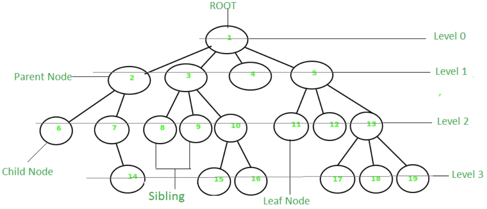
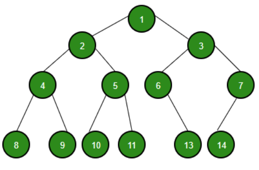

- [Basic](#basic)
- [Binary Tree](#binary-tree)
  - [Representation](#representation)
  - [Operations](#operations)
  - [Traversals](#traversals)
    - [Inorder, Preorder and Postorder](#inorder-preorder-and-postorder)
    - [Inorder Tree Traversal without Recursion](#inorder-tree-traversal-without-recursion)
    - [Inorder Tree Traversal without Recursion & Stack*](#inorder-tree-traversal-without-recursion--stack)
    - [Level Order Binary Tree Traversal](#level-order-binary-tree-traversal)
    - [Iterative Preorder Traversal](#iterative-preorder-traversal)
    - [Morris Traversal for Preorder](#morris-traversal-for-preorder)
    - [Iterative Postorder Traversal](#iterative-postorder-traversal)
    - [BFS vs DFS for Binary Tree](#bfs-vs-dfs-for-binary-tree)
    - [Inorder Successor of a node in Binary Tree](#inorder-successor-of-a-node-in-binary-tree)
    - [Diagonal Traversal of Binary Tree](#diagonal-traversal-of-binary-tree)
  - [Binary Search Tree](#binary-search-tree)
  - [AVL Tree](#avl-tree)
  - [Red-Black Tree](#red-black-tree)
  - [Huffman Tree](#huffman-tree)
  - [Heap](#heap)
  - [Thread Binary Tree](#thread-binary-tree)
- [B Tree](#b-tree)

# Basic

`Tree` data structure is similar to a tree we see in nature but it is upside down. It also has a `root` and `leaves`. The root is the first node of the tree and the leaves are the ones at the bottom-most level. The special characteristic of a tree is that there is only one path to go from any of its nodes to any other node.



Based on the maximum number of children of a node of the tree it can be – 

- Binary tree – This is a special type of tree where each node can have a maximum of `2` children.
- Ternary tree – This is a special type of tree where each node can have a maximum of `3` children.
- N-ary tree – In this type of tree, a node can have at most `N` children.

Based on the configuration of nodes there are also several classifications. Some of them are:

- Complete Binary Tree – In this type of binary tree all the levels are filled except maybe for the last level. But the last level elements are filled as left as possible.
- Perfect Binary Tree – A perfect binary tree has all the levels filled
- [Binary Search Tree](#binary-search-tree) – A binary search tree is a special type of binary tree where the smaller node is put to the left of a node and a higher value node is put to the right of a node
- Ternary Search Tree – It is similar to a binary search tree, except for the fact that here one element can have at most 3 children.

# Binary Tree

Binary Tree is defined as a Tree data structure with at most `2` children. Since each element in a binary tree can have only 2 children, we typically name them the left and right child.



## Representation

A Binary tree is represented by a pointer to the topmost node of the tree. If the tree is empty, then the value of the root is NULL.

Binary Tree node contains the following parts:

- Data
- Pointer to left child
- Pointer to right child

In Go, we can represent a tree node using structures. Below is an example of a tree node with integer data.

```go
type Node struct {
    Val   int
    Left  *Node
    Right *Node
}
```

## Operations

> Basic Operation On Binary Tree:

- Inserting an element.
- Removing an element.
- Searching for an element.
- Traversing an element. There are three types of traversals in a binary tree which will be discussed ahead.

> Auxiliary Operation On Binary Tree:

- Finding the height of the tree
- Find the level of the tree
- Finding the size of the entire tree.

> Applications of Binary Tree:

- In compilers, Expression Trees are used which is an application of binary tree.
- Huffman coding trees are used in data compression algorithms.
- Priority Queue is another application of binary tree that is used for searching maximum or minimum in O(1) time complexity.

> Binary Tree Traversals:

- PreOrder Traversal: Here, the traversal is: `root – left child – right child`. It means that the root node is traversed first then its left child and finally the right child.
- InOrder Traversal: Here, the traversal is: `left child – root – right child`.  It means that the left child is traversed first then its root node and finally the right child.
- PostOrder Traversal: Here, the traversal is: `left child – right child – root`.  It means that the left child is traversed first then the right child and finally its root node.

## Traversals

Unlike linear data structures (`Array`, `Linked List`, `Queues`, `Stacks`, etc) which have only one logical way to traverse them, trees can be traversed in different ways. Following are the generally used methods for traversing trees:


### Inorder, Preorder and Postorder

Inorder Traversal:

Algorithm Inorder(tree)

- Traverse the left subtree, i.e., call Inorder(left->subtree)
- Visit the root.
- Traverse the right subtree, i.e., call Inorder(right->subtree)

Uses of Inorder Traversal:

In the case of `binary search trees (BST)`, Inorder traversal gives nodes in non-decreasing order. To get nodes of BST in non-increasing order, a variation of Inorder traversal where Inorder traversal is reversed can be used. 

Example: In order traversal for the above-given figure is 4 2 5 1 3.

```go
// TreeNode Definition for a binary tree node.
type TreeNode struct {
	Val   int
	Left  *TreeNode
	Right *TreeNode
}

func printInOrder(root *TreeNode) {
	if root == nil {
		return
	}
	
	printInOrder(root.Left)
	fmt.Printf("%d ", root.Val)
	printInOrder(root.Right)
}
```

Preorder Traversal: 

Algorithm Preorder(tree)

- Visit the root.
- Traverse the left subtree, i.e., call Preorder(left->subtree)
- Traverse the right subtree, i.e., call Preorder(right->subtree) 
  
Uses of Preorder:

Preorder traversal is used to create a copy of the tree. Preorder traversal is also used to get `prefix expressions` on an expression tree.

Example: Preorder traversal for the above-given figure is 1 2 4 5 3.

```go
func printPreOrder(root *TreeNode) {
	if root == nil {
		return
	}

	fmt.Printf("%d ", root.Val)
	printPreOrder(root.Left)
	printPreOrder(root.Right)
}
```

Postorder Traversal: 

Algorithm Postorder(tree)

- Traverse the left subtree, i.e., call Postorder(left->subtree)
- Traverse the right subtree, i.e., call Postorder(right->subtree)
- Visit the root

Uses of Postorder:

Postorder traversal is used to delete the tree. Please see the question for the deletion of a tree for details. Postorder traversal is also useful to get the postfix expression of an expression tree

Example: Postorder traversal for the above-given figure is 4 5 2 3 1

```go
func printPostOrder(root *TreeNode) {
	if root == nil {
		return
	}

	fmt.Printf("%d ", root.Val)
	printPostOrder(root.Left)
	printPostOrder(root.Right)
}
```

output:

```go
Preorder traversal of binary tree is 
1 2 4 5 3 
Inorder traversal of binary tree is 
4 2 5 1 3 
Postorder traversal of binary tree is 
4 5 2 3 1 
```

Time Complexity: O(N)

Auxiliary Space: If we don’t consider the size of the stack for function calls then O(1) otherwise O(h) where h is the height of the tree. 

Note: The height of the skewed tree is n (no. of elements) so the worst space complexity is O(N) and the height is (Log N) for the balanced tree so the best space complexity is O(Log N).

### Inorder Tree Traversal without Recursion

### Inorder Tree Traversal without Recursion & Stack*

### Level Order Binary Tree Traversal

### Iterative Preorder Traversal

### Morris Traversal for Preorder

### Iterative Postorder Traversal

### BFS vs DFS for Binary Tree

### Inorder Successor of a node in Binary Tree

### Diagonal Traversal of Binary Tree

## Binary Search Tree
## AVL Tree
## Red-Black Tree
## Huffman Tree
## Heap
## Thread Binary Tree

# B Tree