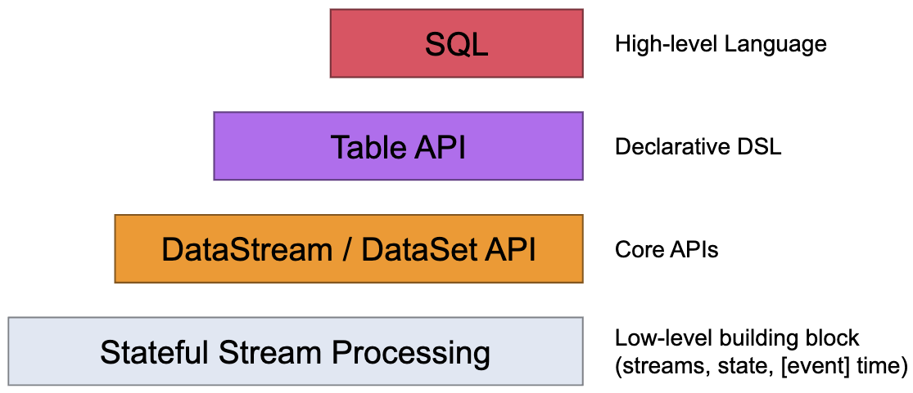

- [Flink Runtime](#flink-runtime)
- [Flink API](#flink-api)
  - [DataStream API](#datastream-api)
    - [Execution Mode](#execution-mode)
    - [Data Source API](#data-source-api)
      - [Bounded File Source](#bounded-file-source)
      - [Unbounded Streaming File Source](#unbounded-streaming-file-source)
      - [Bounded Kafka Source](#bounded-kafka-source)
      - [Unbounded Streaming Kafka Source](#unbounded-streaming-kafka-source)
    - [Event Time](#event-time)
      - [Overview](#overview)
    - [Operators](#operators)
      - [DataStream Transformation](#datastream-transformation)
        - [Map](#map)
        - [FlatMap](#flatmap)
        - [Filter](#filter)
        - [KeyBy](#keyby)
        - [Reduce](#reduce)
      - [Windows](#windows)
        - [Window Lifecycle](#window-lifecycle)
        - [Keyed vs Non-Keyed Windows](#keyed-vs-non-keyed-windows)
        - [Window Assigners](#window-assigners)
          - [Tumbling Windows](#tumbling-windows)
          - [Sliding Windows](#sliding-windows)
          - [Session Windows](#session-windows)
          - [Global Windows](#global-windows)
        - [Window Functions](#window-functions)
          - [ReduceFunction](#reducefunction)
          - [AggregateFunction](#aggregatefunction)
          - [ProcessWindowFunction with Incremental Aggregation](#processwindowfunction-with-incremental-aggregation)
        - [Triggers](#triggers)
          - [Fire and Purge](#fire-and-purge)
          - [Default Triggers of WindowAssigners](#default-triggers-of-windowassigners)
          - [Built-in and Custom Triggers](#built-in-and-custom-triggers)
        - [Evictors](#evictors)
        - [Allowed Latenness](#allowed-latenness)
          - [Getting Late Data as a Side Output](#getting-late-data-as-a-side-output)
          - [Late Elements Considerations](#late-elements-considerations)
        - [Working with Window Results](#working-with-window-results)
          - [Interaction of Watermarks and Windows](#interaction-of-watermarks-and-windows)
          - [Consecutive Windowed Operations](#consecutive-windowed-operations)
        - [Useful State Size Considerations](#useful-state-size-considerations)
      - [Physical Partitioning](#physical-partitioning)
      - [Task Chaining and Resource Groups](#task-chaining-and-resource-groups)
      - [Name And Description](#name-and-description)
    - [Event Time](#event-time-1)
  - [Table API & SQL](#table-api--sql)
  - [Python API](#python-api)
- [Flink Data Type](#flink-data-type)
  - [Java Tuples and Scala Case Classes](#java-tuples-and-scala-case-classes)
  - [Java POJOs](#java-pojos)
  - [Primitive Types](#primitive-types)
  - [Regular Classes](#regular-classes)
  - [Values](#values)
  - [Hadoop Writables](#hadoop-writables)
  - [Special Types](#special-types)

# Flink Runtime

# Flink API

## DataStream API

### Execution Mode

### Data Source API

#### Bounded File Source

#### Unbounded Streaming File Source

#### Bounded Kafka Source

#### Unbounded Streaming Kafka Source

### Event Time

#### Overview

《Streaming Systems》中關於 `watermarks` 描述的原文:

> Watermarks are temporal notions of input completeness in the event-time domain. Worded differently, they are the way the system measures progress and completeness relative to the event times of the records being processed in a stream of events (either bounded or unbounded, though their usefulness is more apparent in the unbounded case).

Flink document 對於 `watermarks` 定義如下:

> The mechanism in Flink to measure progress in event time is watermarks. Watermarks flow as part of the data stream and carry a timestamp t. A Watermark(t) declares that event time has reached time t in that stream, meaning that there should be no more elements from the stream with a timestamp t' <= t (i.e. events with timestamps older or equal to the watermark).

綜上所述, `watermarks` 在事件時間域衡量數據完整性的概念, 其作為數據流的一部分流動並攜帶時間戳 t, **`Watermark(t)` 斷言數據流中不會再有小於時間戳 t** 的事件出現

真實資料流往往會因為許多不可預期因素產生一定程度的延遲與偏差

### Operators

#### DataStream Transformation

##### Map

##### FlatMap

##### Filter

##### KeyBy

##### Reduce

#### Windows

##### Window Lifecycle

A window is created as soon as the first element that should belong to this window arrives, and the window is **completely removed** when the time (event or processing time) passes its end timestamp plus the user-specified `allowed lateness`.

For example, with an `event-time-based` windowing strategy that creates `non-overlapping (or tumbling)` windows **every 5 minutes** and has an `allowed lateness` of **1 min**, Flink will create a new window for the interval between **12:00** and **12:05** when the first element with a timestamp that falls into this interval arrives, and it will remove it when the watermark passes the **12:06** timestamp.

##### Keyed vs Non-Keyed Windows

##### Window Assigners

###### Tumbling Windows

###### Sliding Windows

###### Session Windows

###### Global Windows

##### Window Functions

###### ReduceFunction

###### AggregateFunction

###### ProcessWindowFunction with Incremental Aggregation

##### Triggers

###### Fire and Purge

###### Default Triggers of WindowAssigners

###### Built-in and Custom Triggers

##### Evictors

##### Allowed Latenness

###### Getting Late Data as a Side Output

###### Late Elements Considerations

##### Working with Window Results

###### Interaction of Watermarks and Windows

###### Consecutive Windowed Operations

##### Useful State Size Considerations

#### Physical Partitioning

#### Task Chaining and Resource Groups

#### Name And Description

### Event Time

## Table API & SQL

## Python API

# Flink Data Type

## Java Tuples and Scala Case Classes

## Java POJOs

## Primitive Types

## Regular Classes

## Values

## Hadoop Writables

## Special Types