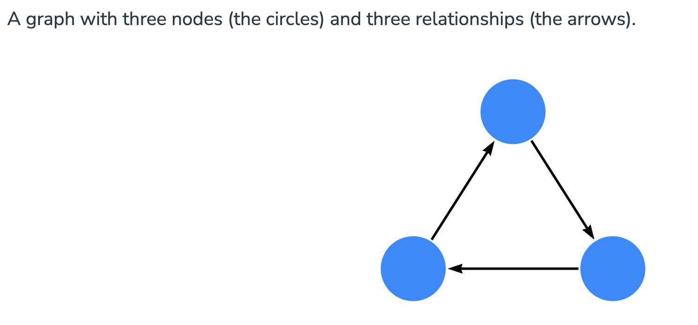
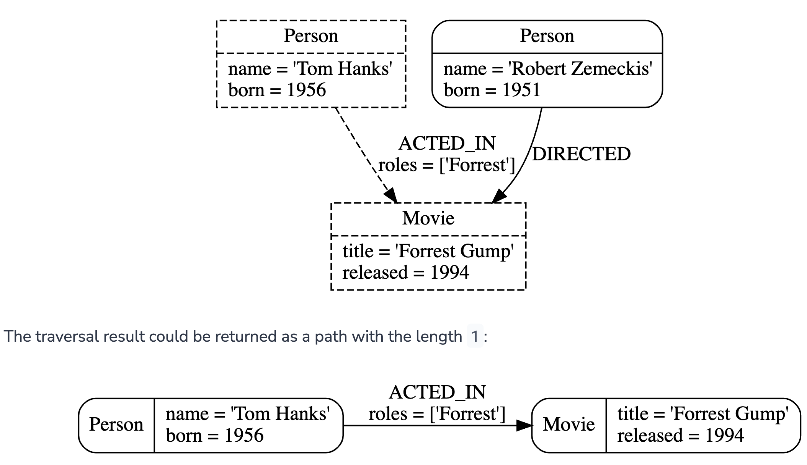

- [Knowledge Graph](#knowledge-graph)
- [Neo4j](#neo4j)
- [Graph Database](#graph-database)
  - [Example Graph](#example-graph)
  - [Node](#node)
  - [Node Labels](#node-labels)
  - [Relationship](#relationship)
  - [Relationship Type](#relationship-type)
  - [Properties](#properties)
    - [Number](#number)
    - [String and Boolean](#string-and-boolean)
    - [List](#list)
  - [Traversals & Paths](#traversals--paths)
  - [Schema](#schema)
  - [Naming Conventions](#naming-conventions)
- [Cypher](#cypher)
  - [Usage](#usage)

# Knowledge Graph

> 知識圖譜（Knowledge Graph），是結構化的語義知識庫，用於以符號形式描述物理世界中的概念及其相互關係。其基本組成單位是「實體-關係-實體」三元組，以及實體及其相關屬性-值對，實體間通過關係相互聯結，構成網狀的知識結構。知識圖譜可以實現Web從網頁連結向概念連結轉變，支持用戶按主題而不是字符串檢索，真正實現語義檢索。基於知識圖譜的搜尋引擎，能夠以圖形方式向用戶反饋結構化的知識，用戶不必瀏覽大量網頁即能準確定位和深度獲取知識。

`wikipedia` 對於 `knowledge graph` 的定義如上, 簡單來說 `knowledge graph` 就是通過不同知識的關聯性形成一個網狀的知識結構, 其可作為 AI 的基石

當前 AI 領域如 `computer vision`, `speech recognition` 或是 `NLP` 的 training model, 都要依賴 `knowledge graph`

`Knowledge graph` 目前主要應用在搜尋, 智能問答, 推薦系統等應用, 其建設一般包括資料擷取, 實體辨識, 抽象關係, 資料存儲及應用等幾個面向, `Neo4j` 主要著眼於資料存儲的部分

# Neo4j

`Knowledge graph` 的資料包含 `entity`, `poperty` 及 `relationship`, 常見的 Relational Database 如 MySQL 無法很好的發揮這類資料的特性, 因此 `knowledge graph` 資料的存儲一般都採用 `Graph Database`, `Neo4j` 為 `Graph Database` 的一種

# Graph Database

> A graph data structure consists of nodes (discrete objects) that can be connected by relationships.



The `Neo4j` property graph database model consists of:

- `Nodes` describe entities (discrete objects) of a domain.
- `Nodes` can have zero or more `labels` to define (classify) what kind of nodes they are.
- `Relationships` describes a connection between a source node and a target node.
- `Relationships` always has a direction (one direction).
- `Relationships` must have a `type` (one type) to define (classify) what type of relationship they are.
- Nodes and relationships can have `properties` (key-value pairs), which further describe them.

```
In mathematics, graph theory is the study of graphs.

In graph therory:

- Nodes are also refered to as vertices or points.
- Relationships are also refered to as edges, links, or lines.
```

## Example Graph

The example graph shown below, introduces the basic concepts of the property graph:


To create the example graph, use the Cypher clause `CREATE`:

```cypher
CREATE (:Person:Actor {name: 'Tom Hanks', born: 1956})-[:ACTED_IN {roles: ['Forrest']}]->(:Movie {title: 'Forrest Gump'})<-[:DIRECTED]-(:Person {name: 'Robert Zemeckis', born: 1951})
```

## Node

> Nodes are used to represent entities (discrete objects) of a domain.

The simplest possible graph is a single node with no relationships. Consider the following graph, consisting of a single node.


The node labels are:
- Person
- Actor

The properties are:
- name: Tom Hanks
- born: 1956

The node can be created with Cypher using the query:

```cypher
CREATE (:Person:Actor {name: 'Tom Hanks', born: 1956})
```

## Node Labels

> A node can have zero to many labels.

In the example graph, the node labels, `Person`, `Actor`, and `Movie`, are used to describe (classify) the nodes. More labels can be added to express different dimensions of the data.

The following graph shows the use of multiple labels:


## Relationship

> A relationship describes how a connection between a source node and a target node are related. It is possible for a node to have a relationship to itself.

A relationship:

- Connects a source node and a target node.
- Has a direction (one direction).
- Must have a `type` (one type) to define (classify) what type of relationship it is.
- Can have properties (key-value pairs), which further describe the relationship.

Relationships organize nodes into structures, allowing a graph to resemble a list, a tree, a map, or a compound entity — any of which may be combined into yet more complex, richly inter-connected structures.


The relationship type: `ACTED_IN`

The properties are:
- `roles: ['Forrest']`
- `performance: 5`

The `roles` property has an array value with a single item (`'Forrest'`) in it.

The relationship can be created with Cypher using the query:

```cypher
CREATE ()-[:ACTED_IN {roles: ['Forrest'], performance: 5}]->()
```

>❗️ You must create or reference a source node and a target node to be able to create a relationship.

A node can have relationships to itself. To express that `Tom Hanks` `KNOWS` himself would be expressed as:


## Relationship Type

> A relationship must have exactly one relationship type.

Below is an `ACTED_IN` relationship, with the `Tom Hanks` node as the source node and `Forrest Gump` as the target node.


## Properties

> Properties are key-value pairs that are used for storing data on nodes and relationships.

The value part of a property:
- Can hold different data types, such as number, string, or boolean.
- Can hold a homogeneous list (array) containing, for example, strings, numbers, or boolean values.

### Number

```cypher
CREATE (:Example {a: 1, b: 3.14})
```

- The property a has the type `integer` with the value `1`.
- The property b has the type `float` with the value `3.14`.

### String and Boolean

```cypher
CREATE (:Example {c: 'This is an example string', d: true, e: false})
```

- The property `c` has the type `string` with the value `'This is an example string'`.
- The property `d` has the type `boolean` with the value `true`.
- The property `e` has the type `boolean` with the value `false`.

### List

```cypher
CREATE (:Example {f: [1, 2, 3], g: [2.71, 3.14], h: ['abc', 'example'], i: [true, true, false]})
```

- The property `f` contains an array with the value `[1, 2, 3]`.
- The property `g` contains an array with the value `[2.71, 3.14]`.
- The property `h` contains an array with the value `['abc', 'example']`.
- The property `i` contains an array with the value `[true, true, false]`.

> For a thorough description of the available data types, refer to the [Cypher manual → Values and types](https://neo4j.com/docs/cypher-manual/4.4/syntax/values/#cypher-values).

## Traversals & Paths

> A traversal is how you query a graph in order to find answers to questions.

Traversing a graph means visiting nodes by following relationships according to some rules. In most cases only a subset of the graph is visited.

To find out which movies `Tom Hanks` acted in according to the tiny example database, the traversal would start from the `Tom Hanks` node, follow any `ACTED_IN` relationships connected to the node, and end up with `Forrest Gump` as the result (see the dashed lines):



>❗️ The shortest possible path has length zero. It contains a single node and no relationships.

## Schema

A schema in Neo4j refers to indexes and constraints.

Neo4j is often described as schema optional, meaning that it is not necessary to create indexes and constraints. You can create data — nodes, relationships and properties — without defining a schema up front.

>💡 Indexes and constraints can be introduced when desired, in order to gain performance or modeling benefits.

## Naming Conventions

`Node labels`, `relationship types`, and `properties` (the key part) are case sensitive, meaning, for example, that the property name is different from the property Name.

The following naming conventions are recommended:

| Graph entity      | Recommended style                                       | Example                                 |
| ----------------- | ------------------------------------------------------- | --------------------------------------- |
| Node label        | Camel case, beginning with an upper-case character      | `:VehicleOwner` rather than `:vehice_owner` |
| Relationship type | Upper case, using underscore to separate words          | `:OWNS_VEHICLE` rather than `:ownsVehicle`  |
| Property          | Lower camel case, beginning with a lower-case character | `firstName` rather than `first_name`        |

# Cypher

`Cypher` 為 `Neo4j` 的聲明式 `GQL(Graph Query Language)`, 其在設計上類似 `SQL`, 主要功能包括 `Node` 和 `Relationship` 的 CRUD, 管理 `index` 和 `constraint`

## Usage

以下為一個 `Cypher` 的使用範例:

```cypher
MATCH (n) DETACH DELETE n
```

`MATCH` 為查詢操作, `()` 代表一個 `Node(括號類似一個圓形)`, 括號中 `n` 為標識符

再來創建一個 person node:

```cypher
CREATE (n:Person {name:'John'}) RETURN n
```

- `CREATE` 是新增操作, `Person` 是 `Node Label`, 代表 `Node` 類型
- `{}` 代表 `Node Property`, 為 `key-value pairs` 結構
- 這句 cypher 語意為: 新增一個類別為 `Person` 的 node, 其具有一個 `name` property, value 為 `John`

繼續新增更多人物節點並分別命名:

```cypher
CREATE (n:Person {name:'Sally'}) RETURN n
CREATE (n:Person {name:'Steve'}) RETURN n
CREATE (n:Person {name:'Mike'}) RETURN n
CREATE (n:Person {name:'Liz'}) RETURN n
CREATE (n:Person {name:'Shawn'}) RETURN n
```

再來新增地區節點:

```cypher
CREATE (n:Location {city:'Miami', state:'FL'})
CREATE (n:Location {city:'Boston', state:'MA'})
CREATE (n:Location {city:'Lynn', state:'MA'})
CREATE (n:Location {city:'Portland', state:'ME'})
CREATE (n:Location {city:'San Francisco', state:'CA'})
```

Node type 為 `Location`, property 包含 `city` 和 `state`

接下來新增關係:

```cypher
MATCH (a:Person {name:'Liz'}), 
      (b:Person {name:'Mike'}) 
MERGE (a)-[:FRIENDS]->(b)
```

- `[]` 即代表 relationship, `FRIENDS` 為 relationship type
- `->` 具有方向性, 表示從 a -> b 的關係
- 語句表示 `Liz` 和 `Mike` 之間建立了一條 `FRIENDS` relationship

關係也可以增加屬性:

```cypher
MATCH (a:Person {name:'Shawn'}), 
      (b:Person {name:'Sally'}) 
MERGE (a)-[:FRIENDS {since:2001}]->(b)
```

- 在關係中同樣使用 `{}` 來表示關係的屬性
- 語意為建立 `Shawn` 與 `Sally` 之間的 `FRIENDS` 關係, 屬性 `since` 值為 `2001`, 表示建立朋友關係的時間

再來新增更多的關係:

```cypher
MATCH (a:Person {name:'Shawn'}), (b:Person {name:'John'}) MERGE (a)-[:FRIENDS {since:2012}]->(b)
MATCH (a:Person {name:'Mike'}), (b:Person {name:'Shawn'}) MERGE (a)-[:FRIENDS {since:2006}]->(b)
MATCH (a:Person {name:'Sally'}), (b:Person {name:'Steve'}) MERGE (a)-[:FRIENDS {since:2006}]->(b)
MATCH (a:Person {name:'Liz'}), (b:Person {name:'John'}) MERGE (a)-[:MARRIED {since:1998}]->(b)
```

再來需要建立不同類型節點之間的關係 - 人物和地區的關係

```cypher
MATCH (a:Person {name:'John'}), (b:Location {city:'Boston'}) MERGE (a)-[:BORN_IN {year:1978}]->(b)
```

`John` 與 `Boston` 建立一個 `BORN_IN` 的關係, 並帶上一個屬性 `year` 表示出生年份

同樣新增更多人與地區的關係:

```cypher
MATCH (a:Person {name:'Liz'}), (b:Location {city:'Boston'}) MERGE (a)-[:BORN_IN {year:1981}]->(b)
MATCH (a:Person {name:'Mike'}), (b:Location {city:'San Francisco'}) MERGE (a)-[:BORN_IN {year:1960}]->(b)
MATCH (a:Person {name:'Shawn'}), (b:Location {city:'Miami'}) MERGE (a)-[:BORN_IN {year:1960}]->(b)
MATCH (a:Person {name:'Steve'}), (b:Location {city:'Lynn'}) MERGE (a)-[:BORN_IN {year:1970}]->(b)
```

至此, graph data 已經新增完成, 可以開始查詢, 以下查詢所有在 `Boston` 出生的人:

```cypher
MATCH (a:Person)-[:BORN_IN]->(b:Location {city:'Boston'}) RETURN a,b
```

查詢所有對外有關係的節點:

```cypher
MATCH (a)-->() RETURN a
```

>❗️ 注意箭頭方向, 返回結果未包含任何地區節點, 因為地區節點並未指向其他節點

查詢所有關係的節點:

```cypher
MATCH (a)--() RETURN a
```

查詢所有對外有關係的節點以及關係類型:

```cypher
MATCH (a)-[r]->() RETURN a.name, type(r)
```

查詢所有有結婚關係的節點:

```cypher
MATCH (n)-[:MARRIED]-() RETURN n
```

新增節點並同時新增關係:

```cypher
CREATE (a:Person {name:'Todd'})-[r:FRIENDS]->(b:Person {name:'Carlos'})
```

查找某人朋友的朋友:

```cypher
MATCH (a:Person {name:'Mike'})-[r1:FRIENDS]-()-[r2:FRIENDS]-(friend_of_a_friend) RETURN friend_of_a_friend.name AS fofName
```

語句返回 `Mike` 朋友的朋友

修改節點屬性:

```cypher
MATCH (a:Person {name:'Liz'}) SET a.age=34
MATCH (a:Person {name:'Shawn'}) SET a.age=32
MATCH (a:Person {name:'John'}) SET a.age=44
MATCH (a:Person {name:'Mike'}) SET a.age=25
```

`SET` 表示修改操作

刪除節點屬性:

```cypher
MATCH (a:Person {name:'Mike'}) SET a.test='test'
MATCH (a:Person {name:'Mike'}) REMOVE a.test
```

`REMOVE` 表示`刪除屬性`操作

刪除節點:

```cypher
MATCH (a:Location {city:'Portland'}) DELETE a
```

`DELETE` 表示`刪除節點`操作

刪除有關係的節點:

```cypher
MATCH (a:Person {name:'Todd'})-[rel]-(b:Person) DELETE a,b,rel
```