- [OLAP Database Comparison: A Technical Guide](#olap-database-comparison-a-technical-guide)
  - [OLTP vs OLAP](#oltp-vs-olap)
  - [**Hive**](#hive)
    - [**Overall Ecosystem:**](#overall-ecosystem)
    - [**Processing Framework:**](#processing-framework)
    - [**Dependency on Storage Systems:**](#dependency-on-storage-systems)
    - [**Index Design:**](#index-design)
    - [**Advantages:**](#advantages)
    - [**Disadvantages:**](#disadvantages)
  - [**Impala**](#impala)
    - [**Overall Ecosystem:**](#overall-ecosystem-1)
    - [**Processing Framework:**](#processing-framework-1)
    - [**Dependency on Storage Systems:**](#dependency-on-storage-systems-1)
    - [**Index Design:**](#index-design-1)
    - [**Advantages:**](#advantages-1)
    - [**Disadvantages:**](#disadvantages-1)
  - [**Presto**](#presto)
    - [**Overall Ecosystem:**](#overall-ecosystem-2)
    - [**Processing Framework:**](#processing-framework-2)
    - [**Dependency on Storage Systems:**](#dependency-on-storage-systems-2)
    - [**Index Design:**](#index-design-2)
    - [**Advantages:**](#advantages-2)
    - [**Disadvantages:**](#disadvantages-2)
  - [**Druid**](#druid)
    - [**Overall Ecosystem:**](#overall-ecosystem-3)
    - [**Processing Framework:**](#processing-framework-3)
    - [**Dependency on Storage Systems:**](#dependency-on-storage-systems-3)
    - [**Index Design:**](#index-design-3)
    - [**Advantages:**](#advantages-3)
    - [**Disadvantages:**](#disadvantages-3)
  - [**Apache Kylin**](#apache-kylin)
    - [**Overall Ecosystem:**](#overall-ecosystem-4)
    - [**Processing Framework:**](#processing-framework-4)
    - [**Dependency on Storage Systems:**](#dependency-on-storage-systems-4)
    - [**Index Design:**](#index-design-4)
    - [**Advantages:**](#advantages-4)
    - [**Disadvantages:**](#disadvantages-4)
  - [**Elasticsearch**](#elasticsearch)
    - [**Overall Ecosystem:**](#overall-ecosystem-5)
    - [**Processing Framework:**](#processing-framework-5)
    - [**Dependency on Storage Systems:**](#dependency-on-storage-systems-5)
    - [**Index Design:**](#index-design-5)
    - [**Advantages:**](#advantages-5)
    - [**Disadvantages:**](#disadvantages-5)
  - [**Apache Doris**](#apache-doris)
    - [**Overall Ecosystem:**](#overall-ecosystem-6)
    - [**Processing Framework:**](#processing-framework-6)
    - [**Dependency on Storage Systems:**](#dependency-on-storage-systems-6)
    - [**Index Design:**](#index-design-6)
      - [**Short Key Index**](#short-key-index)
      - [**Ordinal Index**](#ordinal-index)
      - [**Zone Map Index**](#zone-map-index)
      - [**Bitmap Index**](#bitmap-index)
      - [**BloomFilter Index**](#bloomfilter-index)
      - [**Invert Index**](#invert-index)
    - [**Advantages:**](#advantages-6)
    - [**Disadvantages:**](#disadvantages-6)
  - [**ClickHouse**](#clickhouse)
    - [**Overall Ecosystem:**](#overall-ecosystem-7)
    - [**Processing Framework:**](#processing-framework-7)
    - [**Dependency on Storage Systems:**](#dependency-on-storage-systems-7)
    - [**Index Design:**](#index-design-7)
      - [**Primary Index**](#primary-index)
      - [**Skipping Index**](#skipping-index)
    - [**Advantages:**](#advantages-7)
    - [**Disadvantages:**](#disadvantages-7)
  - [**Apache Doris vs Clickhouse**](#apache-doris-vs-clickhouse)
    - [**Deployment \& Maintenance**](#deployment--maintenance)
      - [**Deployment \& Maintenance**](#deployment--maintenance-1)
      - [**User Management**](#user-management)
      - [**Cluster Migration**](#cluster-migration)
      - [**Autoscaling**](#autoscaling)
    - [**Distributed Capibility**](#distributed-capibility)
      - [**Distributed Protocal \& High Availability**](#distributed-protocal--high-availability)
      - [**Distributed Transaction**](#distributed-transaction)
    - [**Data Import**](#data-import)
    - [**Storage Architecture**](#storage-architecture)
      - [**Storage Format**](#storage-format)
      - [**Table Engine/Model**](#table-enginemodel)
      - [**Data Type**](#data-type)
    - [**Query**](#query)
      - [**Query Architecture**](#query-architecture)
      - [**Concurrency Capability**](#concurrency-capability)
      - [**SQL Compatibility**](#sql-compatibility)
    - [**Storage Architecture**](#storage-architecture-1)
    - [**Usage Cost**](#usage-cost)
    - [**Benchmark**](#benchmark)
  - [**General Comparison Matrix**](#general-comparison-matrix)

# OLAP Database Comparison: A Technical Guide

## OLTP vs OLAP

| Characteristic                     | OLTP                                                                                                                                                                                        | OLAP                                                                                                                                                                                  |
| ---------------------------------- | ------------------------------------------------------------------------------------------------------------------------------------------------------------------------------------------- | ------------------------------------------------------------------------------------------------------------------------------------------------------------------------------------- |
| **Data Model**                     | OLTP systems use an Entity-Relationship (ER) data model that is highly normalized to avoid data redundancy.                                                                                 | OLAP systems typically use a multidimensional data model or a star schema, which is denormalized to facilitate complex analytical queries.                                            |
| **System Design**                  | OLTP systems are designed for real-time business operations and transactional activities. They focus on fast, reliable, and secure data processing and short transactions.                  | OLAP systems are designed for decision support and data analysis. They provide capabilities for complex queries and extensive data analysis.                                          |
| **Transaction Speed**              | High speed. OLTP systems are optimized for a large number of short transactions. Speed is essential to serve a large number of users concurrently and to ensure a seamless user experience. | Comparatively slower. OLAP systems are optimized for complex queries which involve aggregations and calculations on large volumes of data, and thus they take longer time to process. |
| **Data Integrity**                 | High. OLTP systems ensure data integrity through ACID (Atomicity, Consistency, Isolation, Durability) properties.                                                                           | Data integrity in OLAP is not as high a priority as in OLTP. OLAP systems are more concerned with providing a holistic view of data for analysis.                                     |
| **Concurrency**                    | High. OLTP systems are designed to handle many short transactions and thus have high concurrency requirements.                                                                              | Lower. OLAP systems are typically used by fewer users who run long, complex queries.                                                                                                  |
| **Scalability**                    | OLTP systems need to be highly scalable to accommodate increasing transaction volume.                                                                                                       | OLAP systems also need to be scalable, but in terms of handling increasing data volume and complexity of analysis.                                                                    |
| **Query Complexity**               | OLTP systems handle simple, atomic queries that affect a limited number of records.                                                                                                         | OLAP systems handle complex queries that can scan thousands or millions of records and perform complex calculations.                                                                  |
| **Suitable Application Scenarios** | OLTP is suitable for any application that requires real-time operational processing like banking, airline reservation, e-commerce, etc.                                                     | OLAP is suitable for data warehousing, business analysis, and decision support systems.                                                                                               |

## **Hive**

Apache Hive is an open-source data warehouse software project built on top of Apache Hadoop for providing data query and analysis. Hive gives an SQL-like interface to query data stored in various databases and file systems that integrate with Hadoop.

### **Overall Ecosystem:** 

Hive operates within the Hadoop ecosystem, integrating well with other Hadoop-related projects like HBase, Pig, and Yarn. Hive's SQL-like query language, HiveQL, is widely used for data analysis tasks. Hive also integrates with other tools such as Tableau and PowerBI for data visualization.

### **Processing Framework:** 

Hive uses a MapReduce processing framework. It translates SQL-like queries into MapReduce jobs and then executes them on the Hadoop cluster. Hive supports batch processing and is particularly suited to handle large datasets stored in the Hadoop Distributed File System (HDFS).

### **Dependency on Storage Systems:** 

Hive is primarily dependent on HDFS for its data storage. It can also work with other compatible storage types, including Apache HBase, Amazon S3, and Alluxio. Hive's storage handlers allow it to use different types of data storage for different tables.

### **Index Design:** 

Hive uses several types of indexes to improve the performance of queries. These include Compact Indexes, Bitmap Indexes, and B-Tree Indexes. However, as of Hive 3.0, indexing is less used due to improvements in the query planner and execution engine, and the cost of maintaining the indexes. Most of the performance optimization now comes from data organization methods like partitioning and bucketing, as well as file formats like ORC and Parquet that have built-in indexing capabilities.

### **Advantages:** 

1. *SQL-Like Syntax*: HiveQL provides a familiar SQL-like interface for querying data, making it easy to use for users familiar with SQL.
2. *Integration*: As part of the Hadoop ecosystem, Hive integrates well with other Hadoop tools and external systems.
3. *Scalability*: Hive can handle large datasets stored across distributed storage in Hadoop.
4. *Flexibility*: Hive can work with different data types and file formats, providing a high degree of flexibility.

### **Disadvantages:** 

1. *Performance*: Hive's reliance on MapReduce for data processing can lead to slower query performance, especially for real-time queries.
2. *Limited Real-Time Capabilities*: Hive is designed for batch processing and does not support real-time data processing or transactions.
3. *Limited Indexing*: While Hive does support indexing, the options and flexibility are not as rich as some other systems.

## **Impala**

Impala is an open-source, native analytic database for Apache Hadoop. It provides high-performance, low-latency SQL queries on data stored in Hadoop-based platforms. It was developed by Cloudera and is designed to execute SQL queries within the Hadoop ecosystem directly.

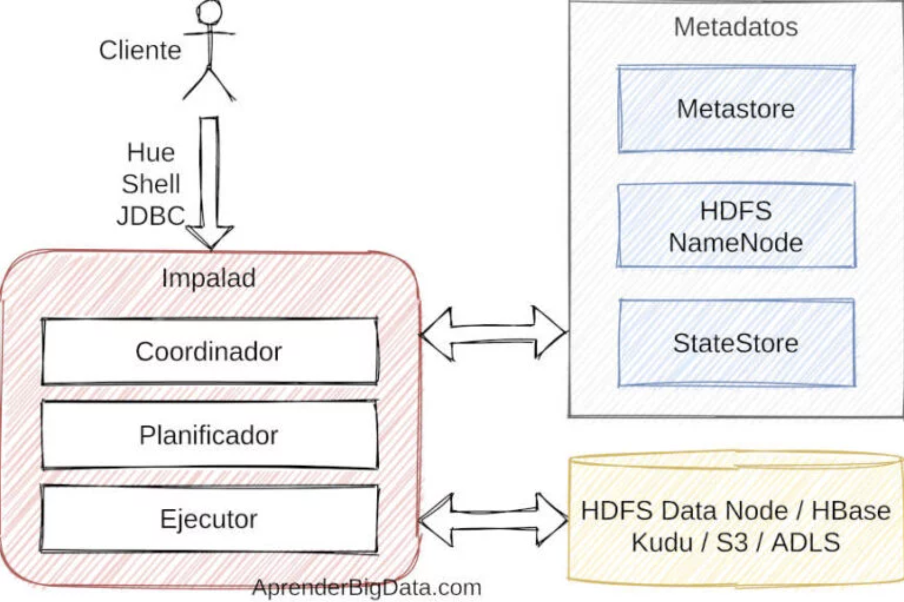

### **Overall Ecosystem:** 

Impala operates within the Hadoop ecosystem, working alongside tools such as HDFS, HBase, and Hive. It can read data from these various formats, allowing for flexibility in data storage and access. Impala is fully integrated with Hadoop, sharing the same metadata, SQL syntax, ODBC driver, and user interface as Apache Hive.

### **Processing Framework:** 

Impala uses a massively parallel processing (MPP) SQL query execution framework. It bypasses the MapReduce stage, which makes it faster for querying large datasets compared to Hive. Impala processes queries in-memory and can stream results back to the client as soon as the first row is available.

### **Dependency on Storage Systems:** 

Impala is designed to read data from multiple file formats in HDFS or HBase directly without data movement. This means that it leverages the distributed storage capabilities of the Hadoop ecosystem. However, unlike other Hadoop-based tools, it doesn't use MapReduce for data processing, making it faster for certain types of queries.

### **Index Design:** 

Impala does not have a built-in indexing mechanism. It relies on full table scans for data retrieval, which can be resource-intensive but are parallelized for improved performance. Impala's speed comes from its MPP architecture, in-memory processing, and the ability to push processing down to the data node where the data resides.

### **Advantages:** 

1. *Performance*: Impala offers superior query performance for certain types of queries, especially those requiring full table scans.
2. *SQL Support*: Impala supports a broad subset of the SQL-92 language, including joins, subqueries, and most of the standard SQL functions.
3. *Integration*: As part of the Hadoop ecosystem, Impala integrates well with other Hadoop tools like HDFS, HBase, and Hive.
4. *Real-time Query*: Impala is designed for real-time queries on Hadoop, providing a more interactive user experience than batch-oriented systems.

### **Disadvantages:** 

1. *Resource Intensive*: Full table scans can be resource-intensive, and large, complex queries can consume significant memory.
2. *Lack of Advanced SQL Features*: While Impala supports a broad subset of SQL, it does not support some advanced features and functions that other SQL-on-Hadoop tools support.
3. *No Built-In Indexing*: The lack of built-in indexing can result in performance degradation for certain types of queries.
4. *Dependency on the Hadoop Ecosystem*: While this is also an advantage, it can be a limitation for users who do not want to adopt the full Hadoop stack.

## **Presto**

Presto is an open-source distributed SQL query engine developed by Facebook, designed to query large data sets distributed over one or many heterogeneous data sources with high performance. It is currently under the auspices of the Presto Foundation, hosted by the Linux Foundation.

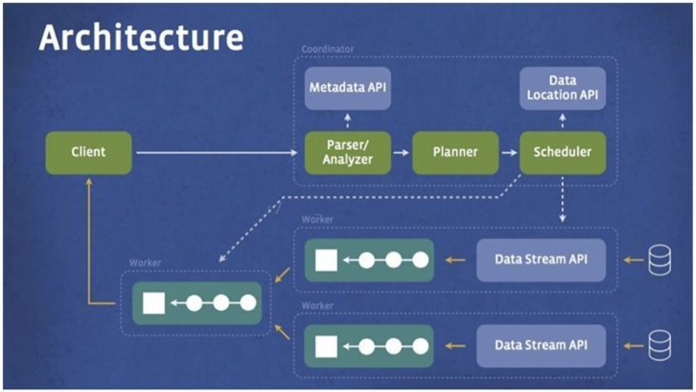

### **Overall Ecosystem:** 

Presto operates within a broad and diverse ecosystem. It can query various data sources, including Hadoop's HDFS, Amazon S3, MySQL, PostgreSQL, Cassandra, MongoDB, and many others. This allows Presto to run analytics across these disparate data sources, making it a truly federated querying engine. It can be integrated with various data visualization and reporting tools that support JDBC/ODBC drivers.

### **Processing Framework:** 

Presto is designed for interactive simple and analytical queries. It follows a distributed architecture and uses a custom query and execution engine with operators designed to support SQL semantics. Unlike traditional `MapReduce` operations in Hadoop, Presto runs queries in memory and pipelines the processing, which allows most queries to return results in seconds.

### **Dependency on Storage Systems:** 

Presto is storage-agnostic. It doesn't manage its own storage and retrieves data from various sources on-demand when a query is executed. It relies on connectors to communicate with the data sources. This design allows Presto to query data where it lives, without needing to move data into a separate analytics system.

### **Index Design:** 

Presto does not have a built-in indexing mechanism, since it does not manage storage and relies on external systems. However, it can leverage indexes provided by the storage systems if they exist, depending on the connector's capabilities. In general, Presto relies more on its ability to execute queries in parallel across a large number of nodes to achieve high performance.

### **Advantages:** 

1. *Versatility*: Presto can query data from multiple sources, making it a versatile tool for analytics.
2. *Performance*: Presto's in-memory and pipelined processing model can deliver fast query responses.
3. *SQL Support*: Presto supports standard SQL, including complex queries, aggregations, joins, and window functions.
4. *Scalability*: Presto can scale out horizontally to accommodate larger data sizes and more complex queries.

### **Disadvantages:** 

1. *No Data Writing*: Presto is designed for reading and querying data, not for writing data.
2. *Memory Intensive*: Because Presto processes data in memory, it can be resource-intensive for large queries.
3. *Lack of Built-In Security Features*: Out-of-the-box, Presto doesn't provide robust security features such as role-based access control or data encryption. These features often need to be implemented using additional tools or integrations.
4. *No Built-in Indexing or Storage*: Presto doesn't manage storage or indexing. It relies on the capabilities of the underlying data sources for these functions.

## **Druid**

Apache Druid is a high-performance, column-oriented, distributed data store. It was designed to quickly ingest massive quantities of event data and provide low-latency queries on top of the data.

The features of Druid include:

- Druid achieves real-time data consumption, truly enabling real-time data ingestion and query results.
- Druid supports the rapid processing of PB-level data and hundreds of billions of events, and can handle thousands of concurrent queries per second.
- The core of Druid is the time series, which stores data in batches according to the time series, making it very suitable for scenarios involving statistical analysis by time.
- Druid divides data columns into three categories: timestamp, dimension column, and metric column.

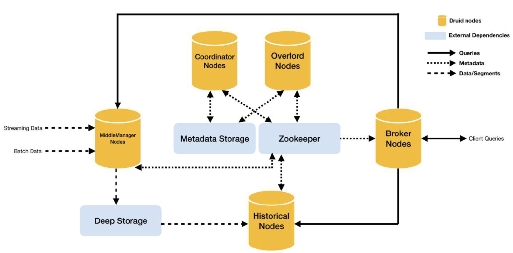

### **Overall Ecosystem:** 

Druid is often used in combination with other data processing systems such as Apache Kafka for real-time data ingestion, Hadoop for batch ingestion, and works well with BI tools such as Apache Superset or Pivot. Druid also has a robust, supportive open-source community contributing to its development and support.

### **Processing Framework:** 

Druid follows a hybrid processing model, combining the best of both streaming and batch processing. It processes real-time data streams, but also has capabilities to handle batch processing. 

### **Dependency on Storage Systems:** 

Druid can integrate with deep storage systems for data persistence, including HDFS, Amazon S3, Google Cloud Storage, and more. However, it also maintains its own segment storage format for efficient query processing.

### **Index Design:** 

Druid uses a combination of `inverted indexes` and `bitmap indexes` for querying the data. The inverted index provides a lookup from a dimension value to the rows that contain that value. The bitmap index provides a fast way to look up rows in the data. Druid's indexes are designed to optimize time series and OLAP-style queries.

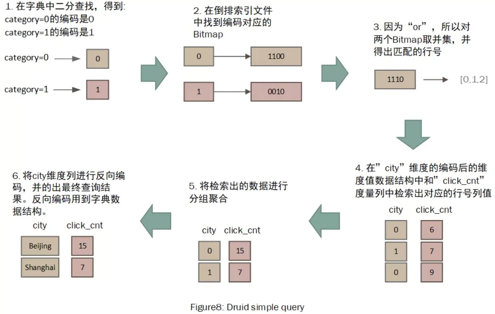

### **Advantages:** 

1. *Real-Time Processing*: Druid is designed to ingest and query data in real-time, making it suitable for use cases with low-latency requirements.
2. *Scalability*: Druid’s distributed architecture allows it to scale out to handle larger data volumes and query loads.
3. *Flexibility*: Druid can handle both streaming and batch data, and it can integrate with various storage systems and data processing frameworks.
4. *High Availability*: Druid uses replication and failover strategies to ensure that the system is always available.

### **Disadvantages:** 

1. *Complexity*: Druid has a complex architecture with multiple node types, which can make it challenging to configure and manage.
2. *Limited Transaction Support*: Like most OLAP systems, Druid does not support transactions like an OLTP system.
3. *Hardware Intensive*: Druid can be resource-intensive and may require significant hardware resources to operate effectively, especially for larger datasets.
4. *Poor Query Performance*: Similar to other time series databases, Druid may have performance issues when the query condition hits a large amount of data, and its capabilities in sorting, aggregating, etc., are generally not good. Its flexibility and scalability are insufficient, such as the lack of Join, subqueries, etc. So Druid is not suitable for handling query scenarios where the perspective dimensions are complex and variable.

## **Apache Kylin**

Apache Kylin is an open-source distributed analytical engine designed to provide a SQL interface and multi-dimensional analysis (OLAP) on large-scale data sets in the petabyte range, making "big data" more accessible to public users. It was originally developed by eBay and contributed to the Apache Software Foundation.

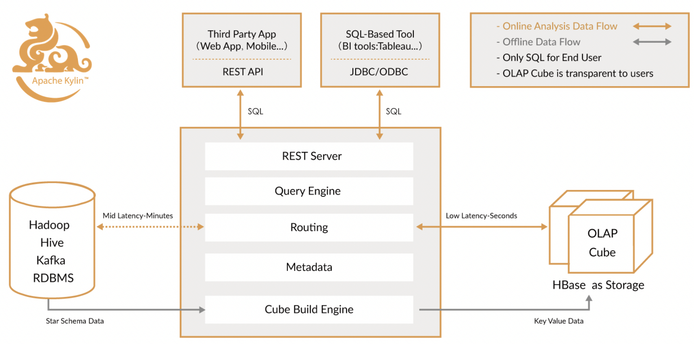

### **Overall Ecosystem:** 

Kylin fits into the broader `Hadoop` ecosystem. It leverages various other Hadoop technologies, such as HBase, MapReduce, and Zookeeper. This allows Kylin to handle large data volumes and utilize the distributed processing capabilities of Hadoop. It is capable of integrating with BI tools that support SQL and MDX for data analysis and visualization. Moreover, it supports a wide range of data sources including Apache Hive, Apache Flink, Apache Kafka, and other JDBC data sources.

### **Processing Framework:** 

Kylin precomputes and stores multi-dimensional cubes (OLAP Cubes) from the underlying large data sets using the distributed processing power of Hadoop. The cubes store aggregated data across multiple dimensions and are built using batch processing jobs run on Hadoop’s `MapReduce`. Once a cube is built, Kylin can leverage the precomputed data to answer queries quickly.

### **Dependency on Storage Systems:** 

Kylin utilizes Hadoop HDFS for storage of raw data and the intermediate data used during the cube building process. The final OLAP Cubes are stored in HBase, a distributed, scalable, big data store. This design allows Kylin to handle very large data volumes and provide fast query response times.

### **Index Design:** 

Kylin leverages Hadoop's HBase for its storage and indexing. Kylin itself pre-aggregates the data into high-dimensional OLAP cubes during the data ingestion process, which acts as a form of index and allows for rapid query execution on large volumes of data. The cuboids in the OLAP cube can be seen as multi-dimensional indexes.

### **Advantages:** 

1. *Performance*: Kylin provides sub-second query response times on massive datasets thanks to its OLAP Cube technology.
2. *Scalability*: As part of the Hadoop ecosystem, Kylin can scale to handle extremely large data sets.
3. *SQL Interface*: Kylin provides a SQL interface, making it easy to use for users familiar with SQL. It also supports MDX for multi-dimensional queries.
4. *Integration*: It integrates well with common BI tools and supports a variety of data sources.

### **Disadvantages:** 

1. *Cube Build Time*: Building the OLAP cubes can be time-consuming, especially for very large datasets. It can also be resource-intensive.
2. *Upfront Design*: The OLAP cubes need to be designed upfront, which requires a good understanding of the queries that will be run.
3. *Not for Real-Time*: While Kylin does have some support for streaming data, it is primarily designed for batch-oriented workloads. Real-time query performance may not be as good as batch performance.
4. *Complexity*: Kylin and its underlying technologies (Hadoop, HBase, etc.) can be complex to set up and manage.

## **Elasticsearch**

Elasticsearch is an open-source, RESTful, distributed search and analytics engine built on Apache Lucene. It is designed for horizontal scalability, maximum reliability, and easy management. It supports a wide variety of use cases, including log and event data analysis, real-time application monitoring, and clickstream analysis.

### **Overall Ecosystem:** 

Elasticsearch is part of the Elastic Stack, which also includes Beats for data ingestion, Logstash for centralized logging and data processing, and Kibana for data visualization. These components work together to provide an integrated solution for data ingestion, storage, analysis, and visualization. Elasticsearch also has a strong community and extensive documentation.

### **Processing Framework:** 

Elasticsearch is built around the concept of distributed, near real-time search and analytics. It uses a `scatter-gather` technique to gather the results set. 

### **Dependency on Storage Systems:** 

Elasticsearch uses its own custom storage engine and does not depend on external storage systems. It can be deployed on various types of storage hardware depending on the use case and performance requirements.

### **Index Design:** 

Elasticsearch uses an inverted index for full-text search, where each unique word is associated with all the documents that contain it. By default, Elasticsearch indexes all data in every field and each indexed field has a dedicated, optimized data structure. For example, text fields are stored in inverted indices, and numeric and geo fields are stored in BKD trees.

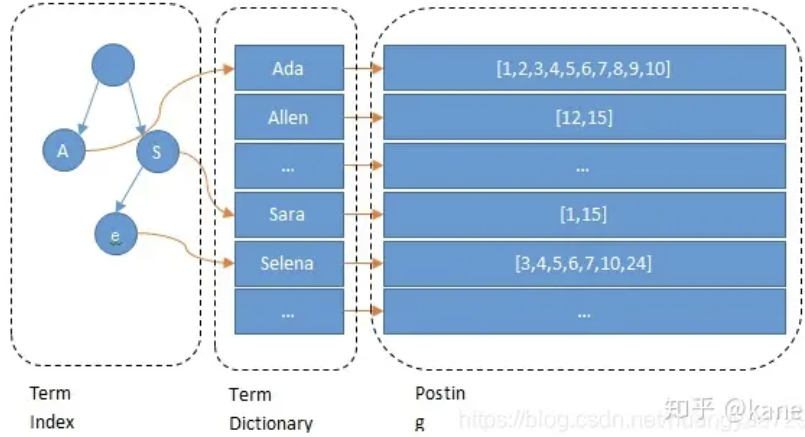

### **Advantages:** 

1. *Scalability*: Elasticsearch is designed for horizontal scalability, and nodes can be easily added to a cluster to increase capacity.
2. *Full-Text Search*: Elasticsearch provides powerful and flexible full-text search capabilities.
3. *Real-Time Analysis*: Elasticsearch supports near real-time search and analytics, making it suitable for use cases that require up-to-the-minute data.
4. *Integration*: Elasticsearch integrates well with various data ingestion, processing, and visualization tools.

### **Disadvantages:** 

1. *Complexity*: Elasticsearch can be complex to set up and manage, particularly in larger, distributed environments.
2. *Resource Intensive*: Elasticsearch can be resource-intensive and may require substantial hardware resources to handle large data volumes and complex queries.
3. *Limited Transaction Support*: While Elasticsearch can handle certain types of updates, it does not support the kind of transactions and consistency guarantees that traditional RDBMS systems do.
4. *Limited Complex Query*: The issue with the Scatter-Gather model is that if the data volume for Gather/Reduce is large, the operation might be very slow due to the fact that Elasticsearch performs it on a single node. Generally speaking, Elasticsearch sacrifices flexibility to improve the QPS (Queries Per Second) of simple OLAP queries and reduce their latency.
5. *Write Performance*: Elasticsearch is optimized for read operations. High-volume write operations can cause performance issues. Write-heavy applications may need to consider strategies like buffering and bulk indexing to mitigate this limitation.

## **Apache Doris**

Apache Doris is an MPP-based interactive SQL data warehousing for reporting and analysis. It was initially developed by Baidu and is now an Apache Software Foundation project.

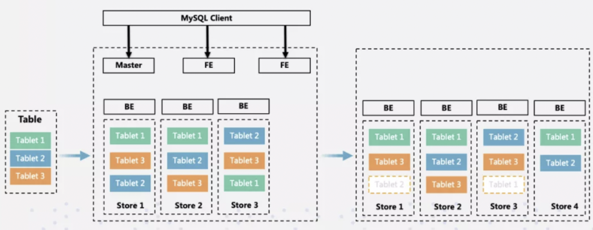

### **Overall Ecosystem:** 

Doris operates within a broad and diverse ecosystem. It has compatibility with Hadoop, Spark, Flink, and other data processing systems. It also supports integration with various data visualization and reporting tools that support MySQL protocol.

### **Processing Framework:** 

Doris follows a Massively Parallel Processing (MPP) architecture. It uses a column-oriented storage engine and vectorized execution engine to ensure fast query performance. The system supports real-time data streaming and batch data loading, providing strong support for both fast queries and high throughput analytics.

### **Dependency on Storage Systems:** 

Doris has its own column-oriented storage engine, which is specifically designed to work efficiently with the MPP framework. It supports various types of data formats for data loading, including CSV, Parquet, ORC, and others. It does not depend on external storage systems like HDFS or S3.

### **Index Design:** 

Doris uses a unique storage model and index structure. It leverages a column-oriented storage model and uses a combination of several indexes to optimize query performance, including Bitmap Indexes, Bloom Filters, and Zone Maps. The Bitmap Index and Bloom Filters help to quickly identify which rows contain a specific value or set of values, while the Zone Maps hold the minimum and maximum values for each page to filter out irrelevant data. These indexes allow Doris to reduce the amount of data that needs to be read from disk, thus improving query performance.

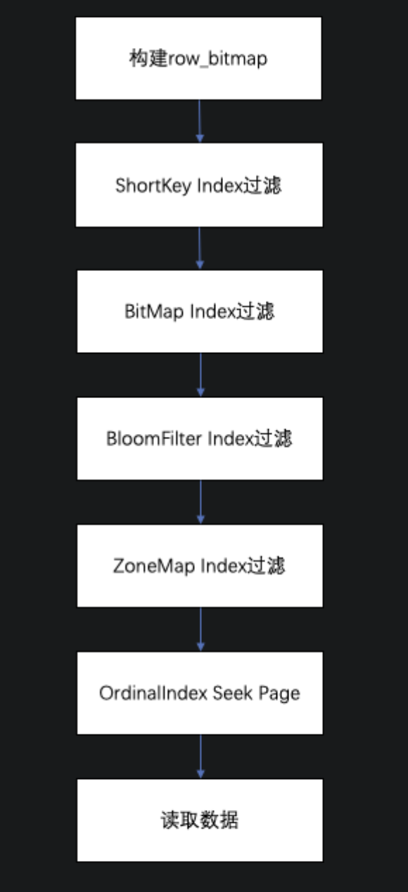

#### **Short Key Index**

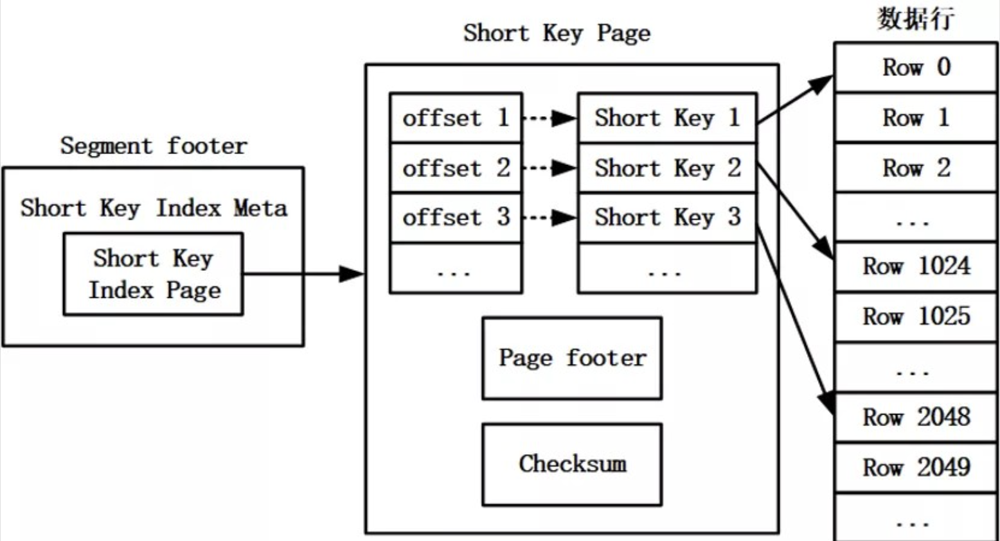

#### **Ordinal Index**

#### **Zone Map Index**

#### **Bitmap Index**

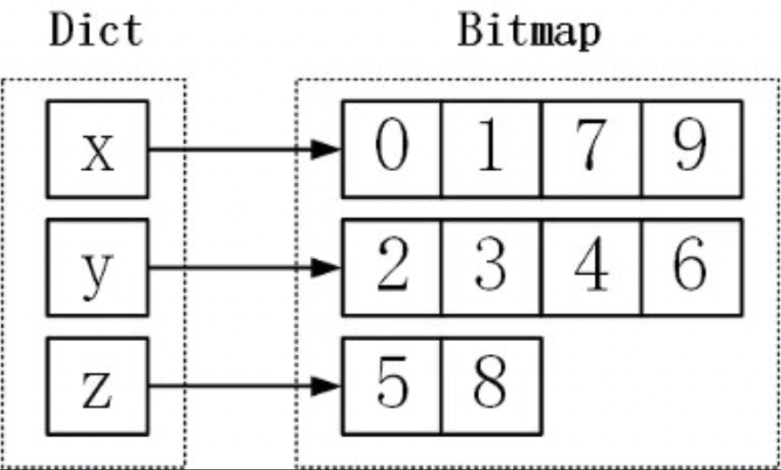

#### **BloomFilter Index**

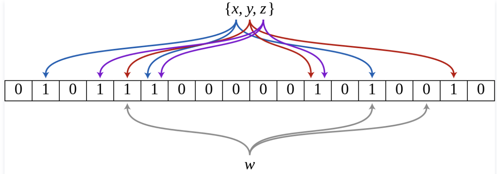

#### **Invert Index**

### **Advantages:** 

1. *Performance*: Doris's MPP architecture and vectorized execution engine provide high-performance query processing.
2. *Real-Time and Batch Loading*: Doris supports both real-time data streaming and batch data loading, offering flexibility in handling different data processing needs.
3. *High Concurrency*: Doris can support a high number of concurrent queries, making it suitable for interactive data analysis.
4. *Scalability*: Doris can be easily scaled out to support larger data volumes and more complex queries.

### **Disadvantages:** 

1. *Dependency on MySQL Protocol*: Doris uses the MySQL protocol for client connections, which might not be preferred in some use cases.
2. *Complex Setup and Management*: Setting up and managing a Doris cluster can be complex, especially for larger deployments.
3. *Limited Support for Non-Analytical Queries*: Doris is designed for OLAP and may not perform well for transactional (OLTP) workloads.

In conclusion, Doris is a powerful and flexible OLAP system with a strong focus on high-performance analytical queries. Its MPP architecture, real-time and batch data loading capabilities, and high concurrency support make it a strong choice for interactive data analysis. However, it may not be the best fit for use cases that require transactional processing or those that prefer not to use the MySQL protocol.

## **ClickHouse**

ClickHouse is an open-source column-oriented database management system (DBMS) that allows generating analytical data reports in real time. It is developed by Yandex, a Russian multinational corporation specializing in Internet-related products and services.

ClickHouse is lightweight, its features include:

- Columnar storage database, data compression.
- Relational, supports SQL.
- Distributed parallel computing, maximizing the performance of a single machine.
- High availability.
- PB-level data volume.
- Real-time data updates.
- Indexing.

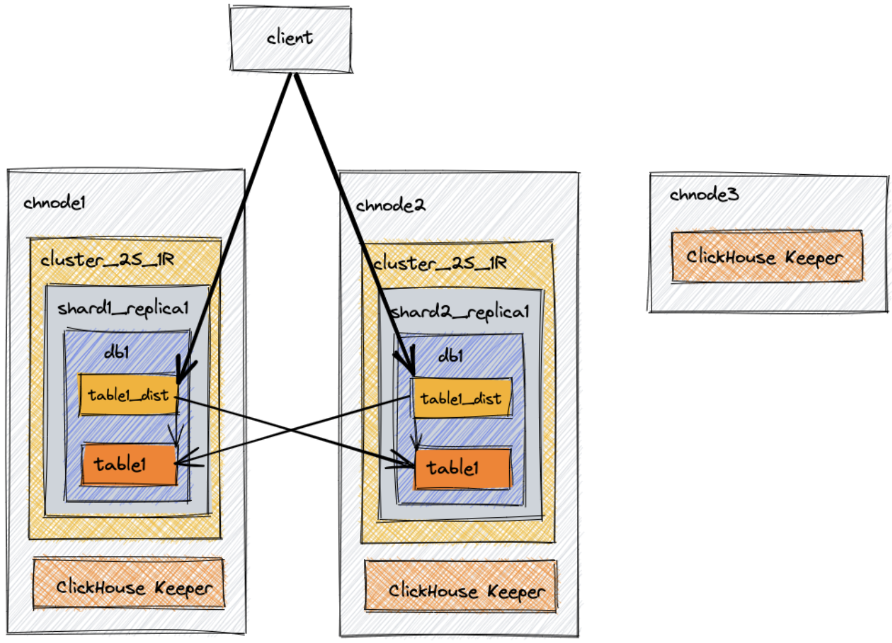

### **Overall Ecosystem:** 

ClickHouse is part of a larger ecosystem of data processing and analytics tools. It provides connectors and integrations with various systems, including Kafka, Hadoop, and MySQL. ClickHouse also has a vibrant community that contributes to its development and provides support.

### **Processing Framework:** 

ClickHouse employs a Massively Parallel Processing (MPP) framework. It distributes queries across multiple nodes and cores and aggregates the results, leading to high-speed query execution. ClickHouse also uses vectorized query execution, which further enhances performance.

### **Dependency on Storage Systems:** 

ClickHouse uses its own storage engine and does not have dependencies on external storage systems like HDFS or S3. The storage system is column-oriented, which is particularly suited to analytical queries that involve a subset of the columns in a table.

### **Index Design:** 

ClickHouse supports primary key and secondary index. The primary key index in ClickHouse is a data skipping index that allows the system to avoid scanning irrelevant data during query processing. It also supports creating secondary indexes on table data, which can further enhance query performance.

#### **Primary Index**

#### **Skipping Index**

### **Advantages:** 

1. *Performance*: ClickHouse's MPP and column-oriented architecture enable fast query execution, particularly for analytical queries.
2. *Scalability*: ClickHouse can be easily scaled horizontally to handle increased data volumes and query loads.
3. *Real-Time Query Processing*: ClickHouse can process queries in real-time, making it suitable for use cases that require up-to-the-minute data.
4. *Data Compression*: ClickHouse uses various compression methods to reduce the size of stored data, which can reduce storage costs and improve query performance.

### **Disadvantages:** 

1. *Complexity*: ClickHouse has a learning curve, and it may require time and experience to get the best performance.
2. *Limited Transactions Support*: ClickHouse is optimized for OLAP and does not support transactions like an OLTP system.
3. *Limited Consistency Guarantees*: ClickHouse follows eventual consistency model, which may not be suitable for use cases that require strong consistency guarantees.
4. *Limited SQL support*: Limited SQL support, with a distinctive implementation of join.
5. *SQL Compatability*: ClickHouse's SQL dialect may be a bit difficult to understand for developers used to standard SQL.
6. *Lack of Data Modification*: ClickHouse's SQL dialect may be a bit difficult to understand for developers used to standard SQL.

## **Apache Doris vs Clickhouse**

### **Deployment & Maintenance**

#### **Deployment & Maintenance**

Deployment involves setting up the cluster, installing relevant dependencies and core components, modifying configuration files, and ensuring the cluster runs normally. Operations & Maintenance involve daily cluster version updates, configuration file changes, expansion and contraction, and other relevant matters. The components required for the cluster are as follows:
   
On the left is the deployment architecture diagram of Doris. JDBC represents the access protocol, DNS is the domain name and request distribution system. The Management Panel is the control interface. Frontend, abbreviated as FE, includes SQL parsing, query planning, plan scheduling, metadata management, and other functions. Backend, abbreviated as BE, is responsible for storage layer, data reading and writing. Additionally, it's best to deploy the BrokerLoad loading component separately. Therefore, Doris generally only needs FE and BE two components.

On the right is the deployment architecture diagram of ClickHouse. ClickHouse itself only has one module, which is the ClickHouse Server. There are two peripheral modules, such as ClickHouseProxy, which is mainly responsible for forwarding requests, quota restrictions, and disaster recovery, etc. ZooKeeper is responsible for distributed DDL and data synchronization between replicas. ClickHouseCopier is responsible for cluster and data migration. ClickHouse generally needs the Server, ZooKeeper, and CHProxy three components.

Routine operations and maintenance, such as updating versions and changing configuration files, both require reliance on Ansible or SaltStack for batch updates. Both have some configuration files that can be hot updated without rebooting nodes, and they have session-related parameters that can be set to override configuration files. Doris has more SQL commands to assist in operations and maintenance, such as adding nodes. In Doris, you can just Add Backend, while in ClickHouse you need to modify the configuration file and distribute it to each node.

#### **User Management**

ClickHouse's permissions and quota granularity are finer, which can conveniently support multi-tenant use of shared clusters. For example, you can set query memory, query thread quantity, query timeout, etc., to limit the size of the query; at the same time, combining query concurrency and a certain number of queries within a certain time window to control the number of queries. The multi-tenant solution is very friendly to developing businesses, because using shared cluster resources can quickly dynamically adjust quotas. If the cluster resources are monopolized, the utilization rate is not high, and expansion is relatively troublesome.

#### **Cluster Migration**

Doris achieves data and metadata backup through its built-in backup/restore commands to third-party object storage or HDFS. A backup can fully export consistent data and metadata via a snapshot mechanism, and it can also perform incremental backups according to partitions to reduce backup costs. In Doris, there is an alternative method to migrate clusters. New machines are added to the existing cluster in batches, and then the old machines are gradually decommissioned. The cluster can automatically balance itself, a process that may take several days, depending on the amount of data in the cluster.

ClickHouse has several methods for data migration. For large amounts of data, the built-in Clickhouse-copier tool can be used for inter-cluster data copying to achieve data migration across clusters. This requires a lot of manual configuration, and we have made some improvements and enhancements. For smaller data volumes, SQL commands with the 'remote' keyword can be used to implement cross-cluster data migration. The official recommendation for backup and recovery from other storage media is to use file system snapshots or third-party tools such as [https://github.com/AlexAkulov/clickhouse-backup].

#### **Autoscaling**

Doris supports online dynamic expansion and reduction of the cluster. This can be done through the built-in SQL command 'alter system add/decommission backends' to expand or reduce nodes. The granularity of data balance is the tablet, each tablet is approximately hundreds of megabytes. After expansion, the tablets of the table will automatically be copied to the new BE node. If you are expanding online, you should add BE in small batches to avoid causing instability in the cluster due to excessive changes.

The expansion and reduction of ClickHouse are complex and cumbersome, and it currently does not support automatic online operations and requires in-house tool support. During expansion, new nodes need to be deployed, new shards and replicas need to be added to the configuration file, and metadata needs to be created on the new nodes. If replicas are being expanded, the data will automatically balance. If shards are being expanded, manual balancing needs to be done, or in-house tools need to be developed to automate the balancing process.

### **Distributed Capibility**

#### **Distributed Protocal & High Availability**

Doris includes the management capability of metadata in the FrontEnd, it has built-in BerkeleyDB JE HA components, which include election strategies and replica data synchronization, providing a high availability solution for FE. The metadata managed in the FE is very rich, including information about nodes, clusters, libraries, tables and users, as well as partition, Tablet and other data information, and also includes transaction, background task, DDL operation and import-related task information.

Doris's FrontEnd can deploy 3 Follwers + n Observers (n>=0) to achieve high availability of metadata and access connections. Followers participate in leader election, when a Follower crashes, a new node will be automatically elected to ensure high availability of read and write operations. Observer is a read-only extension node, which can horizontally scale to achieve read expansion. BE achieves high availability through multiple replicas, generally, it also adopts the default three replicas, and the Quorum protocol is used to ensure data consistency during writing.

Doris's metadata and data are stored in multiple replicas, it can automatically replicate and has automatic disaster recovery capabilities, the service can be automatically restarted when it crashes, the data is automatically balanced when a disk fails, a small-scale node crash will not affect the external service of the cluster, but the data balancing process after the crash will consume cluster resources, leading to a short-term overload. The architecture is shown in the following figure:

The current version of ClickHouse is based on ZooKeeper to store metadata, including distributed DDL, table and data Part information. It is slightly weak in terms of the richness of metadata, because it stores a lot of fine-grained file information, which often causes performance bottlenecks in ZooKeeper. The community also has improvement plans based on the Raft protocol. ClickHouse relies on Zookeeper to achieve data high availability, but Zookeeper brings additional operation and maintenance complexity as well as performance issues.

ClickHouse does not have centralized metadata management, each node manages separately, and high availability generally relies on the business side to implement. When a replica node in ClickHouse crashes, it does not affect queries and imports of distributed tables. Local table imports need to have disaster recovery plans in the import program, such as choosing healthy replicas, and it does affect DDL operations, which need to be dealt with promptly.

In terms of distributed capabilities, Doris has been implemented on the kernel side, with lower usage cost; whereas ClickHouse needs to rely on external measures to guarantee, with higher usage cost.

#### **Distributed Transaction**

ACID refers to the atomicity, consistency, isolation, and durability of transactions. The transactions of OLAP are reflected in several aspects, one is import, which needs to ensure the atomicity of import, and also the consistency of detailed data and materialized view data; the second is the change of metadata, which needs to ensure the strong consistency of metadata changes on all nodes; the third is to ensure data consistency when balancing data between nodes.

Doris provides transaction support for import, which can guarantee the idempotency of import, such as the atomicity of data import, if there are other errors, it will automatically roll back, and the data with the same label will not be imported repeatedly. Based on the import transaction feature, Doris has also implemented external components like the Flink-connector that can ensure data import without duplication or omission. Neither supports the BEGIN/END/COMMIT semantic transaction in the general TP scenario, it is quite clear that Doris with transaction support saves a lot of development costs compared to ClickHouse without transaction support, because in ClickHouse, all these need to be guaranteed by external import programs.

ClickHouse does not support transactions, requiring various checks and validations externally. In terms of imports, it can guarantee atomicity for less than 1 million entries, but it does not ensure consistency, for instance, when updating certain fields or updating materialized views. This operation is asynchronous in the background and requires explicitly specifying the keyword FINAL to query the final data. Moreover, other operations lack transaction support.

DDL operations in both Doris and ClickHouse are asynchronous, but Doris can ensure the consistency of metadata on all nodes. In contrast, ClickHouse can't guarantee this, which might result in some local nodes having inconsistent metadata compared to other nodes.

### **Data Import**

- Doris has built-in data import methods such as RoutineLoad, BrokerLoad, and StreamLoad. These features are very practical. Although they can't handle complex ETL logic, they support simple filtering and transformation functions, can tolerate a small amount of data abnormalities, and support ACID and idempotency of imports.
- RoutineLoad supports consuming real-time data from Kafka. It sets import parameters according to batch size, import interval, and concurrency, and is used for real-time data import.
- BrokerLoad supports importing data files from HDFS for offline imports, but the speed is not very fast.
- StreamLoad is the underlying interface for data import. More advanced features can be imported via StreamLoad after being processed by external programs.
- ClickHouse doesn't have the concept of a background import task. It primarily connects to various storage systems through various engines. Data import is atomic within 1,048,576 rows. Either all rows take effect, or all fail. However, there is no concept of transaction ID as in Doris. In Doris, inserting data with the same transaction ID is invalid, preventing duplicate imports. In ClickHouse, if data is imported repeatedly, it can only be deleted and re-imported. A distinctive feature of ClickHouse is that it can write both distributed and local tables.
- Due to the fact that ClickHouse can import to local tables and doesn't have transaction restrictions, its import performance is roughly equal to the disk writing performance of the node. Doris, on the other hand, is limited to importing distributed tables, so its import performance is slightly weaker.
- If the data volume is small, you can use the import in OLAP. If the data volume is large and the logic is complex, usually use external computing engines like Spark/Flink for ETL and import functions, mainly because imports consume cluster resources.

### **Storage Architecture**

#### **Storage Format**

Both are column stores, and the benefits of column storage are:

- In analytics scenarios, where a large number of rows but only a few columns need to be read, only the columns involved in calculations need to be read, greatly reducing IO and speeding up queries.
- The data in the same column belongs to the same type, which significantly improves the compression effect, saves storage space, and reduces storage costs.
- High compression ratio means that the same size of memory can hold more data, and the system cache effect is better.

Doris data is divided into Table, Partition, Bucket/Tablet, Segment. Partition represents the vertical division of data, generally a date column. Bucket/Tablet generally refers to the horizontal slicing of data, and the bucket rule is usually a certain primary key. Segment is the specific storage file, which contains data and index. The data part contains data from multiple columns stored in columnar format. There are three types of indexes: physical index, sparse index, and ZoneMap index.

ClickHouse is divided into DistributeTable, LocalTable, Partition, Shard, Part, Column. They roughly correspond to Doris, but in ClickHouse, each Column corresponds to a set of data files and index files. The good thing is that the system cache performance is higher, the downside is that IO is higher and there are many files. Also, ClickHouse has a Count index, so it's faster when hitting the index for Counts.

By partitioning and bucketing, users can customize the data distribution in the cluster, reducing data query scans, and facilitating cluster management. As a means of data management, Doris supports range partitioning, while ClickHouse can use expressions to customize. Doris can automatically create new partitions over time with dynamic partition configuration, and it can also do tiered storage for cold and hot data. ClickHouse distributes data among multiple nodes through the distribute engine, but because it lacks the bucket layer, it makes cluster migration and expansion more troublesome. Doris can further divide data through bucket configuration, which facilitates data balancing and migration.

#### **Table Engine/Model**

Both have typical table type (engine type) support:

- Doris: Repeatable Duplicated Key is a detailed table, dimensionally aggregated Aggregate Key, Unique Key with unique primary key. The Unique Key can be seen as a special case of the Aggregate Key. In addition, on top of these three types, Rollup (rolled up) can be built, which can be understood as a materialized view.
- ClickHouse: Mainly the MergeTree table engine family, mainly ReplicatedMergeTree with replicas, ReplacingMergeTree that can update data, and AggregatingMergeTree that can aggregate data. In addition, there are memory dictionary tables that can load data dictionaries, and memory tables that can speed up queries or achieve better write performance. A distinctive feature of ClickHouse is that distributed tables and local tables on each node have to be created separately, and materialized views cannot be automatically routed.

In addition, Doris's newly developed Primary Key model deeply optimizes read performance in real-time update scenarios, supports update semantics while avoiding the sort merge cost of the Unique key. Under the pressure of real-time updates, the query performance is 3-15 times that of the Unique key. Similarly, compared to ClickHouse's ReplicatedMergeTree, it also avoids the problem of select final/optimize final.

#### **Data Type**

ClickHouse supports many complex types such as Array/Nested/Map/Tuple/Enum, etc. These types can satisfy some special scenarios and are quite useful.

### **Query**

#### **Query Architecture**

Distributed queries refer to querying data distributed across multiple servers, much like using a single table. Distributed joins are quite complex. Doris's distributed joins include Local join, Broadcast join, Shuffle join, Hash join, etc. ClickHouse only has Local and Broadcast joins. This architecture is relatively simple, but it also limits the flexibility of Join SQL. The workaround is to implement multi-level joins through subqueries and nested queries.

Both Doris and ClickHouse support vectorized execution. Vectorization, simply understood, means executing batches of data at a time, allowing concurrent execution of multiple rows and also increasing CPU Cache hit rate. In the database field, Codegen and Vectorized always coexist. The following chart is five test SQL queries from TPC-H, where the vertical axis is query time, Type is compiled execution, TW is vectorized execution. It shows that the two have different performance in different scenarios.

#### **Concurrency Capability**

Because of MPP architecture in OLAP, every node participates in computation for every SQL, thereby accelerating massive computations. Therefore, the concurrency capability of a cluster is not much different from a single node. So, like a database, OLAP can't handle extremely high concurrency. However, there are solutions, such as increasing the number of replicas to handle larger concurrency. For example, 4 shards and 1 replica can handle 100 QPS. If you need to handle 500 QPS, you just need to expand the number of replicas to 5. Another important point is whether the query can utilize Cache, including ResultCache, Page Cache, and CPU Cache. This can further improve concurrency.

Doris has two advantages: one is that the replica setting is at the table level. You only need to set a larger number of replicas for tables with high concurrency. Of course, the number of replicas can't exceed the number of cluster nodes. ClickHouse's replica setting is at the cluster level.

#### **SQL Compatibility**

Doris is compatible with MySQL syntax, supports SQL99 standards, and some new standards of SQL2003 (such as window functions, Grouping sets).

ClickHouse partially supports the SQL-2011 standard (https://clickhouse.tech/docs/en/sql-reference/ansi/), but due to some limitations of Planner, ClickHouse's multi-table association requires a lot of SQL rewriting, such as manually pushing down conditions to subqueries, which makes complex queries inconvenient to use.

ClickHouse supports ODBC, JDBC, HTTP interfaces, while Doris supports JDBC and ODBC interfaces.

### **Storage Architecture**

### **Usage Cost**

The cost of using Doris is low. It is a system with strong metadata consistency. The data import functions are comprehensive, the query SQL standards are well compatible without the need for extra work, and the elastic scalability is good. However, ClickHouse requires a lot of work:

- ZooKeeper has performance bottlenecks that prevent the cluster scale from being particularly large
- It's almost impossible to achieve elastic scalability, manual expansion and contraction are laborious and prone to errors
- The tolerance of fault nodes is low, and a failure of a single node can cause some operations to fail
- Data import requires external assurance of data not being lost or duplicated. If the import fails, data must be deleted and re-imported
- Metadata needs to ensure consistency among all nodes by itself, occasional inconsistencies occur more often
- Distributed tables and local tables have two sets of table structures, which many users find hard to understand
- Multi-table Join SQL needs to be rewritten and optimized, dialects are numerous and almost incompatible with other engines' SQL

Therefore, when implementing ClickHouse on a large scale, it is necessary to develop a user-friendly operation and maintenance system to handle most of the daily operation and maintenance tasks.

### **Benchmark**

## **General Comparison Matrix**

| Feature \ DB                    | Doris                                                                                           | Hive                                                                                                                                           | Clickhouse                                                                                         | Elasticsearch                                                                                                                                      | Druid                                                                                                   | Kylin                                                                                                                    | Presto                                                                                                                    | Impala                                                                                                                                                |
| ------------------------------- | ----------------------------------------------------------------------------------------------- | ---------------------------------------------------------------------------------------------------------------------------------------------- | -------------------------------------------------------------------------------------------------- | -------------------------------------------------------------------------------------------------------------------------------------------------- | ------------------------------------------------------------------------------------------------------- | ------------------------------------------------------------------------------------------------------------------------ | ------------------------------------------------------------------------------------------------------------------------- | ----------------------------------------------------------------------------------------------------------------------------------------------------- |
| Data Model                      | Column-oriented DB, great for analytical processing.                                            | Schema-on-read model, making it flexible for data structure.                                                                                   | Column-oriented DB, optimized for real-time query processing.                                      | Document-oriented DB, which is flexible and capable of storing complex data types.                                                                 | Column-oriented DB, ideal for real-time analytics and OLAP.                                             | OLAP cube model, providing fast query responses.                                                                         | Schema-on-read model, ideal for data exploration.                                                                         | Column-oriented DB, built for Hadoop, excellent for analytical workloads.                                                                             |
| Query Language                  | Uses standard SQL.                                                                              | Uses HiveQL, a SQL-like query language.                                                                                                        | Uses SQL, with some proprietary functions for optimization.                                        | Uses Query DSL, a language specifically designed for Elasticsearch.                                                                                | Supports SQL.                                                                                           | Uses SQL.                                                                                                                | Uses ANSI SQL.                                                                                                            | Uses SQL-like language.                                                                                                                               |
| Scalability                     | Highly scalable with MPP architecture.                                                          | Highly scalable due to its Hadoop foundation.                                                                                                  | Highly scalable, supports distributed processing.                                                  | Highly scalable, supports horizontal scaling.                                                                                                      | Highly scalable, with fast aggregation.                                                                 | Scalable but requires significant resources for cube processing.                                                         | Highly scalable, can query petabytes of data.                                                                             | Highly scalable as it's integrated with Hadoop.                                                                                                       |
| System Stability                | Stable, used widely in production environments.                                                 | Very stable, mature as a part of the Hadoop ecosystem.                                                                                         | Stable with a strong consistency model.                                                            | Very stable, with a mature and robust system.                                                                                                      | Stable, but can have complications with high cardinality data.                                          | Stable, used widely in production environments.                                                                          | Stable, used widely in production environments.                                                                           | Stable, mature as a part of the Hadoop ecosystem.                                                                                                     |
| Fault Tolerance                 | Provides fault tolerance through data replication.                                              | Inherits Hadoop's fault-tolerance capabilities.                                                                                                | Provides fault tolerance with replicas and distributed processing.                                 | Highly fault-tolerant through data sharding and replication.                                                                                       | Provides fault tolerance through data replication.                                                      | Inherits HBase's fault-tolerance capabilities.                                                                           | Has built-in fault tolerance.                                                                                             | Inherits Hadoop's fault-tolerance capabilities.                                                                                                       |
| Data Replication                | Supports data replication.                                                                      | Data replication through HDFS.                                                                                                                 | Supports data replication.                                                                         | Provides data replication at the shard level.                                                                                                      | Supports data replication.                                                                              | Data replication through HBase.                                                                                          | Data replication through HDFS.                                                                                            | Data replication through HDFS.                                                                                                                        |
| Backup Options                  | Supports backup through manual snapshots.                                                       | Supports backup through HDFS snapshots.                                                                                                        | Supports backup through manual snapshots.                                                          | Supports backup through automatic and manual snapshots.                                                                                            | Supports backup through manual snapshots.                                                               | Supports backup through HBase snapshots.                                                                                 | Supports backup through HDFS snapshots.                                                                                   | Supports backup through HDFS snapshots.                                                                                                               |
| Ease of Use                     | Moderate learning curve.                                                                        | Moderate learning curve, need to understand Hadoop ecosystem.                                                                                  | Moderate learning curve.                                                                           | High - JSON-like documents and RESTful API.                                                                                                        | Moderate - need to understand the data ingestion process.                                               | Moderate learning curve.                                                                                                 | High - ANSI SQL and JDBC/ODBC support.                                                                                    | Moderate learning curve.                                                                                                                              |
| Concurrency                     | High, supports concurrent queries.                                                              | High, thanks to the Hadoop ecosystem.                                                                                                          | High, supports simultaneous reads and writes.                                                      | High, designed for concurrent operations.                                                                                                          | High, supports concurrent queries.                                                                      | High, supports concurrent queries.                                                                                       | High, supports concurrent queries.                                                                                        | High, supports concurrent queries.                                                                                                                    |
| Integration Capabilities        | Integrates well with other Apache projects.                                                     | Highly integrative with the Hadoop ecosystem.                                                                                                  | Supports a variety of data formats and sources, including real-time streams.                       | Supports data ingestion from multiple sources, integrates well with Logstash and Beats.                                                            | Integrates with Apache projects and supports real-time and batch ingestion.                             | Integrates with Hadoop and various BI tools.                                                                             | Integrates with many data sources through connectors.                                                                     | Integrates well with the Hadoop ecosystem and Cloudera suite.                                                                                         |
| Cost                            | Varies based on deployment, but open source.                                                    | Open source, but cost of Hadoop infrastructure should be considered.                                                                           | Open source, cost depends on deployment and hardware requirements.                                 | Open source, cost depends on deployment and hardware requirements.                                                                                 | Open source, cost depends on deployment and hardware requirements.                                      | Open source, but resource-intensive for cube processing.                                                                 | Open source, cost depends on deployment and hardware requirements.                                                        | Open source, part of Cloudera distribution, cost depends on deployment.                                                                               |
| Security                        | Provides user authentication, and IP-based permission control.                                  | Inherits Hadoop's security model, includes Kerberos authentication.                                                                            | Provides role-based access control and LDAP integration.                                           | Provides robust security features, including role-based access control and encryption.                                                             | Security features include TLS, authentication, and authorization.                                       | Inherits Hadoop's security features, and supports LDAP/Active Directory.                                                 | Supports LDAP, Kerberos, and role-based access control.                                                                   | Inherits Hadoop's security features, includes Kerberos authentication.                                                                                |
| Community Support               | Growing community support.                                                                      | Mature and large community support due to its long presence.                                                                                   | Vibrant and active community support.                                                              | Large community support and extensive documentation.                                                                                               | Active community and growing support.                                                                   | Active community support.                                                                                                | Vibrant community, backed by Facebook.                                                                                    | Large community, backed by Cloudera.                                                                                                                  |
| Deployment Options              | On-premise and cloud.                                                                           | On-premise and cloud.                                                                                                                          | On-premise and cloud.                                                                              | On-premise and cloud.                                                                                                                              | On-premise and cloud.                                                                                   | On-premise and cloud.                                                                                                    | On-premise and cloud.                                                                                                     | On-premise and cloud.                                                                                                                                 |
| Data Compression                | Supports several compression methods.                                                           | Supports various compression algorithms through Hadoop.                                                                                        | Provides a wide range of compression codecs.                                                       | Provides configurable compression options.                                                                                                         | Supports configurable data compression.                                                                 | Supports various compression algorithms through Hadoop.                                                                  | Depends on data source.                                                                                                   | Supports various compression algorithms through Hadoop.                                                                                               |
| Transaction Support             | Supports transactions.                                                                          | Does not support transactions.                                                                                                                 | Supports data insertion transactions.                                                              | Supports ACID-like transactions with versioning.                                                                                                   | Does not support transactions.                                                                          | Does not support transactions.                                                                                           | Does not support transactions.                                                                                            | Does not support transactions.                                                                                                                        |
| Real-time Analysis              | Supports real-time data ingestion and query.                                                    | Not designed for real-time processing.                                                                                                         | Supports real-time data ingestion and query.                                                       | Designed for near real-time search and analysis.                                                                                                   | Supports real-time data ingestion and query.                                                            | Real-time query after cube building.                                                                                     | Can perform real-time queries on some data sources.                                                                       | Not designed for real-time processing.                                                                                                                |
| Storage Management              | Manual storage management.                                                                      | HDFS based storage management.                                                                                                                 | Manual storage management.                                                                         | Elasticsearch manages its own storage.                                                                                                             | Manual storage management.                                                                              | HBase based storage management.                                                                                          | Depends on data source.                                                                                                   | HDFS based storage management.                                                                                                                        |
| Multi-dimensional Analysis      | Supports multi-dimensional analysis through a variety of SQL functions.                         | Limited support - requires complex SQL/HiveQL queries.                                                                                         | Supports multi-dimensional analysis through a variety of SQL functions.                            | Limited support - not designed for multi-dimensional analysis.                                                                                     | Strong support for multi-dimensional analysis.                                                          | Strong support through OLAP cube model.                                                                                  | Depends on the underlying data source.                                                                                    | Supports multi-dimensional analysis through a variety of SQL functions.                                                                               |
| Schema Evolution                | Supports schema evolution.                                                                      | Supports schema evolution due to its schema-on-read model.                                                                                     | Supports adding and modifying columns in the table.                                                | Flexible schema, supports schema evolution.                                                                                                        | Supports schema evolution.                                                                              | Supports schema evolution.                                                                                               | Supports schema evolution due to its schema-on-read model.                                                                | Supports schema evolution.                                                                                                                            |
| Extensibility                   | Moderate - requires understanding of Doris's architecture.                                      | High - can be extended with user-defined functions (UDFs) and custom SerDe.                                                                    | High - ClickHouse allows for user-defined functions.                                               | High - supports custom plugins and scripts.                                                                                                        | High - supports extensions and user-defined aggregations.                                               | Moderate - requires deep understanding of Kylin and OLAP cube model.                                                     | High - supports plugins and user-defined functions.                                                                       | High - can be extended with user-defined functions (UDFs).                                                                                            |
| **Distributed Join**            | Efficient distributed join algorithms.                                                          | MapReduce-based join, can be slow.                                                                                                             | Highly efficient distributed joins.                                                                | Limited join operations.                                                                                                                           | Limited join operations.                                                                                | Efficient distributed joins.                                                                                             | Supports distributed joins.                                                                                               | Efficient distributed joins.                                                                                                                          |
| **Distributed Architecture**    | Native distributed architecture.                                                                | Hadoop-based distributed processing.                                                                                                           | Designed as a distributed DBMS.                                                                    | Distributed search and analytics.                                                                                                                  | Native distributed architecture.                                                                        | Hadoop-based distributed processing.                                                                                     | Designed for distributed processing.                                                                                      | Native distributed architecture.                                                                                                                      |
| **Deduplication**               | Basic deduplication capabilities.                                                               | Limited deduplication.                                                                                                                         | Advanced deduplication features.                                                                   | Strong deduplication features.                                                                                                                     | Basic deduplication capabilities.                                                                       | Basic deduplication capabilities.                                                                                        | Basic deduplication capabilities.                                                                                         | Limited deduplication.                                                                                                                                |
| Write Consistency               | Doris supports write consistency at the partition level.                                        | As Hive operates on Hadoop, it follows HDFS's write-once-read-many model, ensuring strong write consistency.                                   | ClickHouse ensures write consistency at the part level (a subset of a table's data).               | Elasticsearch provides configurable write consistency (one, quorum, all), but does not guarantee strict consistency due to its distributed nature. | Druid ensures write consistency at the segment level and supports transactional data ingestion.         | Kylin leverages HBase for storage, and thus it inherits HBase's strong write consistency.                                | Presto is primarily a query engine and doesn't handle writes; consistency is managed by the underlying data source.       | Impala operates on HDFS and follows a write-once-read-many model, ensuring strong write consistency.                                                  |
| Write Atomicity                 | Doris supports atomic writes at the transaction level.                                          | Hive does not inherently support atomic writes; it relies on underlying HDFS.                                                                  | ClickHouse supports atomic writes at the part level.                                               | Elasticsearch provides atomic writes at the document level.                                                                                        | Druid supports atomic writes at the segment level.                                                      | Kylin, backed by HBase, provides atomic writes at the row level.                                                         | As Presto is a query engine, it doesn't handle writes; atomicity is managed by the underlying data source.                | Impala does not inherently support atomic writes; it relies on underlying HDFS.                                                                       |
| Write Throughput                | Doris has a high write throughput, thanks to its distributed architecture and columnar storage. | Hive's write throughput is dependent on HDFS and the resources of the Hadoop cluster. Generally, it's not optimized for high write throughput. | ClickHouse has a very high write throughput, due to its columnar storage and optimized algorithms. | Elasticsearch has a high write throughput, owing to its distributed nature and efficient indexing.                                                 | Druid's write throughput is high, especially for streaming data, due to its segment-based architecture. | Kylin's write throughput depends on HBase and the Hadoop cluster's resources. Cube processing can be resource-intensive. | Presto is primarily a query engine and does not handle writes; write throughput is managed by the underlying data source. | Impala's write throughput depends on HDFS and the resources of the Hadoop cluster. Like Hive, it's not typically optimized for high write throughput. |
| **Primary Key Constraint**      | Supports primary keys to some extent.                                                           | No native support for primary keys.                                                                                                            | Some support for primary keys.                                                                     | No native support for primary keys.                                                                                                                | No native support for primary keys.                                                                     | No native support for primary keys.                                                                                      | No native support for primary keys.                                                                                       | No native support for primary keys.                                                                                                                   |
| **Index**                       | Efficient indexing mechanisms.                                                                  | Indexing via Hadoop MapReduce.                                                                                                                 | Supports primary and secondary indexes.                                                            | Advanced indexing for search.                                                                                                                      | Advanced indexing for multi-dimensional queries.                                                        | Indexing via Hadoop MapReduce.                                                                                           | Depends on the indexing of underlying data sources.                                                                       | Efficient indexing mechanisms.                                                                                                                        |
| **Distributed Computing Model** | MPP                                                                                             | MapReduce                                                                                                                                      | Scatter-Gather                                                                                     | Scatter-Gather                                                                                                                                     | Scatter-Gather                                                                                          | Scatter-Gather                                                                                                           | MPP                                                                                                                       | MPP                                                                                                                                                   |
