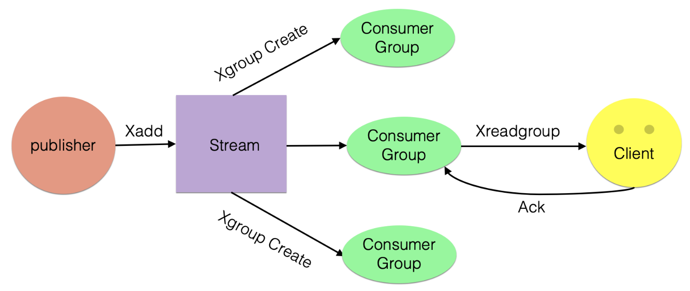
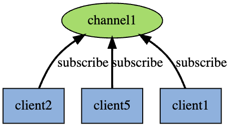
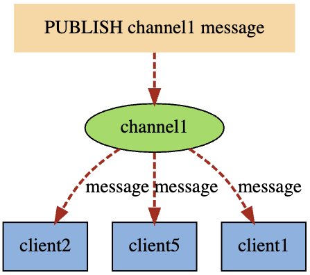
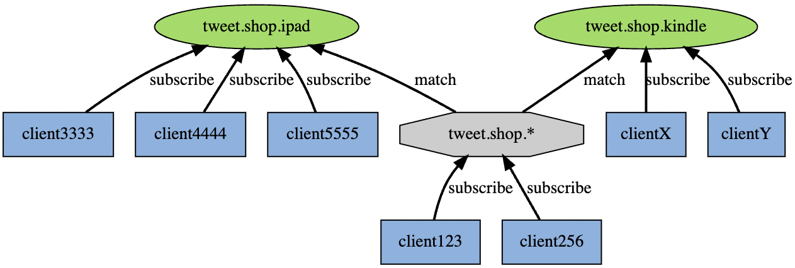
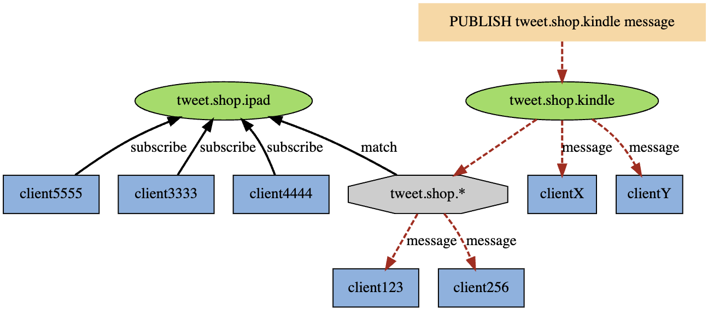
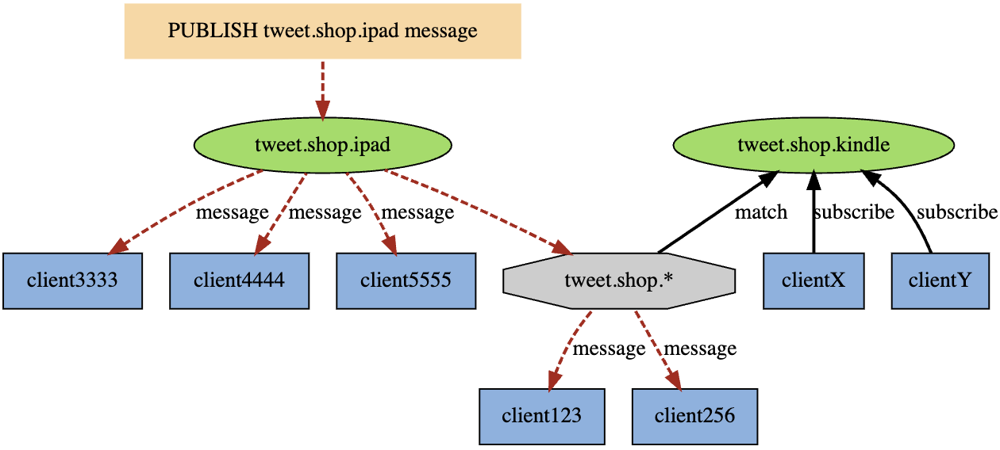

- [Introduction](#introduction)
  - [Why Redis](#why-redis)
  - [Redis Use Cases](#redis-use-cases)
- [Data Structure](#data-structure)
  - [Redis Data Types](#redis-data-types)
    - [String](#string)
    - [List](#list)
    - [Set](#set)
    - [Hash](#hash)
    - [ZSet](#zset)
    - [HyperLogLog](#hyperloglog)
    - [Bitmap](#bitmap)
    - [Geo](#geo)
  - [Stream Types(v5.0)](#stream-typesv50)
    - [Stream Structure](#stream-structure)
    - [CRUD](#crud)
    - [Single Consumer](#single-consumer)
    - [Consumer Group](#consumer-group)
  - [Redis Object](#redis-object)
    - [redisObject](#redisobject)
    - [Shared Object](#shared-object)
  - [Data Structure Implementation](#data-structure-implementation)
- [Persistence](#persistence)
  - [RDB](#rdb)
  - [AOF](#aof)
- [Pub/Sub](#pubsub)
  - [Based on Channel](#based-on-channel)
  - [Based on Pattern](#based-on-pattern)
- [Event](#event)
- [Transaction](#transaction)
  - [Commands](#commands)
  - [Standard Transaction Execution](#standard-transaction-execution)
  - [Errors Inside a Transaction](#errors-inside-a-transaction)
    - [Syntax Error](#syntax-error)
    - [Runtime Error](#runtime-error)
  - [Optimistic Locking Using CAS](#optimistic-locking-using-cas)
- [High Availability](#high-availability)
- [Scalability](#scalability)
- [Application](#application)
- [Keyspace notifications](#keyspace-notifications)
  - [Configuration](#configuration)
  - [Events Generated By Different Commands](#events-generated-by-different-commands)
  - [Example](#example)

# Introduction

> Redis 是一種支持 key-value 等多種資料結構的存儲系統, 可用於 cache, event publish 或 subscribe, 且支持網絡, 提供 string, hash, list, set 等資料類型, 且基於記憶體, 資料可實現持久化

全名為 **Remote Dictionary Server**, 使用 C 撰寫

## Why Redis

Redis 有以下幾種特點:
- r/w 性能優異: read 的速度可達 110k/s, write 可達 81k/s
- 資料類型豐富: 支持 binary Strings, Lists, Hashes, Sets 及 Ordered Sets 資料類型
- atomic: 所有操作都是 atomic operation, 還支持對幾個操作全併後的 atomic 執行
- 豐富的功能: 支持 publish/subscribe, notification, key expiration 等
- persistence: 支持 RDB, AOF 等持久化方式
- pub/sub
- distributed

官方 bench-mark 根據以下條件獲得測試結果(read 110k/s, write 81k/s)
- 50 parallel clients 併發執行 100k requests
- 更新讀取的值為 256 bytes string
- Linux 2.6, X3320 Xeon 2.5 ghz
- 文本執行使用 loopback interface(127.0.0.1)

## Redis Use Cases

> Cache hotspots

Cache 是 Redis 最常見的應用場景, 主要因為 r/w 性能優異且逐漸取代 memcached, 成為首選 server side cache component

且 Redis 支持 transaction, 能有效保證資料一致性

作為 cache 使用時一般有兩種方式保存資料:
- 取資料前先讀取 redis, 若無資料再讀取 database 並將資料寫進 redis
- insert data 時同時寫入 redis

第一種方式實現簡單, 但須注意:
- 避免 `cache breakdown`
- 資料實時性較差

第二種方式資料實時性強, 但開發時不便於統一處理

> Timelimit 業務應用

redis 支持 key expiration, 可以利用這一功能在限時的優惠活動訊息, 手機驗證碼等場景

> Counter 應用

redis 由於 `incrby` 指令可以實現 atomic 遞增, 可以運用於高併發秒殺活動, 分散式序列號生成, 具體業務還體現在如限制一個手機號碼發多少條簡訊, 一個 api 一分鐘限制多少 requests, 一個 api 一天限制調用幾次等

> Distributed Lock

主要利用 redis `setnx` 指令完成, `setnx(set if not exists)` 就是若不存在則成功設置緩存並返回 1, 否則返回 0

在 server cluster 中可能兩台機器上運行定時任務, 首先可以通過 `setnx` 設置一個 lock, 若成功設置則執行; 否則表明該定時任務已執行

此場景主要用在如秒殺系統等場景

> 延遲操作

比如在訂單產生後先佔用庫存, 10 分鐘後去檢查 user 是否真正購買, 若沒有購買則將此訂單設置無效並釋放庫存

由於 redis 從 2.8.0 後提供 `keyspace notifications`, 允許客戶訂閱 pub/sub channel, 以便以某種方式接收 redis 資料集的 event

上述需求可以在訂單產生時設置一個 key, 同時設置 10 分鐘過期, 並實現一個監聽器監聽 key 時效, key 失效後再做後續操作

此需求也可以利用 message queue 的延遲隊列來實現

> Ranking

Relational Database 在 ranking 方面查詢速度普遍偏慢, 可以借住 redis 的 `SortedSet` 進行熱點資料的排序

比如按讚排行榜, 可以做一個 `SortedSet`, 以 user openid 作為 username, 以 user 按讚數作為 score, 然後針對每個 user 做一個 `hash`, 通過 `zrangebyscore` 就可以按照點讚數獲取排行榜, 再根據 username 獲取 user hash 訊息

> 按讚, 好友等相互關係儲存

利用 redis 集合的一些指令, 如交集, 聯集, 差集等

在微薄應用中, 每個 user 關注的人存在一個集合中, 很容易實現找出兩人共同好友的功能

> Simple Queue

由於 redis 有 `list push` 和 `list pop` 這樣的指令, 所以能很方便的執行 queue operation

# Data Structure

> 對於 redis 來說, 所有的 key 都是 string

在討論基本資料結構時, 討論的都是儲存 value 的 data types, 主要包括常見 5 種 data type:
- String
- List
- Set
- Zset
- Hash

## Redis Data Types


| Type   | Value                                 | r/w performance                                                                                                                |
| ------ | ------------------------------------- | ------------------------------------------------------------------------------------------------------------------------------ |
| String | String, int, float                    | 對 String 或 String 部分操作; 對 int 或 float 進行遞增或遞減                                                                   |
| List   | Linked List, 每個節點都有一個 String  | 對 Linked List 頭尾 push 或 pop, 讀取單個或多個元素; 根據值查找或刪除元素                                                      |
| Set    | 包含 String 的無序集合                | String 集合, 確認是否存在新增, 讀取, 刪除; 計算交集, 聯級, 差集等                                                              |
| Hash   | 包含 key-value pair 的無序 hash table | 新增, 讀取, 刪除單個元素                                                                                                       |
| Zset   | 包含 key-value pair 的有序 hash table | String 成員與 float 之間的有序映射; 元素排列順序由 score 大小決定; 新增, 讀取, 刪除單個元素以及根據 score 範圍或成員來讀取元素 |

### String

> String 是 redis 中最基本的資料結構, 一個 key 對應一個 value

String 類型是 binary-safe, 即 redis 的 String 可以包含任何資料, 如數字, 字符串, jpg 圖片或者序列化物件

> Command

| Cmd    | Desc                          | Use               |
| ------ | ----------------------------- | ----------------- |
| GET    | 讀取特定 key 中的 value       | GET name          |
| SET    | 設置儲存在特定 key 中的 value | SET name value    |
| DEL    | 刪除儲存在特定 key 中的 value | DEL name          |
| INCR   | 將 key 中 value 加 1          | INCR key          |
| DECR   | 將 key 中 value 減 1          | DECR key          |
| INCRBY | 將 key 中 value 加上整數      | INCRBY key amount |
| DECRBY | 將 key 中 value 加上整數      | DECRBY key amount |

> Execution

```go
127.0.0.1:6379> set hello world
OK
127.0.0.1:6379> get hello
"world"
127.0.0.1:6379> del hello
(integer) 1
127.0.0.1:6379> get hello
(nil)
127.0.0.1:6379> set counter 2
OK
127.0.0.1:6379> get counter
"2"
127.0.0.1:6379> incr counter
(integer) 3
127.0.0.1:6379> get counter
"3"
127.0.0.1:6379> incrby counter 100
(integer) 103
127.0.0.1:6379> get counter
"103"
127.0.0.1:6379> decr counter
(integer) 102
127.0.0.1:6379> get counter
"102"
```

> Use Cases

- Cache: 將常用資料, string, 圖檔或影片等資料放到 redis 中作為 cache 以降低 db 讀寫壓力
- Counter: redis 是 single-thread model, 同時資料可以一步落地到其他 data source
- Session: session 共享

### List

> Redis 中 List 是以 double linked-list 實現

使用 List 資料結構可以輕鬆實現最新消息排隊的功能(TimeLine), 其另一個應用是 message queue, 可以利用 List push 將任務放在 List 中, 然後 worker thread 再用 pop 將任務取出執行

> Command

| Cmd    | Desc                                                                           | Use              |
| ------ | ------------------------------------------------------------------------------ | ---------------- |
| RPUSH  | 將給定 value push 至 List 右側                                                 | RPUSH key value  |
| LPUSH  | 將給定 value push 至 List 左側                                                 | LPUSH key value  |
| RPOP   | 從 List 右側 pop 出一個 value 並返回                                           | RPOP key         |
| LPOP   | 從 List 左側 pop 出一個 value 並返回                                           | LPOP key         |
| LRANGE | 讀取 List 在給定範圍內所有 value                                               | LRANGE key 0 -1  |
| LINDEX | 通過 index 讀取 List 元素; 也可以用負數下標, -1 表示 List 最後一個元素以此類推 | LINDEX key index |

> 使用 List 技巧

- LPUSH + LPOP = Stack
- LPUSH + RPOP = Queue
- LPUSH + ITRIM = Capped Collection
- LPUSH + BRPOP = Message Queue

> Execution

```go
127.0.0.1:6379> lpush mylist 1 2 ll ls mem
(integer) 5
127.0.0.1:6379> lrange mylist 0 -1
1) "mem"
2) "ls"
3) "ll"
4) "2"
5) "1"
127.0.0.1:6379> lindex mylist -1
"1"
127.0.0.1:6379> lindex mylist 10        # index不在 mylist 的区间范围内
(nil)
```

> Use Cases

- TimeLine: 發布新䩞文用 `LPUSH` 加入 timeline, 展示新的 List 訊息
- Message Queue

### Set

> Redis Set 是 String 類型的無序集合, 集合成員是唯一, 集合中不能出現重複資料

Redis Set 透過 hash table 實現, 新增, 刪除, 查詢的時間複雜度都是 O(1)

> Command

| Cmd       | Desc                                  | Use                  |
| --------- | ------------------------------------- | -------------------- |
| SADD      | 向 Set 新增一個或多個 item            | SADD key value       |
| SCARD     | 讀取 Set 成員數                       | SCARD key            |
| SMEMBERS  | 返回 Set 中所有成員                   | SMEMBERS key         |
| SISMEMBER | 判斷 member 元素是否是 Set key 的成員 | SISMEMBER key member |

其他 set operation 參考: [https://www.runoob.com/redis/redis-sets.html](https://www.runoob.com/redis/redis-sets.html)

> Execution

```go
127.0.0.1:6379> sadd myset hao hao1 xiaohao hao
(integer) 3
127.0.0.1:6379> smembers myset
1) "xiaohao"
2) "hao1"
3) "hao"
127.0.0.1:6379> sismember myset hao
(integer) 1
```

> Use Cases
- Tag: 為 user 或 訊息新增 tag, 可以推薦同一 tag 或類似 tag 給關注的 user
- 按讚, 收藏可以以 set 實現

### Hash

> Redis hash 是一個 String 類型的 field 和 value 映射表, 適合用於儲存 object

> Command

| Cmd     | Desc                          | Use                           |
| ------- | ----------------------------- | ----------------------------- |
| HSET    | 新增 key-value pair           | HSET hash-key sub-key1 value1 |
| HGET    | 讀取指定 hash-key value       | HGET hash-key key1            |
| HGETALL | 讀取 hash 所有 key-value pair | HGETALL hash-key              |
| HDEL    | 若指定 key 存於 hash 中即移除 | HDEL hash-key sub-key1        |

> Execution

```go
127.0.0.1:6379> hset user name1 hao
(integer) 1
127.0.0.1:6379> hset user email1 hao@163.com
(integer) 1
127.0.0.1:6379> hgetall user
1) "name1"
2) "hao"
3) "email1"
4) "hao@163.com"
127.0.0.1:6379> hget user user
(nil)
127.0.0.1:6379> hget user name1
"hao"
127.0.0.1:6379> hset user name2 xiaohao
(integer) 1
127.0.0.1:6379> hset user email2 xiaohao@163.com
(integer) 1
127.0.0.1:6379> hgetall user
1) "name1"
2) "hao"
3) "email1"
4) "hao@163.com"
5) "name2"
6) "xiaohao"
7) "email2"
8) "xiaohao@163.com"
```

> Use Cases
- Cache: 相比 String 更節省空間, 更直觀

### ZSet

> Redis 有序集合, 與集合一樣也是 String 類型元素的集合, 且不允許重複成員; 不同的是每個元素都會關聯一個 double 類型的 score, redis 是透過score 來為集合成員進行排序

ZSet 成員是唯一的, 但分數(score)卻可以重複

ZSet 通過兩種資料結構實現:
- ziplist: 為了提高儲存效率而設計的一種特殊編碼的 double linked-list, 可以儲存字符串或整數, 儲存整數時是採用整數的 binary 而不是字符串形式; 能在 O(1) 的時間複雜度下完成 list 兩端的 pop 和 push, 但因為每次操作都需要重新分配 ziplist 記憶體空間, 空間複雜度較高
- zSkiplist: 其性能可以保證在查詢, 刪除, 新增等操作的時候時間複雜度為 O(log(n)) 

> Command

| Cmd    | Desc                                       | Use                            |
| ------ | ------------------------------------------ | ------------------------------ |
| ZADD   | 將一個帶有指定 score 的成員新增到 ZSet     | ZADD zset-key 178 member1      |
| ZRANGE | 根據元素在 ZSet 所處的位置從中查詢多個元素 | ZRANGE zset-key 0-1 withccores |
| ZREM   | 若指定元素成員存在於 ZSet 即移除此元素     | ZREM zset-key member1          |

更多指令參考: [https://www.runoob.com/redis/redis-sorted-sets.html](https://www.runoob.com/redis/redis-sorted-sets.html)

> Execution

```go
127.0.0.1:6379> zadd myscoreset 100 hao 90 xiaohao
(integer) 2
127.0.0.1:6379> ZRANGE myscoreset 0 -1
1) "xiaohao"
2) "hao"
127.0.0.1:6379> ZSCORE myscoreset hao
"100"
```

> Use Cases
- Ranking: Zset 適合實現各種排行榜場景

### HyperLogLog

> Redis 2.8.9 新增 Hyperloglog 資料結構

HyperLogLogs 主要功能為基數統計, 即不重複的元素, 可以在統計各種計數如註冊 IP 數量, 每日訪問 IP 數量, 在線使用者數量等過程中省去大量記憶體

例如一個大型網站每天訪問 IP 有 1M, 粗算一個 IP 消耗 15 Bytes, 1M 個 IP 即 15MB, 而 HyperLogLog 在 Redis 中每個 key 佔用的大小為 12KB, 理論存儲數量接近 2^64

不管儲存的內容為何, 其為一個基於基數估算的演算法, 只能較精準的估算出基數, 可以使用少量固定的記憶體去存儲並識別集合中唯一的元素, 但估算的基數不一定準確, 是一個帶有 0.81% 標準錯誤的近似值(對於能接受一定程度容錯的場景可忽略)

> Execution

```go
127.0.0.1:6379> pfadd key1 a b c d e f g h i	# 創建第一組元素
(integer) 1
127.0.0.1:6379> pfcount key1					# 统计元素的基数数量
(integer) 9
127.0.0.1:6379> pfadd key2 c j k l m e g a		# 创建第二组元素
(integer) 1
127.0.0.1:6379> pfcount key2
(integer) 8
127.0.0.1:6379> pfmerge key3 key1 key2			# 合并两组：key1 key2 -> key3 并集
OK
127.0.0.1:6379> pfcount key3
(integer) 13
```

### Bitmap

> 即點陣圖, 用一個 bit 來表示元素狀態, 只有 0 和 1 兩種狀態

主要用於記錄兩個狀態的元素, 如 user 活躍不活躍, 登陸未登陸等

若儲存一年的打卡狀態, 365 天 = 365 bit, 相當於使用 46 bytes 記憶體左右

> Execution

使用 bitmap 紀錄一週七天打卡狀態

```go
127.0.0.1:6379> setbit sign 0 1
(integer) 0
127.0.0.1:6379> setbit sign 1 1
(integer) 0
127.0.0.1:6379> setbit sign 2 0
(integer) 0
127.0.0.1:6379> setbit sign 3 1
(integer) 0
127.0.0.1:6379> setbit sign 4 0
(integer) 0
127.0.0.1:6379> setbit sign 5 0
(integer) 0
127.0.0.1:6379> setbit sign 6 1
(integer) 0
```

查看某一天是否有打卡

```go
127.0.0.1:6379> getbit sign 3
(integer) 1
127.0.0.1:6379> getbit sign 5
(integer) 0
```

統計打卡的天數

```go
127.0.0.1:6379> bitcount sign # 统计这周的打卡记录，就可以看到是否有全勤！
(integer) 3
```

### Geo

> Redis Geo 於 3.2 版本推出, 可以推算地理位置的資訊: 兩地之間距離, 方圓幾公里有誰等

> geoadd: 新增地理位置

```go
127.0.0.1:6379> geoadd china:city 118.76 32.04 manjing 112.55 37.86 taiyuan 123.43 41.80 shenyang
(integer) 3
127.0.0.1:6379> geoadd china:city 144.05 22.52 shengzhen 120.16 30.24 hangzhou 108.96 34.26 xian
(integer) 3
```

- 有效的精度從 -180度 -- 180度
- 有效緯度從 -85.05112878度 -- 85.05112878度

```go
// # 當座標位置超出上述範圍返回錯誤
127.0.0.1:6379> geoadd china:city 39.90 116.40 beijin
(error) ERR invalid longitude,latitude pair 39.900000,116.400000
```

> geopos: 讀取只成員的經緯度

```go
127.0.0.1:6379> geopos china:city taiyuan manjing
1) 1) "112.54999905824661255"
   1) "37.86000073876942196"
2) 1) "118.75999957323074341"
   1) "32.03999960287850968"
```

> geodist: 若不存在返回空

```go
127.0.0.1:6379> geodist china:city taiyuan shenyang m
"1026439.1070"
127.0.0.1:6379> geodist china:city taiyuan shenyang km
"1026.4391"
```

> georadius: 查詢附近的位置, 通過半徑查詢

```go
127.0.0.1:6379> georadius china:city 110 30 1000 km			以 100,30 座標為中心尋找半徑為 1000km 的城市
1) "xian"
2) "hangzhou"
3) "manjing"
4) "taiyuan"
127.0.0.1:6379> georadius china:city 110 30 500 km
1) "xian"
127.0.0.1:6379> georadius china:city 110 30 500 km withdist
1) 1) "xian"
   2) "483.8340"
127.0.0.1:6379> georadius china:city 110 30 1000 km withcoord withdist count 2
1) 1) "xian"
   2) "483.8340"
   3) 1) "108.96000176668167114"
      2) "34.25999964418929977"
2) 1) "manjing"
   2) "864.9816"
   3) 1) "118.75999957323074341"
      2) "32.03999960287850968"
```

> georadiusbymember: 顯示與指定成員一定的半徑範圍內的其他成員

```go
127.0.0.1:6379> georadiusbymember china:city taiyuan 1000 km
1) "manjing"
2) "taiyuan"
3) "xian"
127.0.0.1:6379> georadiusbymember china:city taiyuan 1000 km withcoord withdist count 2
1) 1) "taiyuan"
   2) "0.0000"
   3) 1) "112.54999905824661255"
      2) "37.86000073876942196"
2) 1) "xian"
   2) "514.2264"
   3) 1) "108.96000176668167114"
      2) "34.25999964418929977"
```

> Geo 底層實現原理就是 Zset, 因此可以通過 ZSet 指令來操作 Geo

```go
127.0.0.1:6379> type china:city
zset
127.0.0.1:6379> zrange china:city 0 -1 withscores
 1) "xian"
 2) "4040115445396757"
 3) "hangzhou"
 4) "4054133997236782"
 5) "manjing"
 6) "4066006694128997"
 7) "taiyuan"
 8) "4068216047500484"
 9) "shenyang"
1)  "4072519231994779"
2)  "shengzhen"
3)  "4154606886655324"
127.0.0.1:6379> zrem china:city manjing
(integer) 1
127.0.0.1:6379> zrange china:city 0 -1
1) "xian"
2) "hangzhou"
3) "taiyuan"
4) "shenyang"
5) "shengzhen"
```

## Stream Types(v5.0)

> Redis 5.0 中新增加了一個資料類型 Stream, 其借鑒了 Kafka 的設計, 是一個新的支持 multicast 的可持久化 message queue

基於 Redis message queue 實現有很多種:
- pub/sub: 無法持久化, 若出現網路斷線, redis 崩潰訊息就會被丟棄
- 基於 List LPUSH + BRPOP 或 Sorted-Set 實現: 支持持久化但不支持 multicast 及 consumer group

設計一個良好的 MQ 需要考慮什麼?
- 訊息生產
- 訊息消費
  - singlecast
  - multicast
- 訊息有序性
- 訊息持久性

參考自美團技術團隊文章[消息隊列設計精要](https://tech.meituan.com/2016/07/01/mq-design.html)


Redis Stream 設計特點:
- 訊息 ID 序列化生成
- 訊息遍歷
- 訊息 blocking read 和 non-blocking read
- 訊息支持 consumer group
- 未完成訊息處理
- MQ 監控
- ...

> Redis Stream 是一種超輕量 MQ, 並無完全實現 MQ 所有所有設計要點, 決定其適用場景

### Stream Structure

每個 Stream 都有一個唯一的名稱, 其就是 redis key, 在首次使用 `XADD` 指令追加訊息時自動創建


- `Consumer Group`: 由 `XGROUP CREATE` 指令創建, 一個 `Consumer Group` 中有多個 `Consumer`, 其之間為競爭關係
- `last_delivered_id`: 每個 `Consumer Group` 會有個 `last_delivered_id`, 任意一個 `Consumer` 讀取了訊息都會使 `last_delivered_id` 往前移動
- `pending_ids`: `Consumer` 狀態變數, 作用是維護 `Consumer` 未確認的id, 其紀錄了當前被 client 讀取的訊息, 但還沒有 `ACK`, 又被稱為 `PFL(Pending Entries List)`用來確保 client 至少消費了訊息一次, 而不會在網路傳輸中被丟棄未處理

此外還需理解兩點:
- message ID: 形式為 timestampInMillis-sequence, 例如1527846880572-5, 表示當前訊息在毫秒時間戳 1527846880572 時產生, 且是該毫秒內產生的第 5 條訊息; message ID 可由 server 自動生成或由 client 指定, 但形式必須是 int-int, 且後面加入的訊息 ID 必須大於前面的訊息 ID
- message content: 訊息內容就是 key-value pair, 如同 hash 結構的 key-value pair

### CRUD

- `XADD`: 新增訊息到末端
- `XTRIM`: 修剪並限制 Stream 長度
- `XDEL`: 刪除訊息
- `XLEN`: 讀取 Stream 包含的元素數量, 即訊息長度
- `XRANGE`: 讀取訊息列表, 會自動過濾已刪除的訊息
- `XREVRANGE`: 反向讀取訊息列表, ID 從大到小
- `XREAD`: 以 blocking 或 non-blocking 方式讀取訊息列表

```go
# *表示 server 自動生成 ID，後面順序跟著一堆 key/value
127.0.0.1:6379> xadd codehole * name laoqian age 30  #  名字叫laoqian，年齡30岁
1527849609889-0  # 生成的訊息ID
127.0.0.1:6379> xadd codehole * name xiaoyu age 29
1527849629172-0
127.0.0.1:6379> xadd codehole * name xiaoqian age 1
1527849637634-0
127.0.0.1:6379> xlen codehole
(integer) 3
127.0.0.1:6379> xrange codehole - +  # -表示最小值, +表示最大值
127.0.0.1:6379> xrange codehole - +
1) 1) 1527849609889-0
   1) 1) "name"
      1) "laoqian"
      2) "age"
      3) "30"
2) 1) 1527849629172-0
   1) 1) "name"
      1) "xiaoyu"
      2) "age"
      3) "29"
3) 1) 1527849637634-0
   1) 1) "name"
      1) "xiaoqian"
      2) "age"
      3) "1"
127.0.0.1:6379> xrange codehole 1527849629172-0 +  # 指定最小訊息ID的列表
1) 1) 1527849629172-0
   2) 1) "name"
      2) "xiaoyu"
      3) "age"
      4) "29"
2) 1) 1527849637634-0
   2) 1) "name"
      2) "xiaoqian"
      3) "age"
      4) "1"
127.0.0.1:6379> xrange codehole - 1527849629172-0  # 指定最大訊息ID的列表
1) 1) 1527849609889-0
   2) 1) "name"
      2) "laoqian"
      3) "age"
      4) "30"
2) 1) 1527849629172-0
   2) 1) "name"
      2) "xiaoyu"
      3) "age"
      4) "29"
127.0.0.1:6379> xdel codehole 1527849609889-0
(integer) 1
127.0.0.1:6379> xlen codehole  # 長度不受影響
(integer) 3
127.0.0.1:6379> xrange codehole - +  # 被刪除的訊息消失
1) 1) 1527849629172-0
   2) 1) "name"
      2) "xiaoyu"
      3) "age"
      4) "29"
2) 1) 1527849637634-0
   2) 1) "name"
      2) "xiaoqian"
      3) "age"
      4) "1"
127.0.0.1:6379> del codehole  # 刪除整个Stream
(integer) 1
```

### Single Consumer

可以在不定義 consumer group 時進行 Stream 訊息的獨立消費, 當 Stream 沒有新訊息時甚至可以 blocking wait

Redis 設計了一個單獨的消費指令 `XREAD`, 可以將 Stream 當成普通的訊息對列(list)使用, 使用時可以完全忽略 consumer group 的存在

```go
# 從 Stream 頭部讀取兩個訊息
127.0.0.1:6379> xread count 2 streams codehole 0-0
1) 1) "codehole"
   2) 1) 1) 1527851486781-0
         2) 1) "name"
            2) "laoqian"
            3) "age"
            4) "30"
      2) 1) 1527851493405-0
         2) 1) "name"
            2) "yurui"
            3) "age"
            4) "29"
# 從 Stream 尾部讀取一條訊息, 這裡不會返回任何訊息
127.0.0.1:6379> xread count 1 streams codehole $
(nil)
# 從尾部 blocking 等待新訊息, 下面的指令阻塞直到新訊息到來
127.0.0.1:6379> xread block 0 count 1 streams codehole $
# 重新打開一個窗口, 從這個窗口往 Stream 塞訊息
127.0.0.1:6379> xadd codehole * name youming age 60
1527852774092-0
# 切換到前面窗口發現阻塞解除, 返回新的訊息內容
# 並顯示一個等待時間, 這裡等待了 93s
127.0.0.1:6379> xread block 0 count 1 streams codehole $
1) 1) "codehole"
   2) 1) 1) 1527852774092-0
         2) 1) "name"
            2) "youming"
            3) "age"
            4) "60"
(93.11s)
```

Client 若想使用 `XREAD` 進行順序消費, 一定要返回訊息 ID, 下次繼續調用 `XREAD` 時將上次返回的最後一個訊息 ID 作為參數傳遞進去就可以繼續消費後續訊息

block 0 表示永遠 blocking 直到訊息到來, block 1000 表示 blocking 1s, 1s 內沒有訊息來則返回 nil

```go
127.0.0.1:6379> xread block 1000 count 1 streams codehole $
(nil)
(1.07s)
```

### Consumer Group



## Redis Object


### redisObject

### Shared Object

## Data Structure Implementation

# Persistence

## RDB

## AOF

# Pub/Sub

> Redis Pub/Sub 是一種 message communication model: pub 負責發送訊息, sub 負責接收訊息

Redis `SUBSCRIBE` 指令可以讓 client subscribe 任意數量的 channel, 每當有新 message 發送到被訂閱的 channel 時, message 就會被發送給所有 subscribe channel 的 clients

下圖展示了 channel1 以及 subscribe 此 channel 的三個 clients: client2, client5 和 client1 之間的關係:



當有新的 message 通過 `PUBLISH` 發送到 channel1 時, 這個 message 就會被發送給訂閱它的三個 clients:



## Based on Channel

Pub/Sub 包含兩種角色, publisher 可以向指定的 channel 發送 message; Subscriber 可以訂閱一個或多個 channel, 所有 subscribe channel 的 subscriber 都會收到 message


> Publisher publish message

使用 `PUBLISH`:

```go
127.0.0.1:6379> publish channel:1 hi
(integer) 1
```

Return 表示接受到這條 message 的 subscriber 數量, 發出去的 message 不會做持久化, 也就是當有 client subscribe channel:1 後只能接收到後續 publish 的 message, 無法接收之前的

> Subscriber subsribe channel

使用 `SUBSCRIBE`, 可同時 subscribe 多個 channels:

```go
127.0.0.1:6379> subscribe channel:1
Reading messages... (press Ctrl-C to quit)
1) "subscribe" // message type
2) "channel:1" // channel
3) "hi" // message content
```

執行 `SUBSCRIBE` 後無法使用 `SUBSCRIBE`, `UNSUBSCRIBE`, `PSUBSCRIBE` 和 `PUNSUBSCRIBE` 四個屬於 `pub/sub` 之外的指令, 否則會報錯

進入 subscribe status 後 client 可能收到 3 種類型回覆, 每種類型回覆都包含三個值, 第一個值為 message type, 第二三個值可能根據 message type 而有所不同

Message type 值可能為以下三種:
- `subscribe`: 表示 subscribe 成功後 return, 第二個值為 subscribe 的 channel 名稱, 第三個值為當前 client subscribe channels 數量
- `message`: 表示接收 message 成功後 return, 第二個值表示產生 message 的 channel 名稱, 第三個值為 message content
- `unsubscribe`: 表示成功取消 subscribe channel, 第二個值是對應的 channel 名稱, 第三個值是當前 client subscribe channels 數量, 當此值為 0 時 client 會退出訂閱狀態, 之後就可以執行其他非 `pub/sub` 指令

## Based on Pattern

若有某個/某些 pattern 和此 channel match, 那麼所有 subscribe 這個 channel 的 clients 也同樣會收到 message

當 `tweet.shop.*` pattern 匹配了 `tweet.shop.kindle` channel 和 `tweet.shop.ipad` channel, 且有三個不同的 clients 分別 subscribe 他們三個:



當有 message 發送到 `tweet.shop.kindle` channel 時, 除了 `clientX` 和 `clientY` 之外還會發送給 subscribe `tweet.shop.*` pattern 的 `client123` 和 `client256`



另一方面若接收到 message 的是 channel `tweet.shop.ipad`, `client123` 和 `client256`同樣會收到 message:



通配符中 `?` 表示一個占位符, `*` 表示任意個占位符(包含0), `?*` 表示一個以上占位符

Publish:

```go
127.0.0.1:6379> publish c m1
(integer) 0
127.0.0.1:6379> publish c1 m1
(integer) 1
127.0.0.1:6379> publish c11 m1
(integer) 0
127.0.0.1:6379> publish b m1
(integer) 1
127.0.0.1:6379> publish b1 m1
(integer) 1
127.0.0.1:6379> publish b11 m1
(integer) 1
127.0.0.1:6379> publish d m1
(integer) 0
127.0.0.1:6379> publish d1 m1
(integer) 1
127.0.0.1:6379> publish d11 m1
(integer) 1
```

PSubscribe:

```go
127.0.0.1:6379> psubscribe c? b* d?*
Reading messages... (press Ctrl-C to quit)
1) "psubscribe"
2) "c?"
3) (integer) 1
1) "psubscribe"
2) "b*"
3) (integer) 2
1) "psubscribe"
2) "d?*"
3) (integer) 3
1) "pmessage"
2) "c?"
3) "c1"
4) "m1"
1) "pmessage"
2) "b*"
3) "b"
4) "m1"
1) "pmessage"
2) "b*"
3) "b1"
4) "m1"
1) "pmessage"
2) "b*"
3) "b11"
4) "m1"
1) "pmessage"
2) "d?*"
3) "d1"
4) "m1"
1) "pmessage"
2) "d?*"
3) "d11"
4) "m1"
```

>❗️Note:
- 使用 `PSUBSCRIBE` 指令可以重複訂閱同個 channal, 當有 message 時期會收到兩條 messages
- `PUNSUBSCRIBE` 指令可以退訂指定規則, 用法為 `punsubscribe [pattern [pattern ...]]`, 若不帶參數則會退訂所有規則
- 使用 `PUNSUBSCRIBE` 只能退訂通過 `PSUBSCRIBE` 訂閱的規則, 不會直接影響 `SUBSCRIBE` 訂閱的 channels; `UNSUBSCRIBE` 同理
- `PUNSUBSCRIBE` 指令退訂某個規則時不會將其中通配符展開, 而是進行嚴格字符串匹配, 所以 `PUNSUBSCRIBE *` 無法退訂 `c*` 規則, 必須使用 `PUNSUBSCRIBE c*` 才可退訂
# Event

# Transaction

> Redis transaction 本質為一組指令的集合, transaction 支持一次執行多個指令, 一個 transaction 中所有指令都會被序列化, 執行過程也會按照順序串行執行 Queue 中的指令, 不會被其他指令插入到執行序列中

## Commands

- MULTI: 開啟 transaction, redis 會將後續的指令逐個放入 Queue
- EXEC: 執行 transaction 中所有的指令
- DISCARD: 取消 transaction
- WATCH: 標記一個或多個 key, 若 key(s) 在 transaction 執行前被修改則 transaction aborted
- UNWATCH: 取消 WATCH 對所有 key(s) 標記

## Standard Transaction Execution

分別為 `k1`, `k2` 賦值, 並在 transaction 中修改 `k1`, `k2`:

```go
127.0.0.1:6379> SET k1 v1
OK
127.0.0.1:6379> SET k2 v2
OK
127.0.0.1:6379> MULTI
OK
127.0.0.1:6379> SET k1 11
QUEUED
127.0.0.1:6379> SET k2 22
QUEUED
127.0.0.1:6379> EXEC
1) OK
2) OK
127.0.0.1:6379> GET k1
"11"
127.0.0.1:6379> GET k2
"22"
127.0.0.1:6379>
```

取消 transaction:

```go
127.0.0.1:6379> MULTI
OK
127.0.0.1:6379> SET k1 33
QUEUED
127.0.0.1:6379> SET k2 34
QUEUED
127.0.0.1:6379> DISCARD
OK
```

## Errors Inside a Transaction

### Syntax Error

開啟 transaction 後修改 `k1` 為 11, `k2` 為 22, `k2` syntax error 最終導致 transaction commit failed, `k1`, `k2` 沒有任何修改:

```go
127.0.0.1:6379> SET k1 v1
OK
127.0.0.1:6379> SET k2 v2
OK
127.0.0.1:6379> MULTI
OK
127.0.0.1:6379> SET k1 11
QUEUED
127.0.0.1:6379> SETS k2 22
(error) ERR unknown command `sets`, with args beginning with: `k2`, `22`, 
127.0.0.1:6379> EXEC
(error) EXECABORT Transaction discarded because of previous errors.
127.0.0.1:6379> GET k1
"v1"
127.0.0.1:6379> GET k2
"v2"
127.0.0.1:6379>
```

### Runtime Error

開啟 transaction 後修改 `k1` 值為 11, `k2` 值為 22, 但 runtime 檢查 `k2` 型別錯誤導致 transaction commit failed, 但 transaction 並沒有 rollback, 而是跳過錯誤指令繼續執行, 結果 `k1` 修改而 `k2` 沒有修改:

```go
127.0.0.1:6379> SET k1 v1
OK
127.0.0.1:6379> SET k1 v2
OK
127.0.0.1:6379> MULTI
OK
127.0.0.1:6379> SET k1 11
QUEUED
127.0.0.1:6379> LPUSH k2 22
QUEUED
127.0.0.1:6379> EXEC
1) OK
2) (error) WRONGTYPE Operation against a key holding the wrong kind of value
127.0.0.1:6379> GET k1
"11"
127.0.0.1:6379> GET k2
"v2"
127.0.0.1:6379>
```

## Optimistic Locking Using CAS

> `WATCH` 指令可以為 Redis transaction 提供 CAS 行為

若被 `WATCH` 標記的 key 在 transaction `EXEC` 前被修改則整個 transaction 會被取消, `EXEC` 返回 `nil-reply` 表示 transaction 已經失敗

假設需要原子性對某個值進行自增 1 的操作(不使用 `INCR`):

```go
val = GET mykey
val = val + 1
SET mykey $val
```

上述程式只有在 single client 中可以運行順利, 若遇到 multiple client 同時對一個 key 進行如上操作即會產生 `race condition`

通過 `WATCH` 可以輕鬆避免 `race condition` 問題:

```go
WATCH mykey
val = GET mykey
val = val + 1
MULTI
SET mykey $val
EXEC
```

`WATCH` 執行之後到 `EXEC` 執行前, 如果 `mykey` 值被修改則當前 client transaction 就會失敗, 程式就可以透過重試操作直到未發生碰撞為止

大多數情況下發生碰撞的概率很低, 因此通常不需要進行重試, 此種形式的 lock 稱為 `Optimistic Lock`

# High Availability
# Scalability
# Application

# Keyspace notifications

> Monitor changes to Redis keys and values in real time

Keyspace notifications allow clients to subscribe to `Pub/Sub` channels in order to receive `events` affecting the Redis data set in some way.

Examples of events that can be received are:

- All the commands affecting a given key.
- All the keys receiving an LPUSH operation.
- All the keys expiring in the database 0.

## Configuration

> ❗️By default keyspace event notifications are disabled because while not very sensible the feature uses some CPU power. Notifications are enabled using the notify-keyspace-events of redis.conf or via the CONFIG SET.

```go
_, err := rdb.Do(context.Background(), "CONFIG", "SET", "notify-keyspace-events", "Ex").Result() // this is telling redis to publish events since it's off by default.
if err != nil {
   fmt.Printf("unable to set keyspace events %v", err.Error())
   os.Exit(1)
}
```

Parameter:

```
K     Keyspace events, published with __keyspace@<db>__ prefix.
E     Keyevent events, published with __keyevent@<db>__ prefix.
g     Generic commands (non-type specific) like DEL, EXPIRE, RENAME, ...
$     String commands
l     List commands
s     Set commands
h     Hash commands
z     Sorted set commands
t     Stream commands
d     Module key type events
x     Expired events (events generated every time a key expires)
e     Evicted events (events generated when a key is evicted for maxmemory)
m     Key miss events (events generated when a key that doesn't exist is accessed)
n     New key events (Note: not included in the 'A' class)
A     Alias for "g$lshztxed", so that the "AKE" string means all the events except "m".
```

## Events Generated By Different Commands
- 
- `DEL` generates a del event for every deleted key.
- `RENAME` generates two events, a rename_from event for the source key, and a rename_to event for the destination key.
- `MOVE` generates two events, a move_from event for the source key, and a move_to event for the destination key.
- `COPY` generates a copy_to event.
- `MIGRATE` generates a del event if the source key is removed.
- `RESTORE` generates a restore event for the key.
- `EXPIRE` and all its variants (`PEXPIRE`, `EXPIREAT`, `PEXPIREAT`) generate an expire event when called with a positive timeout (or a future timestamp). Note that when these commands are called with a negative timeout value or timestamp in the past, the key is deleted and only a del event is generated instead.
- `SORT` generates a sortstore event when STORE is used to set a new key. If the resulting list is empty, and the STORE option is used, and there was already an existing key with that name, the result is that the key is deleted, so a del event is generated in this condition.
- `SET` and all its variants (`SETEX`, `SETNX`,`GETSET`) generate set events. However SETEX will also generate an expire events.
- `MSET` generates a separate set event for every key.
- `SETRANGE` generates a setrange event.
- `INCR`, `DECR`, `INCRBY`, `DECRBY` commands all generate incrby events.
- `INCRBYFLOAT` generates an incrbyfloat events.
- `APPEND` generates an append event.
- `LPUSH` and `LPUSHX` generates a single lpush event, even in the variadic case.
- `RPUSH` and `RPUSHX` generates a single rpush event, even in the variadic case.
- `RPOP` generates an rpop event. Additionally a del event is generated if the key is removed because the last element from the list was popped.
- `LPOP` generates an lpop event. Additionally a del event is generated if the key is removed because the last element from the list was popped.
- `LINSERT` generates an linsert event.
- `LSET` generates an lset event.
- `LREM` generates an lrem event, and additionally a del event if the resulting list is empty and the key is removed.
- `LTRIM` generates an ltrim event, and additionally a del event if the resulting list is empty and the key is removed.
- `RPOPLPUSH` and `BRPOPLPUSH` generate an rpop event and an lpush event. In both cases the order is guaranteed (the lpush event will always be delivered after the rpop event). Additionally a del event will be generated if the resulting list is zero length and the key is removed.
- `LMOVE` and `BLMOVE` generate an lpop/rpop event (depending on the wherefrom argument) and an lpush/rpush event (depending on the whereto argument). In both cases the order is guaranteed (the lpush/rpush event will always be delivered after the lpop/rpop event). Additionally a del event will be generated if the resulting list is zero length and the key is removed.
- `HSET`, `HSETNX` and `HMSET` all generate a single hset event.
- `HINCRBY` generates an hincrby event.
- `HINCRBYFLOAT` generates an hincrbyfloat event.
- `HDEL` generates a single hdel event, and an additional del event if the resulting hash is empty and the key is removed.
- `SADD` generates a single sadd event, even in the variadic case.
- `SREM` generates a single srem event, and an additional del event if the resulting set is empty and the key is removed.
- `SMOVE` generates an srem event for the source key, and an sadd event for the destination key.
- `SPOP` generates an spop event, and an additional del event if the resulting set is empty and the key is removed.
- `SINTERSTORE`, `SUNIONSTORE`, `SDIFFSTORE` generate sinterstore, sunionstore, sdiffstore events respectively. In the special case the resulting set is empty, and the key where the result is stored already exists, a del event is generated since the key is removed.
- `ZINCR` generates a zincr event.
- `ZADD` generates a single zadd event even when multiple elements are added.
- `ZREM` generates a single zrem event even when multiple elements are deleted. When the resulting sorted set is empty and the key is generated, an additional del event is generated.
- `ZREMBYSCORE` generates a single zrembyscore event. When the resulting sorted set is empty and the key is generated, an additional del event is generated.
- `ZREMBYRANK` generates a single zrembyrank event. When the resulting sorted set is empty and the key is generated, an additional del event is generated.
- `ZDIFFSTORE`, `ZINTERSTORE` and `ZUNIONSTORE` respectively generate zdiffstore, zinterstore and zunionstore events. In the special case the resulting sorted set is empty, and the key where the result is stored already exists, a del event is generated since the key is removed.
- `XADD` generates an xadd event, possibly followed an xtrim event when used with the MAXLEN subcommand.
- `XDEL` generates a single xdel event even when multiple entries are deleted.
- `XGROUP CREATE` generates an xgroup-create event.
- `XGROUP CREATECONSUMER` generates an xgroup-createconsumer event.
- `XGROUP DELCONSUMER` generates an xgroup-delconsumer event.
- `XGROUP DESTROY` generates an xgroup-destroy event.
- `XGROUP SETID` generates an xgroup-setid event.
- `XSETID` generates an xsetid event.
- `XTRIM` generates an xtrim event.
- `PERSIST` generates a persist event if the expiry time associated with key has been successfully deleted.
- Every time a key with a time to live associated is removed from the data set because it expired, an expired event is generated.
- Every time a key is evicted from the data set in order to free memory as a result of the maxmemory policy, an evicted event is generated.
- Every time a new key is added to the data set, a new event is generated.

## Example

```go
func main() {
	rdb := redis.NewClient(&redis.Options{
		Addr:        "redis:6379",
		DB:          0,
		ReadTimeout: -1,
	})

	ctx := context.Background()

	//set up redis keyspace notification config
	_, err := rdb.Do(context.Background(), "CONFIG", "SET", "notify-keyspace-events", "Ex").Result()
	if err != nil {
		fmt.Printf("unable to set keyspace events %v", err.Error())
		os.Exit(1)
	}

	// subscribe to events published in the keyevent channel, specifically for expired events
	pubSub := rdb.PSubscribe(ctx, "__keyevent@0__:expired")
	defer pubSub.Close()

	expiredCh := pubSub.Channel()

	go func() {
		for i := 0; i <= 10; i++ {
			dynamicKey := fmt.Sprintf("event_%v", i)
			rdb.Set(context.Background(), dynamicKey, "notify-test", time.Second*time.Duration(i*2)).Result()
		}
	}()

	for {
		select {
		case <-ctx.Done():
			return
		case msg := <-expiredCh:
			log.Info().Msgf("received key event message from redis: %v", msg.Payload)
		}
	}
}
```