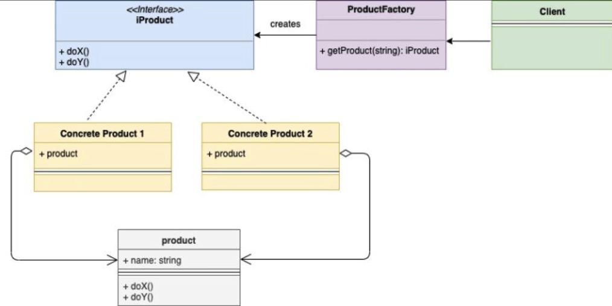
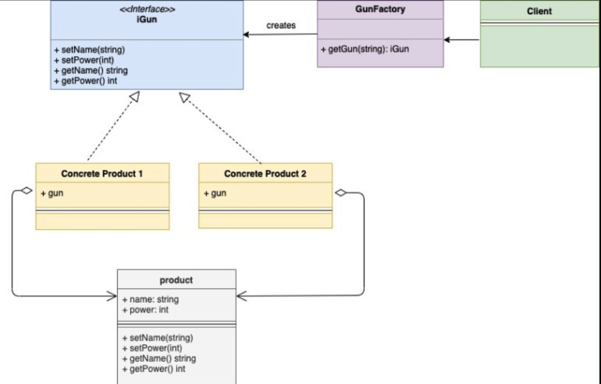
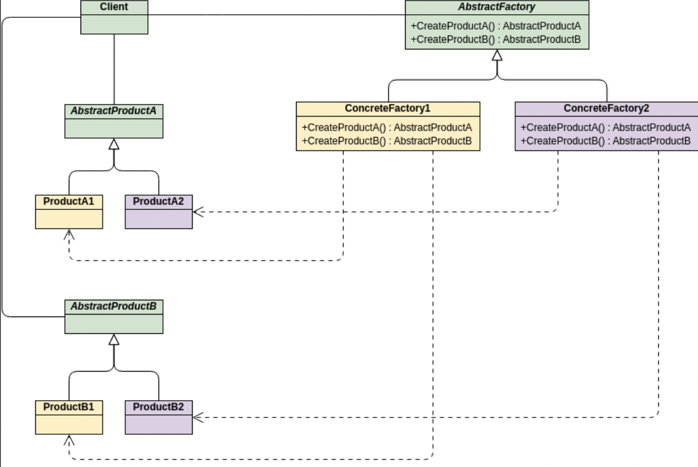

- [Creational](#creational)
  - [Singleton Design Pattern](#singleton-design-pattern)
    - [Double-Checked Locking / DCL](#double-checked-locking--dcl)
    - [init()](#init)
    - [sync.Once](#synconce)
  - [Factory Design Pattern](#factory-design-pattern)
  - [Abstract Factory Pattern](#abstract-factory-pattern)
  - [Builder Design Pattern](#builder-design-pattern)
  - [Prototype Design Pattern [x]](#prototype-design-pattern-x)
- [Structural](#structural)
  - [Proxy Design Pattern](#proxy-design-pattern)
  - [Bridge Design Pattern](#bridge-design-pattern)
  - [Decorator Design Pattern](#decorator-design-pattern)
  - [Adapter Design Pattern](#adapter-design-pattern)
  - [Facade Design Pattern [x]](#facade-design-pattern-x)
  - [Composite Design Pattern [x]](#composite-design-pattern-x)
  - [Flyweight Design Pattern [x]](#flyweight-design-pattern-x)
- [Behavioral](#behavioral)
  - [Observer Design Pattern](#observer-design-pattern)
  - [Template Method Design Pattern](#template-method-design-pattern)
  - [Strategy Method Design Pattern](#strategy-method-design-pattern)
  - [Chain Of Responsibility Design Pattern](#chain-of-responsibility-design-pattern)
  - [State Design Pattern](#state-design-pattern)
  - [State Design Pattern](#state-design-pattern-1)
  - [Iterator Design Pattern](#iterator-design-pattern)
  - [Visitor Design Pattern [x]](#visitor-design-pattern-x)
  - [Memento Design Pattern [x]](#memento-design-pattern-x)
  - [Command Design Pattern [x]](#command-design-pattern-x)
  - [Interpreter Design Pattern [x]](#interpreter-design-pattern-x)
  - [Mediator Design Pattern [x]](#mediator-design-pattern-x)
- [Synchronization](#synchronization)
- [Concurrency](#concurrency)
- [Messaging](#messaging)
- [Stability](#stability)
  
# Creational

## Singleton Design Pattern

當某個 struct 只允許有一個 instance 存在時就會使用 singleton pattern, 以下是需要創建 singleton instance 的一些場景:

- database instance: 一般對於一個應用只需要一個 database object instance
- logger instance: 對於一個應用也只需要一個 logger object instance

Singleton instance 通常在 struct 初始化的時候創建, 通常若某個 struct 只需要創建一個 instance 時會為其定義一個 `getInstance()` 方法, 創建的 singleton instance 會通過這個方法返回給調用者

因為 Go 中 `goroutine` 的存在, 其會為 singleton pattern 應用帶來一些麻煩, 在建構 singleton pattern 時必須考慮在多個 `goroutines` 訪問 struct `getInstance()` 方法時應該返回相同的 instance

### Double-Checked Locking / DCL

以下程式碼演示如何正確創建一個 singleton instance:

```go
var lock = &sync.Mutex{}
 
type single struct {
}
 
var singleInstance *single
 
func getInstance() *single {
    if singleInstance == nil {
        lock.Lock()
        defer lock.Unlock()
        if singleInstance == nil {
            fmt.Println("Creting Single Instance Now")
            singleInstance = &single{}
        } else {
            fmt.Println("Single Instance already created-1")
        }
    } else {
        fmt.Println("Single Instance already created-2")
    }
    return singleInstance
}
```

以上程式碼保證 `single` struct 只會有一個 instance, 有幾點需要注意:
- `getInstance()` 方法首先檢查了 `singleInstance` 是否為 nil, 這樣每次調用 `getInstance()` 方法就可以避免執行 lock operation 以提高性能
- `singleInstance` instance 在 lock section 被創建, 可以避免 goroutines 影響
- 獲得 lock 後再次校驗 `singleInstance` instance 是否為 nil, 因為可能有多個 goroutines 通過第一次校驗, 二次校驗可以確保只有一個 goroutine 創建 instance, 不然每個 goroutine 都有可能創建一個 `single` struct instance

完整程式碼:

single.go
```go
import (
    "fmt"
    "sync"
)
 
var lock = &sync.Mutex{}
 
type single struct {
}
 
var singleInstance *single
 
func GetInstance() *single {
    if singleInstance == nil {
        lock.Lock()
        defer lock.Unlock()
        if singleInstance == nil {
            fmt.Println("Creating Single Instance Now")
            singleInstance = &single{}
        } else {
            fmt.Println("Single Instance already created-1")
        }
    } else {
        fmt.Println("Single Instance already created-2")
    }
    return singleInstance
}
```

main.go
```go
import (
    "fmt"
)
 
func main() {
    for i := 0; i < 100; i++ {
        go GetInstance()
    }
    // Scanln is similar to Scan, but stops scanning at a newline and
    // after the final item there must be a newline or EOF.
    fmt.Scanln()
}
```

Summary:
- 只有一行 `Creating Single Instance Now` 說明只有一個 goruitne 能夠創建一個 `single` struct instance
- 有多行 `Single Instance already created-1` 說明有多個 goroutines 通過第一次校驗 `singleInstance` instance 是否為 nil
- 最後輸出 `Single Instance already created-2` 說明 singleton instance 已經創建完成, 之後的 goroutines 都無法通過第一次校驗

除了二次校驗 + Lock 的方式

### init()

在 `init()` 函數中創建 singleton instance, 因為一個 package 中每個文件的 `init()` 函數只會調用一次, 這樣可以確保只有一個 instance 被創建:

```go
import (
    "fmt"
    "log"
)
 
type single struct {
}
 
var singleInstance *single
 
func init() {
    fmt.Println("Creating Single Instance Now")
    singleInstance = &single{}
}
 
func GetInstance() *single {
    if singleInstance == nil {
        log.Fatal("Single Instance is nil")
    } else {
        fmt.Println("Single Instance already created-2")
    }
    return singleInstance
}
```

若不在意過早創建 instance 造成資源佔用, 可使用此種方法創建 singleton instance

### sync.Once

`sync.Once` 中程式碼會被保證只執行一次, 也可用來建立 singleton instance:

```go
import (
    "fmt"
    "sync"
)
 
var once sync.Once
 
type single struct {
}
 
var singleInstance *single
 
func GetInstance() *single {
    if singleInstance == nil {
        once.Do(
            func() {
                fmt.Println("Creating Single Instance Now")
                singleInstance = &single{}
            })
        fmt.Println("Single Instance already created-1")
    } else {
        fmt.Println("Single Instance already created-2")
    }
    return singleInstance
}
```

Summary:
- 仍有多行 `Single Instance already created-1`, 說明有多個 goroutine 通過了 if 校驗
- 只有一行 `Creating Single Instance Now` 說明只有一個 goroutine 能夠創建 instance

## Factory Design Pattern

`Factory Pattern` 是一種 Creational pattern, 也是最常用的 pattern 之一, 調用方通過工廠製造並獲取物件, 可以不必關注物件創建的細節和構建的邏輯

在 `Factory Pattern` 中調用者只和 factory 互動, 並告訴 factory 具體獲得哪種類型的物件, factory 負責與對應的 struct 互動並 reture 所需的物件

以下是 `Factory pattern` UML:



下面是一個 `Factory Pattern` 範例:
- 提供一個 interface `iGun`, 定義槍擁有的方法
- 提供一個 `gun` struct, 並實現 `iGun` interface
- 兩個 instances `ak47` 和 `maverick`, 其都具備 `gun` struct 並實現了 `iGun` 方法, 其可視為 `iGun` 子類
- `main()` 作為調用方, 依賴 `gunFactory` 來創建 `ak47` 和 `maverick` instance 並應用

對應 UML:



具體程式碼如下:

iGun.go

```go
package main
 
type iGun interface {
    setName(name string)
    setPower(power int)
    getName() string
    getPower() int
}
```

gun.go

```go
package main
 
type gun struct {
    name  string
    power int
}
 
func (g *gun) setName(name string) {
    g.name = name
}
 
func (g *gun) getName() string {
    return g.name
}
 
func (g *gun) setPower(power int) {
    g.power = power
}
 
func (g *gun) getPower() int {
    return g.power
}
```

ak47.go

```go
package main
 
type ak47 struct {
    gun
}
 
func newAk47() iGun {
    return &ak47{
        gun: gun{
            name:  "AK47 gun",
            power: 4,
        },
    }
}
```

maverick.go

```go
package main
 
type maverick struct {
    gun
}
 
func newMaverick() iGun {
    return &maverick{
        gun: gun{
            name:  "Maverick gun",
            power: 5,
        },
    }
}
```

gunFactory.go

```go
package main
 
import "fmt"
 
func getGun(gunType string) (iGun, error) {
    if gunType == "ak47" {
        return newAk47(), nil
    }
    if gunType == "maverick" {
        return newMaverick(), nil
    }
    return nil, fmt.Errorf("Wrong gun type passed")
}
```

main.go

```go
package main
 
import "fmt"
 
func main() {
    ak47, _ := getGun("ak47")
    maverick, _ := getGun("maverick")
    printDetails(ak47)
    printDetails(maverick)
}
 
func printDetails(g iGun) {
    fmt.Printf("Gun: %s", g.getName())
    fmt.Println()
    fmt.Printf("Power: %d", g.getPower())
    fmt.Println()
}
```

## Abstract Factory Pattern

Abstract factory pattern 即是對 factory pattern 的一層抽象, UML 大致如下:



假設有兩家生產運動服的工廠, 現在消費者想要購買一套運動服, 包含 short 和 shoe, 通常會在同一家工廠購買整套的運動服, 此時就可以用到 abstract factory pattern

消費者需要的產品有兩種: short 和 shoe

生產產品的工廠有兩家: nike 和 adidas

nike 和 adidas 可以視為 `iSportsFactory` interface implementation

另外再為具體產品定義兩個 interface:

`iShort`, 其兩個實現分別為 `nikeShort` 和 `adidasShort`
`iShoe`, 其兩個實現分別為 `nikeShoe` 和 `adidasShoe`

具體程式碼如下:

iSportsFactory.go

```go
package pattern

import (
	"fmt"
)

type iSportsFactory interface {
	makeShoe() iShoe
	makeShort() iShort
}

func getSportsFactory(brand string) (iSportsFactory, error) {
	if brand == "adidas" {
		return &adidas{}, nil
	}
	if brand == "nike" {
		return &nike{}, nil
	}
	switch {
	case brand == "adidas":
		return &adidas{}, nil
	case brand == "nike":
		return &nike{}, nil
	}

	return nil, fmt.Errorf("Wrong brand type passed")
}
```

iShort.go

```go
package main
 
type iShort interface {
    setLogo(logo string)
    setSize(size int)
    getLogo() string
    getSize() int
}
 
type short struct {
    logo string
    size int
}
 
func (s *short) setLogo(logo string) {
    s.logo = logo
}
 
func (s *short) getLogo() string {
    return s.logo
}
 
func (s *short) setSize(size int) {
    s.size = size
}
 
func (s *short) getSize() int {
    return s.size
}
```

iShoe.go

```go
package main
 
type iShoe interface {
    setLogo(logo string)
    setSize(size int)
    getLogo() string
    getSize() int
}
 
type shoe struct {
    logo string
    size int
}
 
func (s *shoe) setLogo(logo string) {
    s.logo = logo
}
 
func (s *shoe) getLogo() string {
    return s.logo
}
 
func (s *shoe) setSize(size int) {
    s.size = size
}
 
func (s *shoe) getSize() int {
    return s.size
}
```

nike.go

```go
package main
 
type nike struct {
}
 
type nikeShoe struct {
    shoe
}
 
type nikeShort struct {
    short
}
 
func (n *nike) makeShoe() iShoe {
    return &nikeShoe{
        shoe: shoe{
            logo: "nike",
            size: 14,
        },
    }
}
 
func (n *nike) makeShort() iShort {
    return &nikeShort{
        short: short{
            logo: "nike",
            size: 14,
        },
    }
}
```

adidas.go

```go
package main
 
type adidas struct {
}
 
type adidasShoe struct {
    shoe
}
 
type adidasShort struct {
    short
}
 
func (a *adidas) makeShoe() iShoe {
    return &adidasShoe{
        shoe: shoe{
            logo: "adidas",
            size: 14,
        },
    }
}
 
func (a *adidas) makeShort() iShort {
    return &adidasShort{
        short: short{
            logo: "adidas",
            size: 14,
        },
    }
}
```

main.go

```go
package main
 
import "fmt"
 
func main() {
    adidasFactory, _ := getSportsFactory("adidas")
    nikeFactory, _ := getSportsFactory("nike")
    nikeShoe := nikeFactory.makeShoe()
    nikeShort := nikeFactory.makeShort()
    adidasShoe := adidasFactory.makeShoe()
    adidasShort := adidasFactory.makeShort()
    printShoeDetails(nikeShoe)
    printShortDetails(nikeShort)
    printShoeDetails(adidasShoe)
    printShortDetails(adidasShort)
}
 
func printShoeDetails(s iShoe) {
    fmt.Printf("Logo: %s", s.getLogo())
    fmt.Println()
    fmt.Printf("Size: %d", s.getSize())
    fmt.Println()
}
 
func printShortDetails(s iShort) {
    fmt.Printf("Logo: %s", s.getLogo())
    fmt.Println()
    fmt.Printf("Size: %d", s.getSize())
    fmt.Println()
}
```


## Builder Design Pattern

## Prototype Design Pattern [x]

# Structural

## Proxy Design Pattern

## Bridge Design Pattern

## Decorator Design Pattern

## Adapter Design Pattern

## Facade Design Pattern [x]

## Composite Design Pattern [x]

## Flyweight Design Pattern [x]

# Behavioral

## Observer Design Pattern

## Template Method Design Pattern

## Strategy Method Design Pattern

## Chain Of Responsibility Design Pattern

## State Design Pattern

## State Design Pattern

## Iterator Design Pattern

## Visitor Design Pattern [x]

## Memento Design Pattern [x]

## Command Design Pattern [x]

## Interpreter Design Pattern [x]

## Mediator Design Pattern [x]

# Synchronization
# Concurrency
# Messaging
# Stability