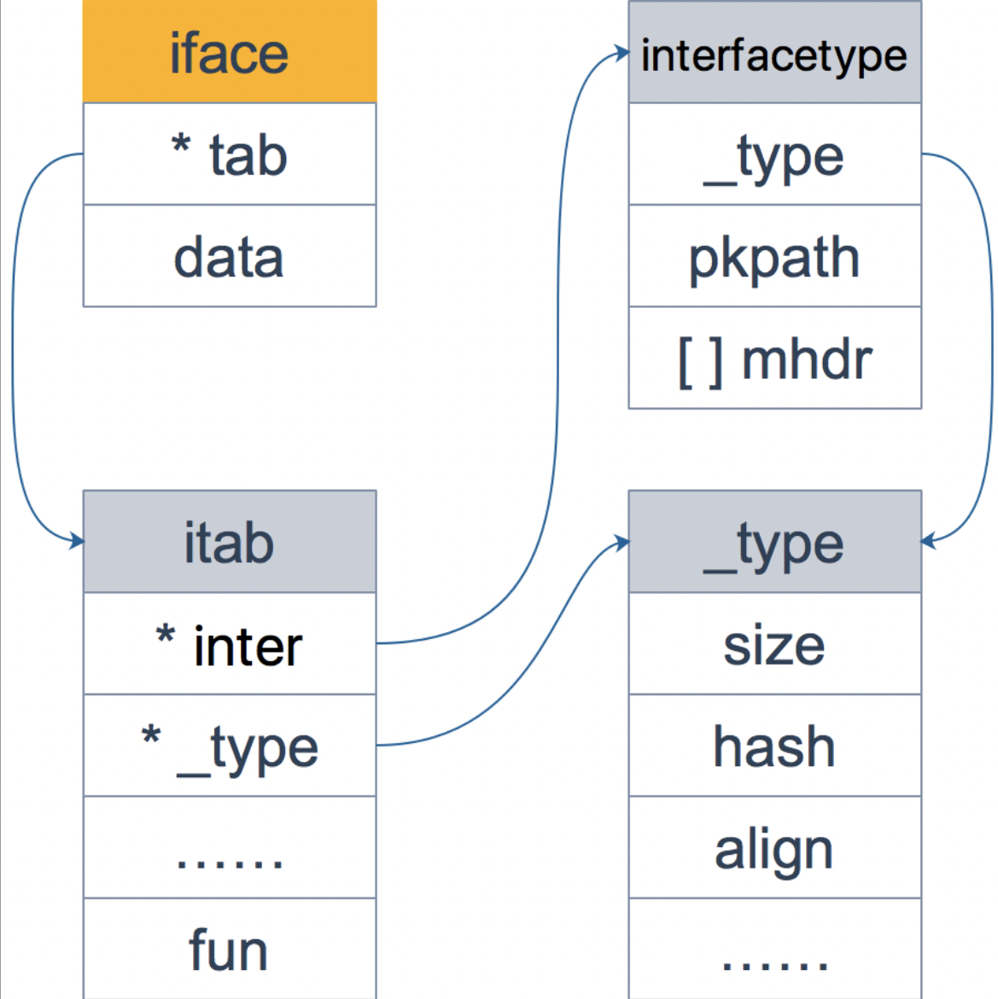
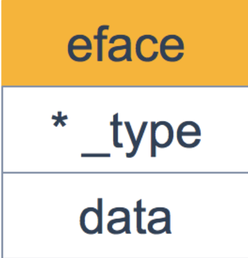
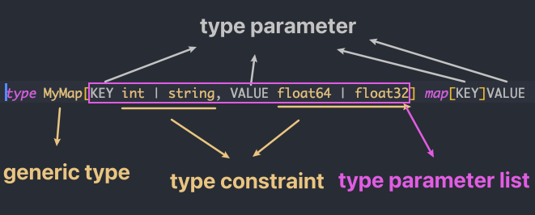
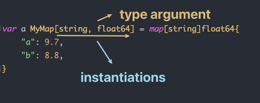

- [Interface](#interface)
  - [Relationship between Go and Duck Typing](#relationship-between-go-and-duck-typing)
  - [Value Receiver vs Pointer Receiver](#value-receiver-vs-pointer-receiver)
  - [Nil Interface](#nil-interface)
  - [Polymorphism with Open Closed Principle](#polymorphism-with-open-closed-principle)
  - [Composition Instead of Inheritance](#composition-instead-of-inheritance)
- [Reflection](#reflection)
  - [Why Reflection](#why-reflection)
  - [Types & interface](#types--interface)
- [Generic](#generic)
  - [Beginning From Parameter & Argument](#beginning-from-parameter--argument)
  - [Generic in Go](#generic-in-go)
  - [Type Parameter, Type Argument, Type Constraint & Generic Type](#type-parameter-type-argument-type-constraint--generic-type)
    - [Other Generic Types](#other-generic-types)
    - [Nested Type Parameter](#nested-type-parameter)
    - [Syntax Error](#syntax-error)
    - [Special Generic](#special-generic)
    - [Nested Generic](#nested-generic)
    - [Generic With Anonymous](#generic-with-anonymous)
  - [Generic Receiver](#generic-receiver)
    - [Queue Implementation Base On Generic Type](#queue-implementation-base-on-generic-type)
    - [Dynamic Checkout Variable Type](#dynamic-checkout-variable-type)

# Interface

Interface 是一組抽象方法集合(未實現方法/僅包含方法名參數返回值的方法), 如果 implement interface 中所有 methods, 即該類型物件實現了此 interface

interface 定義語法：

```go
type interfaceName interface {  
    //methods 
}  
```

```go
package main

import "fmt"

type Human struct {
    name string
    age int
    phone string
}

type Student struct {
    Human //anonymous field
    school string
    loan float32
}

type Employee struct {
    Human //anonymous field
    company string
    money float32
}

//Human implement SayHi method
func (h Human) SayHi() {
    fmt.Printf("Hi, I am %s you can call me on %s\n", h.name, h.phone)
}

//Human implement SayHi method
func (h Human) Sing(lyrics string) {
    fmt.Println("La la la la...", lyrics)
}

//Employee overwrite Human SayHi method
func (e Employee) SayHi() {
    fmt.Printf("Hi, I am %s, I work at %s. Call me on %s\n", e.name,
        e.company, e.phone)
    }

// Interface Men 被 Human,Student 和 Employee implement
// 因為這三個 struct 都 implement 下面兩個 methods
type Men interface {
    SayHi()
    Sing(lyrics string)
}

func main() {
    mike := Student{Human{"Mike", 25, "222-222-XXX"}, "MIT", 0.00}
    paul := Student{Human{"Paul", 26, "111-222-XXX"}, "Harvard", 100}
    sam := Employee{Human{"Sam", 36, "444-222-XXX"}, "Golang Inc.", 1000}
    tom := Employee{Human{"Tom", 37, "222-444-XXX"}, "Things Ltd.", 5000}

    //定義 Men type 的變數 i
    var i Men

    //i 能承載 Student
    i = mike
    fmt.Println("This is Mike, a Student:")
    i.SayHi()
    i.Sing("November rain")

    //i 也能承載 Employee
    i = tom
    fmt.Println("This is tom, an Employee:")
    i.SayHi()
    i.Sing("Born to be wild")

    //宣告 slice Men
    fmt.Println("Let's use a slice of Men and see what happens")
    x := make([]Men, 3)
    //三個不同 type element 都 implement Men interface
    x[0], x[1], x[2] = paul, sam, mike

    for _, value := range x{
        value.SayHi()
    }
}
```

## Relationship between Go and Duck Typing

首先來看一下 wiki 對於 `Duck Typing` 的定義:

> If it looks like a duck, swims like a duck, and quacks like a duck, then it probably is a duck.

`Duck Typing` 為動態程式語言的一種物件推斷策略, 其更關注於物件的行為而非物件的型別

Go 作為一個靜態語言, 可以通過 `interface` 完美實現 duck typing

例如在動態語言 python 中, 定義一個函式如下:

```python
def hello_world(coder):
    coder.say_hello()
```

調用此函式時可以傳入任意型別, 只要其實現 `say_hello()` 函式即可, 若沒有實現則為在 runtime 出現錯誤

而在靜態語言如 Java, C++ 中必須顯示聲明實現某個 interface 才能使用在需要此 interface 的地方, 若在程式中調用 `hello_world` 函式卻傳入未實現 `say_hello()` 的型別, 則會發生 compile error, 這也是靜態語言較安全的原因

靜態語言可以在 compile time 就發現型別不匹配的錯誤, 不需像動態語言一樣必須運行到那一行程式碼才會報錯

但靜態語言要求開發者在編寫程式碼階段需為每個變數規定資料型別, 動態語言則沒有這些要求, 程式碼相對更短小簡潔, 開發效率更高

Go 作為一個現代靜態語言, 引入了動態語言便利的同時又會進行靜態型別檢查, 其不要求型別顯示聲明實現某個 interface, 只要實現相關的方法即可, compiler 就能進行檢查判斷

舉個例子, 先定義一個 interface, 並使用此 interface 作為參數的函式:

```go
type IGreeting interface {
	sayHello()
}

func sayHello(i IGreeting) {
	i.sayHello()
}
```

接著定義兩個 struct:

```go
type Go struct {}
func (g Go) sayHello() {
	fmt.Println("Hi, I am GO!")
}

type PHP struct {}
func (p PHP) sayHello() {
	fmt.Println("Hi, I am PHP!")
}
```

最後在 `main` 函式中調用 `sayHello()` 函式:

```go
func main() {
	golang := Go{}
	php := PHP{}

	sayHello(golang)
	sayHello(php)
}
```

output:

```go
Hi, I am GO!
Hi, I am PHP!
```

`golang`, `php` struct 並沒有顯式聲明實現 `IGreeting` 型別, 只是實現了 interface 中的 `sayHello()` 函式

實際上 compiler 在調用 `sayHello()` 函式時會將 `golang` 和 `php` 物件隱式轉換為 `IGreeting` 型別, 這也是靜態語言的型別檢查功能

順便提一下動態語言的特點:

> 變數綁定的型別是不確定的, 在 runtime 才能確定; 函式和方法可以接收任何型別的參數, 且調用時不需檢查參數型別, 也不需要實現 interface

簡單總結, `Duck Typing` 為一種動態語言的特色, 一個物件有效的語義不是由繼承自特定的型別或實現特定的 interface, 而是由其**當前方法和屬性的集合**來決定

Go 作為一種靜態語言, 通過 interface 實現了 `Duck Typing`, 實際上為 Go compiler 在其中做了隱式的型別轉換

## Value Receiver vs Pointer Receiver

`method` 能為自定義型別擴展行為, 與 `function` 的差別在於 method 有一個 `receiver`, `receiver` 可以是 `value receiver` 或 `pointer receiver`

在調用 method 時, `value type` 既可以調用 `value receiver method`, 也可以調用 `pointer receiver method`; `pointer type` 亦同

> 不論 method receiver 為什麽型別, 該型別的 value 和 pointer 都可以調用

```go
package main

import "fmt"

type Person struct {
	age int
}

func (p Person) howOld() int {
	return p.age
}

func (p *Person) growUp() {
	p.age += 1
}

func main() {
	// qcrao is value type
	qcrao := Person{age: 18}

	// value type call value receiver method
	fmt.Println(qcrao.howOld())

	// value type call pointer receiver method
	qcrao.growUp()
	fmt.Println(qcrao.howOld())

	// ----------------------

	// stefno is pointer type
	stefno := &Person{age: 100}

	// pointer type call value receiver method
	fmt.Println(stefno.howOld())

	// pointer type call pointer receiver method
	stefno.growUp()
	fmt.Println(stefno.howOld())
}
```

output:

```go
18
19
100
101
```

調用 `growUp` method 後, 不論調用者為 `value type` 還是 `pointer type`, 其 `Age` 值都改變了

實際上當型別與 `method receiver` 不同時 compiler 在背後隱式做了一些轉換:

| -                   | value receiver                                                                | pointer receiver                                                                        |
| ------------------- | ----------------------------------------------------------------------------- | --------------------------------------------------------------------------------------- |
| value type caller   | method 會使用調用者的 copy, 類似 `pass by value`                              | 使用value reference 來調用 method, 上例中 `qcrao.growUp()` 實際上為 `(&qcrao).growUp()` |
| pointer type caller | pointer dereferencing, 上例中 `stefno.howOld()` 實際上為 `(*stefno).howOld()` | 實際上也是 `pass by value`, value 為 pointer                                            |

前面提到, 不論 `receiver type` 為 `value type` 還是 `pointer type` 都可以通過 `value type` 或 `pointer type` 調用, 底層是通過語法糖作用

> 結論為, implement value type receiver method 相當於 implement pointer type receiver method; 而 implement pointer type receiver method 不會自動 implement value type receiver method

```go
package main

import "fmt"

type coder interface {
	code()
	debug()
}

type Gopher struct {
	language string
}

func (p Gopher) code() {
	fmt.Printf("I am coding %s language\n", p.language)
}

func (p *Gopher) debug() {
	fmt.Printf("I am debuging %s language\n", p.language)
}

func main() {
	var c coder = &Gopher{"Go"}
	c.code()
	c.debug()
}
```

`Gopher struct` 實現了兩個方法, 分別為 `value type receiver` 和 `pointer type receiver`

在 `main` 函式中通過 interface type 的變數調用了定義的兩個 methods:

```go
I am coding Go language
I am debuging Go language
```

但如果將 `&Gopher` 改成 `Gopher`:

```go
func main() {
	var c coder = Gopher{"Go"}
	c.code()
	c.debug()
}
```

則會報錯:

```go
./main.go:23:6: cannot use Gopher literal (type Gopher) as type coder in assignment:
	Gopher does not implement coder (debug method has pointer receiver)
```

報錯原因為 `Gopher` 沒有 implement `coder interface`, 因為 `Gopher struct` 沒有 implement `debug method`; 表面上看 `*Gopher type` 也沒有 implement `code method`, 但是因為 `Gopher` implement 了 `code method`, 所以 `*Gopher type` 也自動 implement 了 `code method`
 
## Nil Interface

Nil interface (interface{}) 不包含任何 method, 所有的類型都實現了 nil interface. 

Nil interface 在需要承載任意類型的值時相當有用, 類似 C 中的 `void*`

```go
// define a nil interface
var a interface{}
var i int = 5
s := "Hello world"
// a 可以承載任意類型值
a = i
a = s
```

那如何知道這個 interface 變數實際保存了哪種類型的物件？目前常用的兩種方法：
- switch
- Comma-ok

Switch check
```go
type Element interface{}
type List [] Element

type Person struct {
    name string
    age int 
}

//print
func (p Person) String() string {
    return "(name: " + p.name + " - age: "+strconv.Itoa(p.age)+ " years)"
}

func main() {
    list := make(List, 3)
    list[0] = 1 //an int 
    list[1] = "Hello" //a string
    list[2] = Person{"Dennis", 70} 

    for index, element := range list{
        switch value := element.(type) {
            case int:
                fmt.Printf("list[%d] is an int and its value is %d\n", index, value)
            case string:
                fmt.Printf("list[%d] is a string and its value is %s\n", index, value)
            case Person:
                fmt.Printf("list[%d] is a Person and its value is %s\n", index, value)
            default:
                fmt.Println("list[%d] is of a different type", index)
        }   
    }   
}
```

Comma-ok check

```go
func main() {
    list := make(List, 3)
    list[0] = 1 // an int
    list[1] = "Hello" // a string
    list[2] = Person{"Dennis", 70}

    for index, element := range list {
        if value, ok := element.(int); ok {
            fmt.Printf("list[%d] is an int and its value is %d\n", index, value)
        } else if value, ok := element.(string); ok {
            fmt.Printf("list[%d] is a string and its value is %s\n", index, value)
        } else if value, ok := element.(Person); ok {
            fmt.Printf("list[%d] is a Person and its value is %s\n", index, value)
        } else {
            fmt.Printf("list[%d] is of a different type\n", index)
        }
    }
}
```

## Polymorphism with Open Closed Principle

OCP 描述軟體實體(類型, 模組, 函數等)應該是可擴展但不能被修改的

```go
package main

import (  
    "fmt"
)

type SalaryCalculator interface {  
    CalculateSalary() int
}

type Permanent struct {  
    empId    int
    basicpay int
    pf       int
}

type Contract struct {  
    empId  int
    basicpay int
}

//salary of permanent employee is sum of basic pay and pf
func (p Permanent) CalculateSalary() int {  
    return p.basicpay + p.pf
}

//salary of contract employee is the basic pay alone
func (c Contract) CalculateSalary() int {  
    return c.basicpay
}

/*
total expense is calculated by iterating though the SalaryCalculator slice and summing  
the salaries of the individual employees  
*/
func totalExpense(s []SalaryCalculator) {  
    expense := 0
    for _, v := range s {
        expense = expense + v.CalculateSalary()
    }
    fmt.Printf("Total Expense Per Month $%d", expense)
}

func main() {  
    pemp1 := Permanent{1, 5000, 20}
    pemp2 := Permanent{2, 6000, 30}
    cemp1 := Contract{3, 3000}
    employees := []SalaryCalculator{pemp1, pemp2, cemp1}
    totalExpense(employees)

}
```

`SalaryCalculator` interface 的設計使得 `totalExpense` 可以擴展新的員工類型而不需要修改任何程式碼.

若公司新增了一種員工類型 `Freelancer` 且有著不同的薪資結構, `Freelancer` 只需傳遞到 `totalExpense` slice parameter, 不需要修改 `totalExpense` method 本身.

只要 `Freelancer` 也實現 `SalaryCalculator` interface 即可實現

## Composition Instead of Inheritance

Go 中沒有提供繼承機制, 但可以通過 embedding interface 來創建一個新 interface 實現

```go
package main

import (  
    "fmt"
)

type SalaryCalculator interface {  
    DisplaySalary()
}

type LeaveCalculator interface {  
    CalculateLeavesLeft() int
}

type EmployeeOperations interface {  
    SalaryCalculator
    LeaveCalculator
}

type Employee struct {  
    firstName string
    lastName string
    basicPay int
    pf int
    totalLeaves int
    leavesTaken int
}

func (e Employee) DisplaySalary() {  
    fmt.Printf("%s %s has salary $%d", e.firstName, e.lastName, (e.basicPay + e.pf))
}

func (e Employee) CalculateLeavesLeft() int {  
    return e.totalLeaves - e.leavesTaken
}

func main() {  
    e := Employee {
        firstName: "Naveen",
        lastName: "Ramanathan",
        basicPay: 5000,
        pf: 200,
        totalLeaves: 30,
        leavesTaken: 5,
    }
    var empOp EmployeeOperations = e
    empOp.DisplaySalary()
    fmt.Println("\nLeaves left =", empOp.CalculateLeavesLeft())
}
```

創建新 interface `EmployeeOperations` 並嵌套兩個 interface: `SalaryCalculator` & `LeaveCalculator`.

如果一個類型定義了 `SalaryCalculator` 及 `LeaveCalculator` interface 中的 method, 就稱該類型實現了 `EmployeeOperations` interface

# Reflection

何為 `reflection` ? Wiki 定義如下:

> In computer science, reflective programming or reflection is the ability of a process to examine, introspect, and modify its own structure and behavior.

簡單來說, `reflection` 本質上為程式在 run time 探知物件的型別資訊和記憶體結構並修改自身的行為

但不用 `reflection` 就無法在 run time 訪問, 檢測或修改程式自身的狀態或行為嗎?

其實使用 `assembly language` 直接與機器底層交互也可以獲取對應的資訊, 但是使用 Go 等高階語言則無法做到, 只能通過 `reflection` 來達成

不同程式語言的 reflection model 不盡相同, 有些語言甚至不支援 reflection

`《The Go Programming Language》` 中是如此定義 `reflection`:

> Go 語言提供了一種機制在 run time 時更新變數和檢查其值, 調用它們方法, 但在 compile time 並不知道這些變數的具體型別, 稱為 reflection

## Why Reflection

`interface` 為 Go 中實現抽象的強大工具, 當向 interface 賦予一個實體型別時, interface 會儲存實體的型別資訊, `reflection` 就是通過 interface 型別資訊實現, 其建立在型別的基礎上

Go `reflect` package 中定義了各種型別, 並實現了 `reflection` 的各種函數, 通過它們可以在 run time 檢測型別資訊或改變型別的值

## Types & interface

Go 中每個變數都有一個靜態型別, 在 compile time 就確定了, 如 `int`, `float64`, `[]int` 等, 注意這個型別為聲明時的型別而非底層資料型別

```go
type MyInt int

var i int
var j MyInt
```

雖然 `i`, `j` 底層型別都是 `int`, 但其靜態型別並不相同, 除非進行型別轉換, 否則 `i`, `j` 不能同時出現在等號兩側

`reflection` 主要與 `interface{}` 型別有關:

```go
type iface struct {
	tab  *itab
	data unsafe.Pointer
}

type itab struct {
	inter  *interfacetype
	_type  *_type
	link   *itab
	hash   uint32
	bad    bool
	inhash bool
	unused [2]byte
	fun    [1]uintptr
}
```



其中 `itab` 由具體型別 `_type` 及 `interfacetype` 組成, `_type` 表示具體型別, 而 `interfacetype` 則表示具體型別實現的 interface type

實際上 `iface` 描述的為非空 interface, 其包含方法; 與其相對的是 `eface`, 描述的為空 interface, 不包含任何方法

Go 中所有型別都實現了空 interface

```go
type eface struct {
    _type *_type
    data  unsafe.Pointer
}
```

比起 `iface`, `eface` 就簡單多了, 只維護一個 `_type` field, 表示空 interface 所承載的具體實體型別, `data` 描述具體的值



# Generic

2022.03.15, 飽受爭議又備受期待的 `generic` 終於隨著 Go@v1.18 release 了

## Beginning From Parameter & Argument

假設目前有一個計算兩數之和的函式:

```go
func Add(a int, b int) int {
    return a + b
}
```

這個函式很簡單, 但有個問題: **其無法計算 `int` 型別之外的和**

如果想計算 float 或 string 的和則需要實現不同型別的不同函式:

```go
func AddFloat32(a float32, b float32) float32 {
    return a + b
}

func AddString(a string, b string) string {
    return a + b
}
```

除此之外還有其他更好的實現方式嗎? 這裡先來回顧一下函式的 `parameter` 及 `argument` 的概念:

```go
// var a, b are parameter, "a int, b int" is a parameter list
func Add(a int, b int) int {  
    return a + b
}

Add(100,200) // 100, 200 are argument
```

函式的 `parameter` 只是類似佔位符的存在, 並沒有具體的值, 只有當函式調用並傳入 `argument` 之後才有具體的值

若將 `parameter` 及 `argument` 概念延伸, 為變數的型別也引入類似 `parameter` 及 `argument` 的概念, 上述問題就迎刃而解, 這裡將其稱為 `type parameter` 和 `type argument`:

```go
// 假設 T 為 type parameter, 則定義函式時其型別是不確定的, 類似佔位符
func Add(a T, b T) T {  
    return a + b
}
```

上面這段 pseudocode 中 `T` 被稱為 `type parameter`, 其不是具體型別, 定義函式時型別不確定, 需要在調用函式時傳入具體類型

如此一來就能達到一個函式同時支援多個不同類型的目的了, 這裡被傳入的具體型別稱為 `type argument`:

```go
// [T=int] 中的 int type argument, 表示函示 Add() 定義中的 type parameter T 全部被 int 替換
Add[T=int](100, 200)  
// 傳入 type argument int 之後, Add() 函式的定義近似成:
func Add( a int, b int) int {
    return a + b
}

// 當想要計算 string 之和時就傳入 string 當作 type argument
Add[T=string]("Hello", "World") 
// 傳入 type argument string 之後, Add() 函式的定義近似成:
func Add( a string, b string) string {
    return a + b
}
```

通過引入 `type argument` 和 `type parameter` 兩個概念, 可以讓一個函式擁有處理多種不同型別資料的能力, 稱為 `generic programming`

雖然通過 `interface` + `reflection` 也能實現動態資料處理, 但其有很多問題:
- 使用上麻煩
- 失去了 compile time type checking 功能, 容易出錯
- 性能不理想

而 `generic` 的引入能解決上述問題, 但 `generic` 也無法解決全部問題, 依然有自己適用的場景

> 若需要為不同型別撰寫相同邏輯的程式碼, 使用 `generic` 將是最適合的選擇

## Generic in Go

通過上述 pseudocode, 實際上對 Go 中的 generic programming 有了最初步也最重要的認知: `type parameter` 和 `type argument`, Go@v1.18 也是通過這種方式實現 `generic programming`, 除此之外還引入非常多新概念:
- type parameter
- type argument
- type parameter list
- type constraint
- instantiations
- generic receiver
- generic function

## Type Parameter, Type Argument, Type Constraint & Generic Type

觀察下面簡單的例子:

```go
type IntSlice []int

var a IntSlice = []int{1, 2, 3} // correct
var b IntSlice = []float32{1.0, 2.0, 3.0} // ✗ incorrect
```

因為 IntSlice 底層型別為 []int, float 型別的 slice 無法賦值

若想要定義一個可以容納 `float32` 或 `string` 等其他型別的 slice 怎麼辦? 可以直接為每種型別定義新型別:

```go
type StringSlice []string
type Float32Slie []float32
type Float64Slice []float64
```

但其結構都相同, 只是成員型別不同就需要重新定義這麼多的新型別, 若使用 `generic` 的方式, 就只需定義一個型別代表上述所有型別:

```go
type Slice[T int|float32|float64 ] []T
```

不同於一般型別定義, 這裡型別名稱 `Slice` 後面跟著中括號:
- `T` 為 `type parameter`, 定義 `Slice` 型別時 `T` 代表的具體型別不確定, 類似一個佔位符
- `int|float32|float64` 被稱為 `type constraint`, `|` 作用為告訴 compiler `type parameter T` 只能接受 `int`, `float32` 或 `float64` 這三種型別的 argument
- ` T int|float32|float64` 定義了所有 `type parameter`, 稱其為 `type parameter list`
- 此處新定義的型別名稱為 `Slice[T]`

> 型別定義中使用 `type parameter` 型別, 則稱為 `generic type`

`generic type` 不能直接使用, 必須傳入 `type argument` 將其確定為具體型別後才可用, 而傳入 `type argument` 確定具體型別的行為稱為 `Instantiations`

```go
// 傳入 type argument int, generic type Slice[T] 被實體化為具體型別  Slice[int]
var a Slice[int] = []int{1, 2, 3}  
fmt.Printf("Type Name: %T",a)  //output -> Type Name: Slice[int]

// 傳入 type argument float32, 將 generic type Slice[T] 實體化為具體型別 Slice[string]
var b Slice[float32] = []float32{1.0, 2.0, 3.0} 
fmt.Printf("Type Name: %T",b)  //output -> Type Name: Slice[float32]

// ✗ Incorrect, var a 型別為 Slice[int], b 型別為 Slice[float32], 兩者型別不同
a = b  

// ✗ Incorrect, string 不在 type constraint int|float32|float64 中, 不能用來實體化 generic type
var c Slice[string] = []string{"Hello", "World"} 

// ✗ Incorrect, Slice[T] 為 generic type, 不可直接使用必須實體化為具體的型別
var x Slice[T] = []int{1, 2, 3} 
```

對於上述例子, 需要先為 `generic type Slice[T]` 傳入 `type argument int`, 如此一來 `generic type` 就會被實體化為具體型別 `Slice[int]`, 被實體化之後的型別定義可近似為:

```go
// 定義一個普通型別 Slice[int], 其底層型別為 []int
type Slice[int] []int     
```

用實體化後的型別 `Slice[int]` 聲明一個新的變數 `a`, 可以儲存 `int` 型別的 slice, 再用同樣的方式實體化另一個型別 `Slice[float32]` 並聲明變數 `b`

因為變數 `a` 和 `b` 為具體的不同型別(`Slice[int]` & `Slice[float32]`), 所以不同型別間的變數賦值是不允許的

同時因為 `Slice[T]` 的 `type constraint` 限定只能使用 `int` 或 `float32` 來實體化, 所以 `Slice[string]` 也是不允許的

實際應用中 `type parameter` 數量可以超過一個:

```go
// MyMap 型別定義了兩個 type parameter KEY 和 VALUE, 並分別指定了不同的 type constranit
// 此 generic type 名稱為: MyMap[KEY, VALUE]
type MyMap[KEY int | string, VALUE float32 | float64] map[KEY]VALUE  

// 用 type argument string 和 flaot64 替換 type parameter KEY, VALUE, generic type 被實體化為具體型別 MyMap[string, float64]
var a MyMap[string, float64] = map[string]float64{
    "jack_score": 9.6,
    "bob_score":  8.4,
}
```

簡單總結:
- `KEY` 和 `VALUE` 為 `type parameter`
- `int|string` 為 `KEY` 的 `type constraint`, `float32|float64` 為 `VALUE` 的 `type constraint`
- `KEY int|string, VALUE float32|float64` 為 `type parameter list`
- `Map[KEY,VALUE]` 為 `generic type`, 型別名稱為 `Map[KEY,VALUE]`
- `var a MyMap[string, float64] = xx` 中的 `string` 和 `float64` 為 `type argument`, 用於替換 `KEY` 和 `VALUE` 並實體化出具體型別 `MyMap[string, float64]`





### Other Generic Types

所有型別定義都可以使用 `type parameter`:

```go
// generic type struct
type MyStruct[T int | string] struct {  
    Name string
    Data T
}

// generic type interface
type IPrintData[T int | float32 | string] interface {
    Print(data T)
}

// generic type channel
type MyChan[T int | string] chan T
```

### Nested Type Parameter

`type parameter` 可以互相套用:

```go
type WowStruct[T int | float32, S []T] struct {
    Data     S
    MaxValue T
    MinValue T
}
```

任何 `generic type` 都必須傳入 `type argument` 實體化才能使用:

```go
var ws WowStruct[int, []int]
```

上述程式碼中為 `T` 傳入 `type argument int`, 又因 `S` 定義為 `[]T`, 所以 `S` 的 `type argument` 為 `[]int`, 實體化後 `WowStruct[T,S]` 定義如下:

```go
type WowStruct[int, []int] struct {
    Data     []int
    MaxValue int
    MinValue int
}
```

因為 `S` 定義為 `[]T`, 所以一旦 `T` 確認之後 `S` 的 `type argument` 就確定了:

```go
ws := WowStruct[int, []float32]{
        Data:     []float32{1.0, 2.0, 3.0},
        MaxValue: 3,
        MinValue: 1,
}
```

`T` 傳入 `type argument int`, 所以 `S` 的 `type argument` 為 `[]int` 而非 `[]float32`

### Syntax Error

定義 `generic type` 時基礎型別不能只有 `generic parameter`:

```go
type CommonType[T int|string|float32] T
```

`type constraint` 部分語法會被 compiler 誤認為表達式:

```go
//✗ Incorrect, T *int 會被 compiler 判斷為表達式: T 乘以 int, 而非 int pointer
// compiler: 定義一個存放 slice 的 array, array length 為 T 乘以 int
type NewType[T *int] []T

//✗ Incorrect, 同上, * 被判斷為乘號, | 被判斷為 or operation
type NewType2[T *int|*float64] []T 

//✗ Incorrect
type NewType2 [T (int)] []T 
```

> 為了避免上述歧異, 解決方法為給 `type constraint` 包上 `interface{}` 或加上逗號消除歧異:

```go
type NewType[T interface{*int}] []T
type NewType2[T interface{*int|*float64}] []T 

// 若 type constranit 中只有一個型別可以加上逗號消除歧異
type NewType3[T *int,] []T

//✗ Incorrect, 若 type constranit 存在多個型別則無法使用逗號消除歧異
type NewType4[T *int|*float32,] []T 
```

統一推薦使用 `interface{}` 處理

### Special Generic

這裡討論一種較為特殊的 `generic type`:

```go
type Wow[T int | string] int

var a Wow[int] = 123     // compile correct
var b Wow[string] = 123  // compile correct
var c Wow[string] = "hello" // compile error, 因為 hello 無法賦值給底層型別 int
```

這裡雖然使用了 `type parameter`, 但因為型別定義底層型別為 `int`, 所以無論傳入什麼型別的 `type argument` 實體化後的新型別底層型別都為 `int`

### Nested Generic

`generic type` 與普通型別相同, 可以互相嵌套定義出更複雜的新型別:

```go
// 首先定義一個 generic type Slice[T]
type Slice[T int|string|float32|float64] []T

// ✗ Incorrect, generic type Slice[T] type constranit 不包含 uint, uint8
type UintSlice[T uint|uint8] Slice[T]  

// ✓ Correct, 基於 generic type Slice[T] 定義新的 generic type FloatSlice[T], FloatSlice[T] 只接受 float32 和 float64 兩種型別
type FloatSlice[T float32|float64] Slice[T] 

// ✓ Correct, 基於 generic type Slice[T] 定義新的 generic type IntAndStringSlice[T]
type IntAndStringSlice[T int|string] Slice[T]  
// ✓ Correct, 基於 IntAndStringSlice[T] nested 定義出新的 generic type
type IntSlice[T int] IntAndStringSlice[T] 

// Nested generic type with map
type WowMap[T int|string] map[string]Slice[T]
type WowMap2[T Slice[int] | Slice[string]] map[string]T
```

### Generic With Anonymous

使用匿名 struct 時通常會先定義好匿名 struct 並直接初始化:

```go
testCase := struct {
        caseName string
        got      int
        want     int
    }{
        caseName: "test OK",
        got:      100,
        want:     100,
    }
```

但是匿名 struct 無法使用 generic type 做型別定義:

```go
testCase := struct[T int|string] {
        caseName string
        got      T
        want     T
    }[int]{
        caseName: "test OK",
        got:      100,
        want:     100,
    }
```

這一點對於為 genric type 做 unit test 的時候非常麻煩

## Generic Receiver

> Generic 一個最主要的應用場景就是與 receiver 結合使用

定義普通型別之後可以為型別實現方法, 同樣也可以為 generic type 實現方法:

```go
type MySlice[T int | float32] []T

func (s MySlice[T]) Sum() T {
    var sum T
    for _, value := range s {
        sum += value
    }
    return sum
}
```

這個例子為 generic type `MySlice[T]` 新增了一個計算成員總和的方法 `Sum()`:
- 將 `MySlice[T]` 作為 receiver
- 方法返回的參數使用 `type parameter T`
- 方法定義中也可以使用 `type paramter T` (`var sum T`)

使用 `MySlice[T]` 之前需要先用 `type argument` 進行實體化:

```go
var s MySlice[int] = []int{1, 2, 3, 4}
fmt.Println(s.Sum()) // output: 10

var s2 MySlice[float32] = []float32{1.0, 2.0, 3.0, 4.0}
fmt.Println(s2.Sum()) // output: 10.0
```

上述例子用 `type argument int` 實體化了 generic type `MySlice[T]`, 所有 generic type 定義中的 `T` 都被替換為 `int`:

```go
type MySlice[int] []int // 實體化後的型別為 MyIntSlice[int]

func (s MySlice[int]) Sum() int {
    var sum int 
    for _, value := range s {
        sum += value
    }
    return sum
}
```

通過 `generic type receiver`, generic type 實用性得到巨大的擴展, 在沒有 generic type 之前若想實現通用的資料結構如 `heap`, `stack`, `queue`, `linked list` 等, 選擇只有兩個:
- 為每個型別寫一個實現
- 使用 `interface` + `reflection`

有了 generic 後就能非常簡單地創建通用的資料節後了

### Queue Implementation Base On Generic Type

`Queue` 為一種 `FIFO` 的資料結構, 與現實中排隊同理, 資料只能從尾部進入, 從頭部取出

```go
// type constraint 使用 `interface` 型別, 表示所有型別都能用來實體化 generic type Queue[T]
type Queue[T interface{}] struct {
    elements []T
}

// 將資料放入隊尾
func (q *Queue[T]) Put(value T) {
    q.elements = append(q.elements, value)
}

// 從對首取出資料並刪除
func (q *Queue[T]) Pop() (T, bool) {
    var value T
    if len(q.elements) == 0 {
        return value, true
    }

    value = q.elements[0]
    q.elements = q.elements[1:]
    return value, len(q.elements) == 0
}

// Queue 大小
func (q Queue[T]) Size() int {
    return len(q.elements)
}
```

>❗️ 為方便說明, 此 Queue 實現方法為考慮 thread safe 等其他問題

`Queue[T]` 為 generic type, 使用前須實體化:

```go
var q1 Queue[int]  // 可儲存 int 型別的 Queue
q1.Put(1)
q1.Put(2)
q1.Put(3)
q1.Pop() // 1
q1.Pop() // 2
q1.Pop() // 3

var q2 Queue[string]  // 可儲存 string 型別的 Queue
q2.Put("A")
q2.Put("B")
q2.Put("C")
q2.Pop() // "A"
q2.Pop() // "B"
q2.Pop() // "C"

var q3 Queue[struct{Name string}] 
var q4 Queue[[]int] // 可儲存 []int slice 的 Queue
var q5 Queue[chan int] // 可儲存 int channel 的 Queue
var q6 Queue[io.Reader] // 可儲存 interface 的 Queue
// ......
```

### Dynamic Checkout Variable Type

使用 `interface` 時經常會用到 `type assertion` 或 `type switch` 來確認 interface 具體的型別, 並針對不同型別做出不同處裡:

```go
var i interface{} = 123
i.(int) // type assertion

// type switch
switch i.(type) {
    case int:
        // do something
    case string:
        // do something
    default:
        // do something
}
```

那對於 `value T` 這種通過 `type parameter` 定義的變數, 是否能判斷具體型別並針對不同型別做出不同處理呢? 答案是不行:

```go
func (q *Queue[T]) Put(value T) {
    value.(int) // error, generic type variable 不能使用 type assertion

    // error, 不允許使用 type switch 判斷 value 的具體型別
    switch value.(type) {
    case int:
        // do something
    case string:
        // do something
    default:
        // do something
    }
    
    // ...
}
```

雖然 `type switch` 和 `type assertion` 不可用, 但可通過 `reflection` 來達到目的:

```go
func (receiver Queue[T]) Put(value T) {
    // Printf() 可輸出 value type (reflection)
    fmt.Printf("%T", value) 

    // 通過 reflection 可以動態取得變數 value 型別並按情況處理
    v := reflect.ValueOf(value)

    switch v.Kind() {
    case reflect.Int:
        // do something
    case reflect.String:
        // do something
    }

    // ...
}
```

這看似達到了目的, 但當寫出如上程式碼則反應了一個問題:

> 為了避免使用 reflection 而選擇了 generic, 最後卻又在 generic 中使用 reflection

當出現這種情況時應該重新思考需求是否真的需要使用 `generic`

