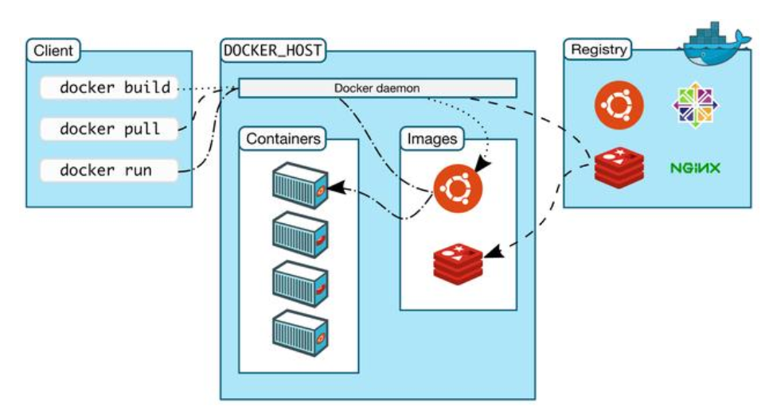

- [Introduction](#introduction)
  - [Docker Container](#docker-container)
  - [Kubernetes Introduction](#kubernetes-introduction)

# Introduction

## Docker Container

> Docker provides a way to run applications securely isolated in a container, packaged with all its dependencies and libraries.Build once, Run anywhwere.

`Docker` 提供了一種將應用程式安全且隔離運行的一種方式, 能夠將應用程式 dependency 和 package files 打包於一個容器中, 後續即可在任何地方運行, 達到 **bulild one, run anywhere** 的目的

Docker 組成元件:

- Docker Daemon: 容器管理組件, 負責負載容器, 鏡像, 存儲, 網絡等管理
- Docker Client: 容器客戶端, 負責與 `Docker Daemon` 交互並完成容器生命週期管理
- Docker Registry: 容器鏡像倉庫, 負責儲存, 分發及打包
- Docker Object: 容器物件, 主要包含 `cointainer` 和 `image`

容器為應用程式開發環境帶來極高的便利性, 從根本上解決了容器的環境依賴, 打包等問題

然而容器帶來的便利性同時也夾帶著新的挑戰:

- 容器如何調度, 分發
- 多台機器如何協同工作
- Docker 主機故障時應用如何復原
- 如何保障應用 HA 及實現 autoscaling

## Kubernetes Introduction

> Kubernetes (K8s) is an open-source system for automating deployment, scaling, and management of containerized applications.It groups containers that make up an application into logical units for easy management and discovery. Kubernetes builds upon15 years of experience of running production workloads at Google, combined with best-of-breed ideas and practices from the community.

`Kubernetes` 是 Google 開源的一個容器編排引擎, 提供容器化應用的自動化部署, 水平擴展及管理, 為 Google 內部容器十多年沈澱的結晶, 已經戰勝 `Swarm`, `Mesos`, 成為容器編排界的標準

三大容器編排引擎現況:

- Swarm: Docker 原生提供的容器編排引擎, 隨著 Docker 支持 Kubernetes 而逐漸廢棄
- Mesos: 結合 Marathon 提供容器編排調度的能力, 還能提供其他 framwork 調度
- Kubernetes: 已成為容器編排引擎的唯一標準

Kubernetes 內建有非常多優秀的特性使得開發者能更專注於業務本身, 其包含的功能如下:

- Service discovery and load balancing: 通過 DNS 實現內部解析, service 負載均衡
- Storage orchestration: 通過 plugins 形式支持多種存儲方式, 如 local, nfs, ceph, public cloud storage 等
- Automated rollouts and rollbacks: 通過匹配當前與目標狀態一致, 更新失敗時可回滾
- Automatic bin packing: 自動資源調度, 可以設置 pod 調度所需資源 (requests) 及限制 (limits)
- Self-healing: 自動發現及處理集群內異常, 更換或重啟 pod
- Secret and configuration management: 私鑰配置管理, 對於敏感資訊通過 secret 儲存, 應用的配置文件通過 configmap 儲存, 避免將配置文件寫死於鏡像中以增加容器編排靈活性
- Batch execution: 通過 job 和 cornjob 提供單次批次處理任務和循環計畫任務功能
- Horizontal scaling: 水平擴充功能, 包含 HPA 和 AS, 即應用基於 CPU Usage 的彈性伸縮和基於平台級的彈性伸縮, 如自動增刪 node 節點